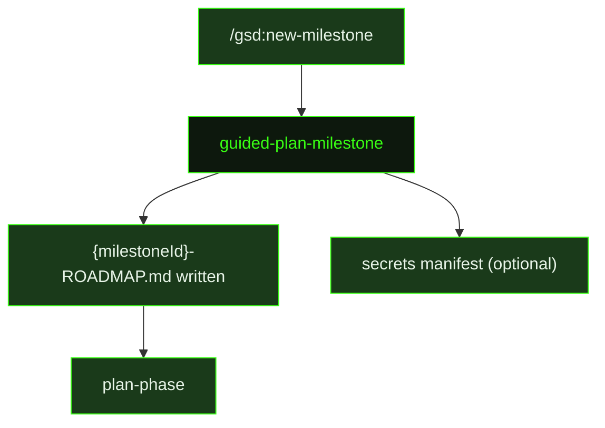

## What It Does

`guided-plan-milestone` builds a milestone roadmap by reading `.gsd/DECISIONS.md` and `.gsd/REQUIREMENTS.md`, surveying existing patterns in the codebase, and writing `{milestoneId}-ROADMAP.md` with a full slice plan. It is dispatched when the user starts a new milestone cycle interactively through [`/gsd:new-milestone`](../../commands/new-milestone/).

The prompt enforces a strict planning doctrine. Risk-first means proof-first: the earliest slices must prove the hardest thing works by shipping the real feature through the uncertain path. If auth is the risk, the first slice ships a working login page with real session handling — not a CLI command that returns `"authenticated: true"`. Every slice must be vertical, shippable, and demonstrable to a stakeholder as real product progress. Foundation-only slices and proof-of-concept spikes are not permitted. If a slice can only be demonstrated via a test runner or a curl command, it is missing its UI/UX surface and must be restructured.

Brownfield bias is baked in: when planning against an existing codebase, slices are grounded in existing modules, conventions, and seams — preferring to extend real patterns over inventing new ones. Each slice should also establish a stable surface (an API, a data shape, a proven integration path) that downstream slices can depend on.

Completion must imply capability. If every slice in the roadmap were completed exactly as written, the milestone's promised outcome must actually work at the claimed proof level — the roadmap must not allow all checkboxes to be ticked while the user-visible capability still does not exist. Ambition must match the milestone: a milestone promising "core platform with auth, data model, and primary user loop" requires enough slices to deliver all three as working features, not two proofs-of-concept and a note that the rest will come later. When a milestone is genuinely straightforward with no major unknowns, the doctrine is clear: don't invent risks — just ship value in smart order.

Requirement coverage is enforced: every relevant Active requirement must be mapped to a primary owning slice, deferred with reason, or moved out of scope — orphaned requirements are surfaced rather than silently skipped. If planning produces structural decisions, they are appended to `.gsd/DECISIONS.md`.

After writing the roadmap, `guided-plan-milestone` performs secret forecasting: it analyzes the planned slices and boundary maps for external service dependencies. If any are found, it writes a secrets manifest at `{secretsOutputPath}` listing every predicted secret with the service name, a direct dashboard URL for obtaining the key, a format hint, numbered step-by-step instructions for getting the key, status (`pending`), and destination (`dotenv`, `vercel`, or `convex`). If no external secrets are required, this step is skipped entirely — no empty manifest is created.

## Pipeline Position

`guided-plan-milestone` is dispatched once at the start of each milestone cycle. Its output — `{milestoneId}-ROADMAP.md` — is the authoritative contract that drives all subsequent phase research and planning. The optional secrets manifest surfaces credential requirements early so they can be obtained before execution begins.

## Variables

| Variable | Description | Required |
|----------|-------------|----------|
| `milestoneId` | Current milestone identifier (e.g. M001) | Yes |
| `milestoneTitle` | Human-readable title of the milestone being planned | Yes |
| `secretsOutputPath` | File path where the secrets manifest should be written if external services are needed | Yes |
| `inlinedTemplates` | Output template content inlined directly into the prompt (Roadmap and Secrets Manifest templates) | Yes |
| `skillActivation` | Injected skill-loading instruction block; activates any skills relevant to milestone planning | Yes |

## Used By

- [`/gsd:new-milestone`](../../commands/new-milestone/) — dispatched to produce the milestone roadmap when starting a new milestone cycle
