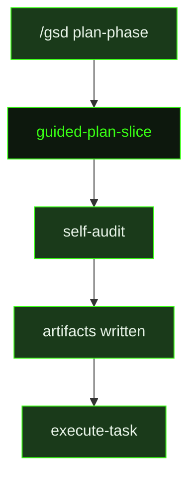

## What It Does

`guided-plan-slice` is the interactive counterpart to [`plan-slice`](../plan-slice/). Where `plan-slice` receives pre-assembled context injected by the auto-mode dispatcher, `guided-plan-slice` reads project context directly from disk — consulting `.gsd/DECISIONS.md` for locked architectural decisions, `.gsd/REQUIREMENTS.md` to identify which Active requirements this slice owns or supports, the roadmap boundary map, and any available context, research, or dependency summary files.

Once the planner has oriented itself, it decomposes the slice into tasks with explicit must-haves, fills a `Proof Level` section that honestly declares what class of proof this slice delivers (fixture, contract, or live integration), and fills an `Integration Closure` section that identifies what end-to-end wiring still remains after this slice completes. This prevents plans from overclaiming progress while leaving critical wiring gaps unacknowledged.

Before writing the final artifacts, the planner performs a detailed self-audit against a strict checklist: every must-have maps to at least one task; every task has complete sections (steps, must-haves, verification, observability impact, inputs, and expected output); task ordering is consistent with no circular references; every pair of artifacts that must connect has an explicit wiring step; task scope targets 2–5 steps and 3–8 files (6–8 steps or 8–10 files — consider splitting; 10+ steps or 12+ files — must split); the plan honors locked decisions from context, research, and decisions artifacts; the proof-level wording does not overclaim live integration if only fixture or contract proof is planned; every Active requirement this slice owns has at least one task with verification that proves it is met; and every task produces real user-facing progress — if the slice has a UI surface at least one task builds the real UI, if it has an API at least one task connects it to a real data source, and showing the completed result to a non-technical stakeholder would demonstrate real product progress rather than developer artifacts.

If planning surfaces structural decisions that weren't captured previously, the planner appends them to `.gsd/DECISIONS.md`. The output artifacts — `{sliceId}-PLAN.md` and individual `T##-PLAN.md` files in the `tasks/` subdirectory — are identical in format to auto-mode plan outputs and can be executed by either guided or auto-mode task runners.

## Pipeline Position

`guided-plan-slice` fires when the user initiates an interactive planning session for a slice. It reads all necessary context from disk rather than relying on injected variables, making it suitable for planning outside the fully automated pipeline. The resulting `{sliceId}-PLAN.md` and `T##-PLAN.md` files feed directly into `execute-task`, whether dispatched manually or by the auto-mode runner.

## Variables

| Variable | Description | Required |
|----------|-------------|----------|
| `sliceId` | Current slice identifier within the milestone (e.g. S01) | Yes |
| `sliceTitle` | Human-readable title of the slice being planned | Yes |
| `milestoneId` | Current milestone identifier (e.g. M001) | Yes |
| `skillActivation` | Injected skill-loading instruction block; activates any skills that match the current planning context | Yes |
| `inlinedTemplates` | Output template content (Slice Plan and Task Plan templates) inlined directly into the prompt | Yes |

## Used By

- [`/gsd plan-phase`](../../commands/plan-phase/) — dispatched to plan a slice interactively with user oversight and input
