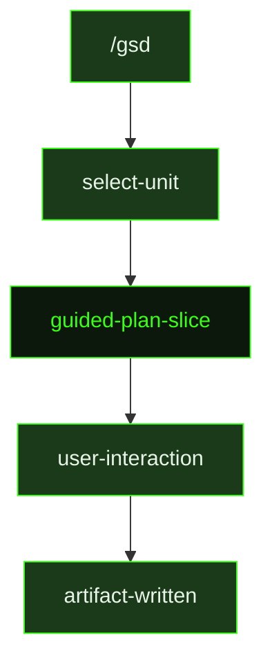

## What It Does

`guided-plan-slice` is the interactive counterpart to [`plan-slice`](../plan-slice/). In auto-mode, the planner reads research artifacts and writes a slice plan and task breakdown without pausing for input. The guided version works through the same decomposition process but invites the user into the loop — asking about scope tradeoffs, confirming task ordering, and surfacing places where the plan touches uncertain territory.

This is a compact dispatch wrapper — the guided session loads the same templates as auto-mode but adds interactive checkpoints. The source file is 3 lines, delegating directly to the same planning conventions and artifact format that `plan-slice` uses. The output (`{sliceId}-PLAN.md` and `T{n}-PLAN.md` files) is identical in structure.

## Pipeline Position

The `/gsd` command dispatches `guided-plan-slice` when the user selects a slice to plan interactively. The resulting plan files are identical in format to auto-mode outputs and can be executed by either guided or auto-mode task runners.

## Variables

| Variable | Description | Required |
|----------|-------------|----------|
| `sliceId` | Current slice identifier within the milestone (e.g. S01) | Yes |
| `sliceTitle` | Human-readable title of the slice being planned | Yes |
| `milestoneId` | Current milestone identifier (e.g. M001) | Yes |
| `inlinedTemplates` | Output template content inlined directly into the prompt | Yes |

## Used By

- [`/gsd`](../../commands/gsd/) — dispatched when the user selects a slice to plan in guided (interactive) mode
