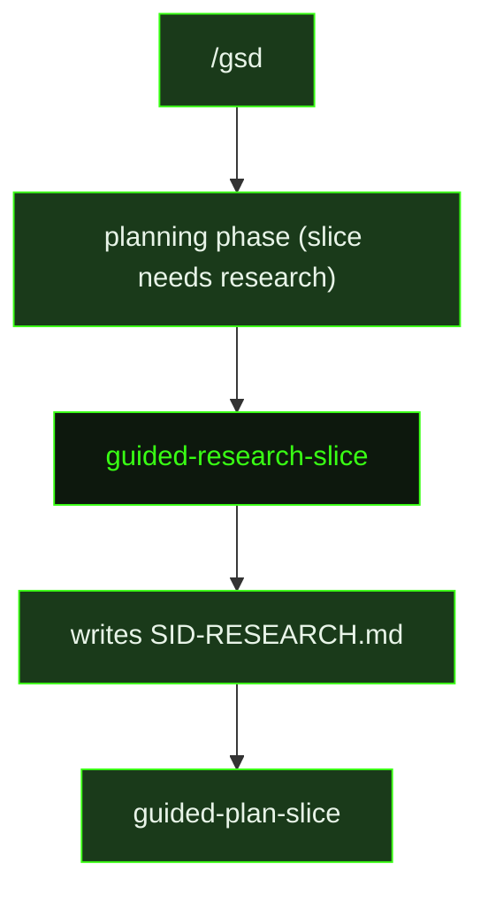

## What It Does

`guided-research-slice` is the in-conversation counterpart to [`research-slice`](../research-slice/). Where auto-mode dispatches research as an isolated sub-agent with pre-loaded context and depth calibration, the guided version runs directly in the user's active context window — making the exploration visible and interruptible. The user is present and can steer: pointing out relevant files, clarifying constraints, or stopping to redirect before the research artifact is written.

The prompt instructs the agent to read `.gsd/DECISIONS.md` and `.gsd/REQUIREMENTS.md` first, targeting research toward active requirements the slice owns. From there the agent explores relevant code using `rg`/`find` for targeted reads or `scout` for broader unfamiliar subsystems, and checks libraries with `resolve_library`/`get_library_docs` for anything not already used in the codebase.

A key framing distinguishes this prompt from raw exploration: **you are the scout, not the planner**. A planner agent reads the output in a fresh context to decompose the slice into tasks. The research document must be written for that planner — surfacing key files, where the work divides naturally, what to build first, and how to verify. If the research doc is vague, the planner re-explores code the scout already read; if it's precise, the planner decomposes immediately. This framing keeps the output decision-driving rather than just fact-collecting.

Rather than the elaborate depth-calibration and numbered steps of the auto-mode version, `guided-research-slice` uses five **Strategic Questions** to structure the agent's thinking: what to prove first, what existing patterns to reuse, what boundary contracts matter, what constraints the codebase imposes, and what failure modes should shape slice ordering. The result is a `{sliceId}-RESEARCH.md` file written to the slice directory, consumed by `guided-plan-slice` or `plan-slice` in the next step.

## Pipeline Position

When the user runs `/gsd` during the planning phase and selects **"Research slice first"** from the smart entry wizard (shown only when no `RESEARCH.md` exists yet), the guided flow dispatches `guided-research-slice` in the current conversation. Once the research artifact is written, the user can run `/gsd` again to proceed to planning, where `guided-plan-slice` consumes the `RESEARCH.md` output.

## Variables

| Variable | Description | Required |
|----------|-------------|----------|
| `sliceId` | Current slice identifier within the milestone (e.g. S01) | Yes |
| `sliceTitle` | Human-readable title of the slice being researched | Yes |
| `milestoneId` | Current milestone identifier (e.g. M001) | Yes |
| `skillActivation` | Injected skill-loading instruction block; activates skills relevant to the slice context | Yes |
| `inlinedTemplates` | Research output template content inlined directly into the prompt | Yes |

## Used By

- [`/gsd`](../../commands/gsd/) — dispatched when the user selects "Research first" during the planning phase of a slice
