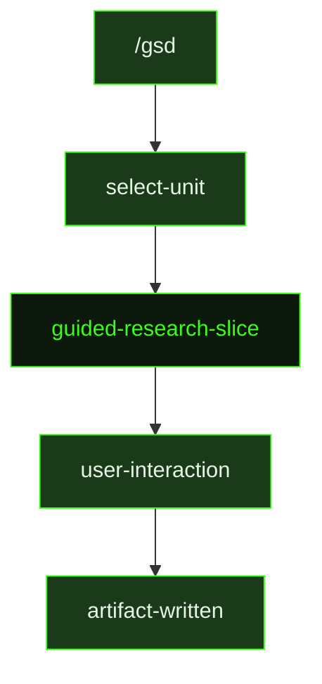

## What It Does

`guided-research-slice` is the interactive counterpart to [`research-slice`](../research-slice/). Where auto-mode explores the codebase and writes a research artifact without pausing, the guided version turns the exploration into a conversation. As the agent reads code and identifies unknowns, it asks the user targeted questions — about existing patterns to respect, risks that look significant, and constraints the codebase imposes — before writing the research output that a planner will consume.

The agent's goal is to be a scout: surface key files, where the work divides naturally, what to build first, and how to verify. In guided mode, the user can point the scout toward what they already know, saving exploration time and making the research output sharper. The agent is explicitly instructed to answer five strategic questions in its research: what should be proven first, what existing patterns to reuse, what boundary contracts matter, what constraints the codebase imposes, and what failure modes should shape slice ordering.

Like the auto-mode version, `guided-research-slice` reads `.gsd/DECISIONS.md` and `.gsd/REQUIREMENTS.md` at the start, targeting research toward active requirements the slice owns. The output is a `{sliceId}-RESEARCH.md` file written to the slice directory that feeds directly into planning.

## Pipeline Position

The `/gsd` command dispatches `guided-research-slice` when the user selects a slice to research interactively. The resulting research file is consumed by `guided-plan-slice` or `plan-slice` in the next step.

## Variables

| Variable | Description | Required |
|----------|-------------|----------|
| `sliceId` | Current slice identifier within the milestone (e.g. S01) | Yes |
| `sliceTitle` | Human-readable title of the slice being researched | Yes |
| `milestoneId` | Current milestone identifier (e.g. M001) | Yes |
| `inlinedTemplates` | Output template content inlined directly into the prompt | Yes |

## Used By

- [`/gsd`](../../commands/gsd/) — dispatched when the user selects a slice to research in guided (interactive) mode
