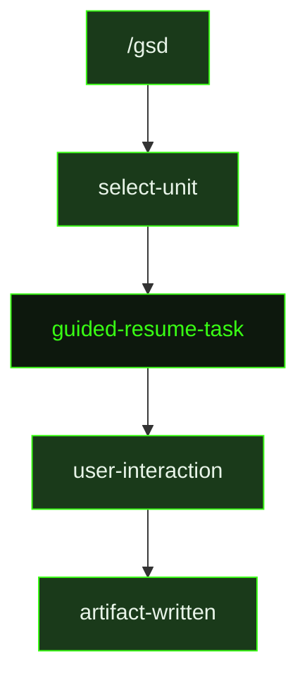

## What It Does

`guided-resume-task` is the interactive counterpart for resuming a partially completed task. Where auto-mode silently finds the continue file and picks up execution, the guided version surfaces what the continue file contains before resuming — giving the user a chance to understand where execution was interrupted, review any partial state, and decide whether to continue or redirect.

This is a compact dispatch wrapper — the guided session loads the same templates as auto-mode but adds interactive checkpoints. The source file is 1 line, delegating directly to the resume logic: find the continue file in the slice directory, read it, delete it, and proceed.

## Pipeline Position

The `/gsd` command dispatches `guided-resume-task` when interrupted work needs to be continued interactively. After resumption completes, the standard task summary artifact is written.

## Variables

| Variable | Description | Required |
|----------|-------------|----------|
| `sliceId` | Slice identifier where the continue file lives (e.g. S01) | Yes |
| `milestoneId` | Current milestone identifier (e.g. M001) | Yes |

## Used By

- [`/gsd`](../../commands/gsd/) — dispatched when the user chooses to resume an interrupted task in guided (interactive) mode
