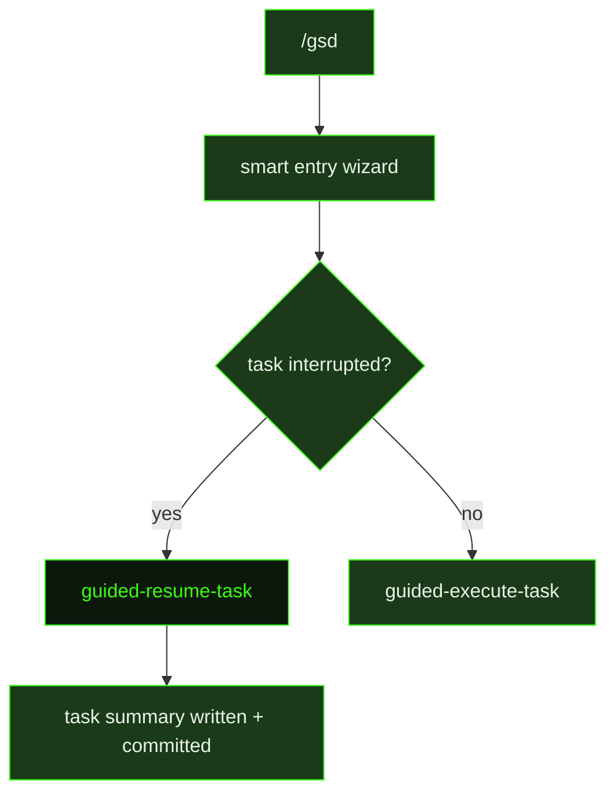

## What It Does

`guided-resume-task` is the guided (interactive) version of task resumption. Where auto-mode handles interrupted tasks by injecting a resume section into a new `execute-task` dispatch, the guided version is a dedicated prompt that runs in the user's active session — meaning every recovery step is visible, and the user can intervene if needed.

When dispatched, the prompt locates the continue file (`{{sliceId}}-CONTINUE.md` or `continue.md`) in the slice directory and reads it as the recovery contract for where to pick up. Before creating any expected artifact or output file, it checks whether the file already exists and reads it first — a prior session may have already started or partially completed that work. The continue file is **not** deleted immediately; it is retained until the task is successfully completed or a newer summary or continue artifact clearly supersedes it. If the resumed attempt fails again, the continue file is updated or replaced so that no recovery context is lost across retries.

Skill preferences are also respected: if a skill activation block is present in system context, the executor loads any matching skills during the resumed session, without relaxing verification or artifact requirements.

## Pipeline Position

```mermaid
flowchart TD
    GsdCommand["/gsd"] --> SmartEntry["smart entry wizard"]
    SmartEntry --> UserChoice{"task interrupted?"}
    UserChoice -->|"yes"| GuidedResumeTask["guided-resume-task"]
    UserChoice -->|"no"| GuidedExecuteTask["guided-execute-task"]
    GuidedResumeTask --> ArtifactWritten["task summary written + committed"]

    style GuidedResumeTask fill:#0d180d,stroke:#39ff14,color:#39ff14
    style GsdCommand fill:#1a3a1a,stroke:#39ff14,color:#e8f4e8
    style SmartEntry fill:#1a3a1a,stroke:#39ff14,color:#e8f4e8
    style UserChoice fill:#1a3a1a,stroke:#39ff14,color:#e8f4e8
    style GuidedExecuteTask fill:#1a3a1a,stroke:#39ff14,color:#e8f4e8
    style ArtifactWritten fill:#1a3a1a,stroke:#39ff14,color:#e8f4e8
```

`guided-resume-task` fires when the user runs `/gsd` and the smart entry wizard determines that the next task was previously interrupted — indicated by the presence of a continue file in the slice directory. If no continue file exists, the wizard dispatches [`guided-execute-task`](../guided-execute-task/) instead. After resumption completes, the standard task summary artifact is written and committed.

## Variables

| Variable | Description | Required |
|----------|-------------|----------|
| `sliceId` | Slice identifier where the continue file lives (e.g. S01) | Yes |
| `milestoneId` | Current milestone identifier (e.g. M001) | Yes |
| `skillActivation` | Injected skill-loading instruction block; activates any skills matching the current task context | Yes |

## Used By

- [`/gsd`](../../commands/gsd/) — dispatched when the smart entry wizard detects an interrupted task and the user is running in guided (interactive) mode
