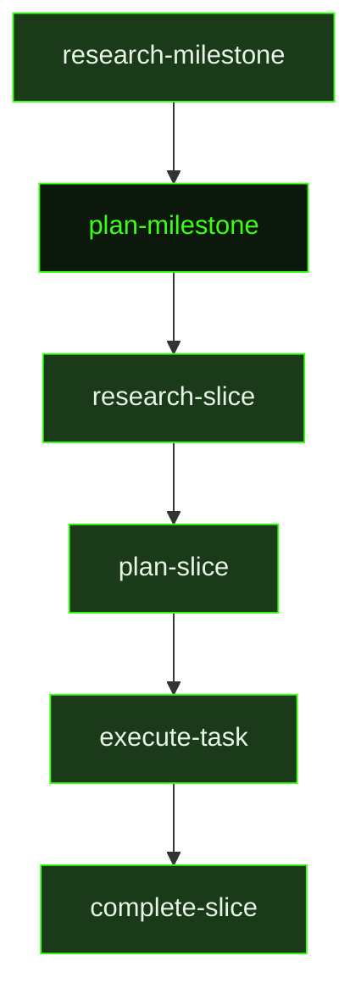

## What It Does

`plan-milestone` is the strategic planner that translates milestone research into a concrete, ordered roadmap. Before decomposing anything, it actively explores the codebase — using `rg`, `find`, and targeted reads for familiar codebases, or the `scout` tool for large unfamiliar ones — and pulls library docs for any unfamiliar dependencies. It also performs skill discovery and, when a `REQUIREMENTS.md` exists, analyses which active requirements are table stakes, likely omissions, overbuilt risks, or expected-but-missing behaviors. Research findings from [`research-milestone`](../research-milestone/) are trusted directly and redundant exploration is skipped.

Only after that groundwork does `plan-milestone` decompose the work into demoable vertical slices. Each slice must ship real user-facing functionality in a form that a stakeholder could actually see — not a terminal command, not a curl response, not a test run. The planner applies strict planning doctrines to prevent common decomposition failures: the earliest slices must prove the highest-risk paths through real working features (not spikes), every slice must be vertical and shippable, and the total number of slices must honestly match the milestone's ambition. A simple feature might be one slice; a milestone promising "core platform with auth, data model, and primary user loop" needs enough slices to deliver all three as working capabilities.

The planner writes `ROADMAP.md` with checkboxes, risk annotations, dependency declarations, demo sentences, proof strategies, verification classes, a milestone definition of done, and a requirement coverage summary. Every active requirement relevant to the milestone must end up mapped to a slice, explicitly deferred, blocked with a reason, or moved out of scope — silent orphaned requirements are a planning failure. The planner also populates `DECISIONS.md` for any structural choices made during planning (slice ordering rationale, technology choices, scope exclusions).

Beyond decomposition, `plan-milestone` handles two additional responsibilities. **Secret forecasting**: after writing the roadmap it scans boundary maps for external service dependencies (third-party APIs, OAuth providers, cloud credentials) and writes a secrets manifest — with direct dashboard URLs, key format hints, and step-by-step acquisition instructions — so secrets are ready before the first executor runs. **Single-slice fast path**: if the roadmap has only one slice, `plan-milestone` also writes the slice plan and all task plans in the same unit, eliminating a separate `research-slice` + `plan-slice` cycle for straightforward work.

## Pipeline Position

`plan-milestone` fires after `research-milestone` completes, or directly if research is skipped. The roadmap it writes — `ROADMAP.md` — is the document the auto-mode dispatcher reads to determine which slices exist, their ordering, their dependencies, and their completion state. Every subsequent dispatch decision in the pipeline flows from this file. Once the roadmap is written, the dispatcher moves into slice planning with `research-slice` for the first slice. When the single-slice fast path triggers, the dispatcher skips directly to the `executing` phase.

## Variables

| Variable | Description | Required |
|----------|-------------|----------|
| `milestoneId` | Current milestone identifier being planned | Yes |
| `milestoneTitle` | Human-readable title of the milestone being planned | Yes |
| `workingDirectory` | Absolute path to the project working directory | Yes |
| `inlinedContext` | Pre-assembled context block containing research summaries and existing project context for the planner | Yes |
| `skillDiscoveryMode` | Mode string controlling how skill discovery is performed (`auto`, `manual`, `skip`) | Yes |
| `skillDiscoveryInstructions` | Instructions for the planner on how to discover and evaluate relevant skills for this milestone | Yes |
| `skillActivation` | Injected skill-loading instruction block; activates any skills that match the current milestone planning context | Yes |
| `sourceFilePaths` | List of source file paths that are particularly relevant to this milestone's implementation scope | Yes |
| `researchOutputPath` | File path to the research document that informs this planning session | Yes |
| `outputPath` | File path where the completed ROADMAP.md should be written | Yes |
| `milestonePath` | File system path to the milestone directory (used by the single-slice fast path) | Yes |
| `secretsOutputPath` | File path where the secrets manifest should be written if external API keys are predicted | Yes |

## Used By

- [`/gsd auto`](../../commands/auto/) — dispatched after milestone research completes, in the `pre-planning` phase
