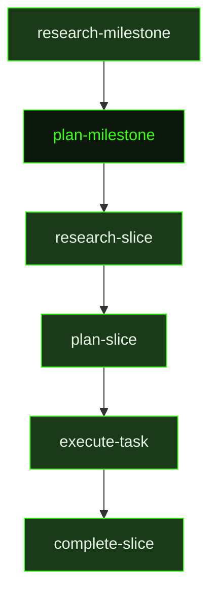

## What It Does

`plan-milestone` is the strategic planner that translates milestone research into a concrete, ordered roadmap. It receives the research document produced by [`research-milestone`](../research-milestone/) and uses it to decompose the work into demoable vertical slices — each shipping real user-facing functionality, ordered by risk so the hardest things are proven first.

The planner applies a set of planning doctrines that prevent common decomposition failures: every slice must be vertical and demoable (not just internal scaffolding), the earliest slices must prove the highest-risk paths through real working features rather than spikes or proofs of concept, and the overall number of slices must match the actual ambition of the milestone. A simple feature might be one slice. A milestone promising "core platform with auth, data model, and primary user loop" needs enough slices to deliver all three as working capabilities.

Beyond slice decomposition, `plan-milestone` also handles requirement mapping (every active requirement must be mapped to a slice, deferred, or explicitly excluded), secret forecasting (predicting which external API keys will be needed before the first task runs), and skill discovery. If the milestone requires only one slice, it takes a fast path and writes the slice plan and individual task plans in the same unit — eliminating a separate research-slice + plan-slice cycle.

## Pipeline Position

This prompt fires after `research-milestone` completes (or directly if research is skipped). The planner writes `ROADMAP.md` — the document that the auto-mode dispatcher reads to determine which slices exist, their ordering, their dependencies, and their completion state. Every subsequent dispatch decision in the pipeline flows from this file. Once the roadmap is written, the dispatcher moves into the slice planning phase with `research-slice` for the first slice.

## Variables

| Variable | Description | Required |
|----------|-------------|----------|
| `milestoneId` | Current milestone identifier being planned | Yes |
| `milestoneTitle` | Human-readable title of the milestone being planned | Yes |
| `workingDirectory` | Absolute path to the project working directory | Yes |
| `inlinedContext` | Pre-assembled context block containing research summaries and existing project context for the planner | Yes |
| `skillDiscoveryMode` | Mode string controlling how skill discovery is performed ('auto', 'manual', 'skip') | Yes |
| `skillDiscoveryInstructions` | Instructions for the planner on how to discover and evaluate relevant skills for this milestone | Yes |
| `skillActivation` | Injected skill-loading instruction block; activates any skills that match the current milestone planning context | Yes |
| `sourceFilePaths` | List of source file paths that are particularly relevant to this milestone's implementation scope | Yes |
| `researchOutputPath` | File path to the research document that informs this planning session | Yes |
| `outputPath` | File path where the completed milestone plan should be written | Yes |
| `milestonePath` | File system path to the milestone directory | Yes |
| `secretsOutputPath` | File path where any discovered secrets or sensitive configuration notes should be written | Yes |

## Used By

- [`/gsd auto`](../../commands/auto/) — dispatched after milestone research completes, in `pre-planning` phase
