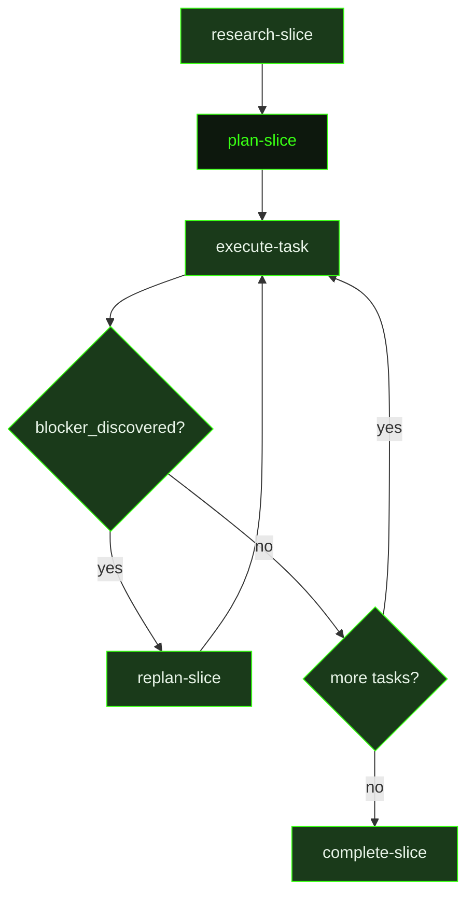

## What It Does

`plan-slice` turns a slice description — which might be a single line in the milestone roadmap — into a set of fully specified, executable task plans. Each task plan is sized to fit one context window, contains everything the executor agent needs (specific file paths, numbered steps, must-haves, verification commands, and expected output), and is ordered so that each task's output unblocks the next.

Before decomposing, the planner explores the relevant code to verify that the roadmap's assumptions still hold. Dependency summaries from completed slices are provided so the planner can account for constraints discovered during execution — prior summaries may contain **Forward Intelligence** sections that flag fragility, changed approaches, or hard-won gotchas this slice should watch out for. The planner adjusts its decomposition accordingly, rather than blindly following a roadmap description that may already be stale.

If `REQUIREMENTS.md` exists in the project, the planner identifies which Active requirements this slice owns and ensures every owned requirement has at least one task that directly advances it — verification must prove each requirement is met, not just that the task ran.

The resulting task plans are the primary contract for executor agents. Executors see only their task plan and a slice goal excerpt — they do not see the research document, the full roadmap, or requirements. Everything they need must be explicit in the task plan itself: which files to read, which files to write, what commands to run to verify success, and what "done" looks like as an observable, checkable condition. A vague task plan produces vague execution; a precise task plan produces precise execution. Critically, **Inputs and Expected Output fields must list concrete backtick-wrapped file paths** — these are machine-parsed to derive task dependencies, and vague prose without paths breaks parallel execution.

After writing the slice plan and individual task plans, the planner performs a mandatory self-audit: it walks each task to confirm completion semantics (if every task completed as written, would the slice goal actually be true?), requirement coverage, dependency ordering, key artifact links, and scope sanity. The scope sanity rule is concrete: target 2–5 steps and 3–8 files per task; 10+ steps or 12+ files requires a split. If any check fails, the planner fixes the plan files before finishing. If structural decisions were made during planning, they are appended to `.gsd/DECISIONS.md`.

## Pipeline Position

This prompt fires after `research-slice` completes. The planner writes the slice plan file (`S0x-PLAN.md`) and individual task plan files (`T01-PLAN.md`, `T02-PLAN.md`, etc.) into the slice's `tasks/` subdirectory. Once these are written, the dispatcher begins dispatching `execute-task` for each incomplete task in order. If any task reports `blocker_discovered: true`, the dispatcher fires `replan-slice` instead of continuing to the next task.

## Variables

| Variable | Description | Required |
|----------|-------------|----------|
| `sliceId` | Current slice identifier being planned (e.g. S01) | Yes |
| `sliceTitle` | Human-readable title of the slice being planned | Yes |
| `milestoneId` | Current milestone identifier | Yes |
| `workingDirectory` | Absolute path to the project working directory | Yes |
| `inlinedContext` | Pre-assembled context block containing research output and milestone context for the planner | Yes |
| `dependencySummaries` | Pre-assembled summaries of completed slices that this slice depends on, including Forward Intelligence sections | Yes |
| `sourceFilePaths` | List of source file paths particularly relevant to this slice's implementation scope | Yes |
| `executorContextConstraints` | Constraints and context limits that executor agents must respect when running tasks in this slice | Yes |
| `skillActivation` | Injected skill-loading instruction block; tells the planner which skills to record in each task plan's `skills_used` frontmatter | Yes |
| `outputPath` | File path where the completed slice plan (`S01-PLAN.md`) should be written | Yes |
| `slicePath` | File system path to the slice directory (tasks/ subdirectory already exists) | Yes |
| `commitInstruction` | Instruction block telling the planner how to commit the completed slice plan | Yes |

## Used By

- [`/gsd auto`](../../commands/auto/) — dispatched after slice research completes, transitioning the slice into `executing` phase
