## What It Does

`queue` is the ongoing intake mechanism for GSD projects. It runs when the user invokes `/gsd queue` to add new work to the project roadmap without starting a full interactive discussion. The user describes what they want to build in natural language, and the prompt structures it into a milestone context file that auto-mode can pick up when the current work completes.

The prompt begins with draft awareness — checking whether any previously queued milestones have `CONTEXT-DRAFT.md` files from prior multi-milestone discussions. If drafts exist, the prompt surfaces them and asks the user to either discuss them now (using the draft as seed material for a focused discussion) or leave them for a future session. Only after handling any drafts does it proceed to "What do you want to add?"

Once the user describes new work, the prompt investigates the codebase between question rounds to ground its questions in what actually exists. It applies careful dedup, extension, and dependency checks against the existing milestone list: is this already covered, should it extend an existing pending milestone rather than create a new one, and does it depend on in-progress work? It also checks `REQUIREMENTS.md` to determine whether the new work advances unmet Active requirements or promotes Deferred ones, and updates the requirement contract accordingly.

The output of a queue session is a `CONTEXT.md` file for each new milestone (written to `.gsd/milestones/<ID>/`), an updated `PROJECT.md`, an updated `QUEUE.md`, and any relevant `DECISIONS.md` entries. Critically, the prompt does not write roadmaps for queued milestones — roadmap planning happens when auto-mode reaches that milestone, ensuring plans are made close to when the work will actually start. Queue sessions end with "Queued N milestone(s). Auto-mode will pick them up after current work completes."

## Pipeline Position

```mermaid
flowchart LR
    QueueCommand["/gsd queue"] --> QueuePrompt["queue"]
    QueuePrompt --> Discussion["lightweight discussion"]
    Discussion --> ContextFile["CONTEXT.md written"]
    ContextFile --> ProjectUpdate["PROJECT.md + QUEUE.md updated"]
    ProjectUpdate --> AutoMode["auto-mode picks up when ready"]

    style QueuePrompt fill:#0d180d,stroke:#39ff14,color:#39ff14
    style QueueCommand fill:#1a3a1a,stroke:#39ff14,color:#e8f4e8
    style Discussion fill:#1a3a1a,stroke:#39ff14,color:#e8f4e8
    style ContextFile fill:#1a3a1a,stroke:#39ff14,color:#e8f4e8
    style ProjectUpdate fill:#1a3a1a,stroke:#39ff14,color:#e8f4e8
    style AutoMode fill:#1a3a1a,stroke:#39ff14,color:#e8f4e8
```

`queue` runs outside the auto-mode execution loop — it is invoked interactively by the user whenever new work needs to be added to the backlog. The context files it produces are consumed by auto-mode when earlier milestones complete and the dispatcher advances to the next queued unit.

## Variables

| Variable | Description | Required |
|----------|-------------|----------|
| `preamble` | Opening context describing the project and the scope of work to be queued | Yes |
| `existingMilestonesContext` | Summary of existing milestones in the roadmap for context when queuing new work | Yes |
| `commitInstruction` | Instruction telling the queue agent how to commit updated roadmap and milestone files | Yes |
| `inlinedTemplates` | Pre-assembled block of GSD roadmap and milestone templates for reference during queuing | Yes |

## Used By

- [`/gsd queue`](../../commands/queue/) — invoked to add new work items to the project roadmap via a lightweight natural-language intake session
