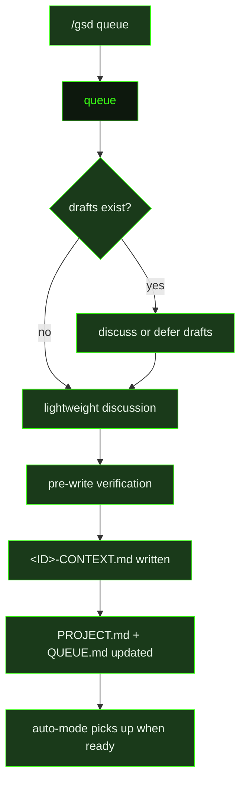

## What It Does

`queue` is the ongoing intake mechanism for GSD projects. It runs when the user invokes `/gsd queue` to add new work to the project roadmap without starting a full interactive discussion. The user describes what they want to build in natural language, and the prompt structures it into a milestone context file that auto-mode can pick up when the current work completes.

The prompt begins with **draft awareness** — checking whether any previously queued milestones have `CONTEXT-DRAFT.md` files from prior multi-milestone discussions where the user chose "Needs own discussion." If drafts exist, the prompt surfaces them and asks whether to discuss them now (using the draft as seed material for a focused discussion) or leave them for a future session. Only after resolving all drafts does it proceed to "What do you want to add?"

Once the user describes new work, the prompt **investigates between question rounds** to ground its questions in reality — checking library docs with `resolve_library` / `get_library_docs`, running web searches via `search-the-web` (and reading full pages with `fetch_page` when snippets aren't enough), and scouting the codebase with `ls`, `find`, `rg`, or broader exploration tools. This investigation surfaces technical unknowns, integration surfaces, and dependencies before questions are asked.

Before writing any context files, a **mandatory Pre-Write Verification** pass runs. First, the prompt reads the actual code for every module or file referenced in the context, checking for stale assumptions and phantom capabilities. Then it uses `ask_user_questions` (with an ID containing both `depth_verification` and the milestone ID) to present scope, verified assumptions, and surfaced risks to the user before writing. This per-milestone write-gate cannot be skipped — the system blocks `CONTEXT.md` writes until verification passes.

It also applies careful dedup, extension, and dependency checks against the existing milestone list: is this already covered, should it extend an existing pending milestone rather than create a new one, and does it depend on in-progress work? Before writing, it assesses whether the described work is **single-milestone** or **multi-milestone** in scope — if the work has natural phase boundaries or is too large to stay focused, it proposes the split to the user first. It checks `REQUIREMENTS.md` to determine whether the new work advances unmet Active requirements or promotes Deferred ones, and updates the requirement contract accordingly.

The output of a queue session is a `<ID>-CONTEXT.md` file for each new milestone (written to `.gsd/milestones/<ID>/`), where the milestone ID is generated by calling `gsd_milestone_generate_id` — IDs are never invented manually. Context files for milestones that depend on others include a `depends_on` YAML frontmatter field so auto-mode can enforce execution order. The session also produces an updated `PROJECT.md`, an updated `QUEUE.md`, and any relevant `DECISIONS.md` entries if discussion surfaced decisions relevant to existing work. Critically, the prompt does not write roadmaps for queued milestones — roadmap planning happens when auto-mode reaches that milestone, ensuring plans are made close to when the work will actually start. Queue sessions end with "Queued N milestone(s). Auto-mode will pick them up after current work completes."

## Pipeline Position

`queue` runs outside the auto-mode execution loop — it is invoked interactively by the user whenever new work needs to be added to the backlog. The context files it produces are consumed by auto-mode when earlier milestones complete and the dispatcher advances to the next queued unit. Milestones with `depends_on` frontmatter are held until their prerequisites complete, preventing out-of-order execution.

## Variables

| Variable | Description | Required |
|----------|-------------|----------|
| `preamble` | Opening context describing the project and the scope of work to be queued | Yes |
| `existingMilestonesContext` | Summary of existing milestones in the roadmap for context when queuing new work | Yes |
| `commitInstruction` | Instruction telling the queue agent how to commit updated roadmap and milestone files | Yes |
| `inlinedTemplates` | Pre-assembled block of GSD roadmap and milestone templates for reference during queuing | Yes |

## Used By

- [`/gsd queue`](../../commands/queue/) — invoked to add new work items to the project roadmap via a lightweight natural-language intake session
