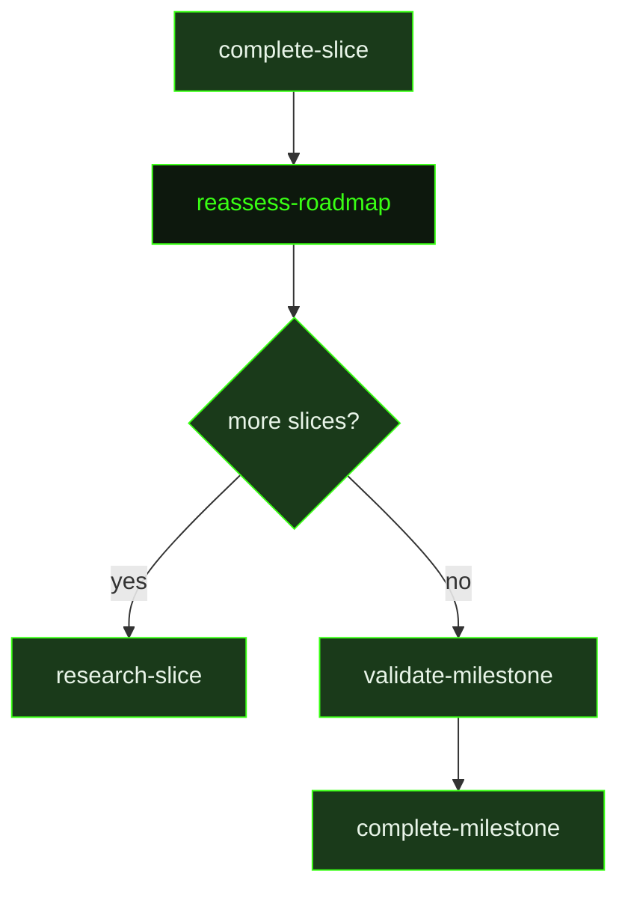

## What It Does

`reassess-roadmap` fires after every slice completes and asks a simple question: does the remaining plan still make sense? It reads the slice summary just written, compares it against the remaining unchecked slices in the roadmap, and evaluates whether any of the original assumptions have been invalidated by what execution actually revealed.

The assessment bias is strongly toward "roadmap is fine." Most of the time, the plan is still good, and the agent writes a brief confirmation and the pipeline moves on immediately. Changes are only warranted when there is concrete evidence — a prior slice changed an API surface that a later slice depends on, boundary contracts in the boundary map are no longer accurate, a risk was retired earlier than expected and a proof slice is now redundant, or a new risk emerged that should be addressed before the next planned slice.

Before deciding whether changes are needed, the agent runs a **success-criterion coverage check**: every criterion in the roadmap's `## Success Criteria` section must map to at least one remaining unchecked slice. Each criterion is mapped explicitly — covered ones list their owning slices, uncovered ones are flagged as blocking. If any criterion has no remaining owner after the proposed changes, it is a blocking issue the agent must resolve before finalizing. This prevents silent gaps where completing a slice leaves important outcomes unproven by anything downstream.

When changes are needed, the reassessment agent rewrites only the unchecked slices in the roadmap — completed slices are never modified. Along with the slice content, it updates the boundary map for changed slices and revises the proof strategy if the risk landscape shifted. If a `.gsd/REQUIREMENTS.md` file exists, it also evaluates requirement coverage and updates ownership or status if scope changed. Deferred captures — user thoughts captured during execution and held for future consideration — are also reviewed and may warrant slice adjustments, reordering, or new scope additions. The assessment document it writes is brief and concrete: what changed, why, and what the coverage impact is. The pipeline then continues with the next slice in the updated roadmap.

## Pipeline Position

This prompt fires after every `complete-slice` in the pipeline. It can be skipped entirely via the `skip_reassess` preference, in which case the dispatcher moves directly from `complete-slice` to the next `research-slice` (or to `validate-milestone` if all slices are done). When it does run, it writes an assessment document to disk — the dispatcher checks for this artifact before advancing the pipeline.

## Variables

| Variable | Description | Required |
|----------|-------------|----------|
| `milestoneId` | Current milestone identifier | Yes |
| `completedSliceId` | Identifier of the slice that was just completed, triggering this reassessment | Yes |
| `workingDirectory` | Absolute path to the project working directory | Yes |
| `inlinedContext` | Pre-assembled context block containing milestone status, roadmap state, and completion summaries | Yes |
| `deferredCaptures` | List of deferred capture items to consider when reassessing the roadmap priorities | Yes |
| `skillActivation` | Injected skill-loading instruction block; activates any skills relevant to the reassessment context | Yes |
| `assessmentPath` | File path where the roadmap reassessment document should be written | Yes |
| `roadmapPath` | File path to the project roadmap document being reassessed | Yes |
| `commitInstruction` | Instruction block telling the reassessment agent how to commit updated roadmap files | Yes |

## Used By

- [`/gsd auto`](../../commands/auto/) — dispatched after every `complete-slice`, between the end of one slice and the start of the next
