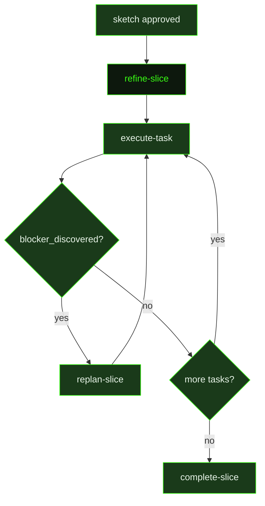

## What It Does

`refine-slice` is the planning step used when a slice was created from a sketch rather than from a blank planning pass. Where `plan-slice` operates from a roadmap entry and fresh research, `refine-slice` operates from a pre-approved sketch — a scoped description of what this slice should deliver — and must reconcile that sketch against the real outcomes of any slices that already completed. The sketch scope is a hard constraint; the prior slice summaries are the authoritative context.

Before decomposing, the refiner reads the summaries of dependency slices that have already shipped. These summaries often contain **Forward Intelligence** sections — hard-won knowledge about what's fragile, what assumptions changed, and what this slice should watch out for. Because the sketch was written before those slices ran, the resulting plan must reconcile against what was actually built, not what was originally anticipated. If an assumed module, type, or API has moved or changed shape, the task plans must reflect that reality.

If `REQUIREMENTS.md` exists, the refiner identifies which Active requirements the sketch says this slice owns and ensures every owned requirement has at least one task that directly advances it. Each task plan is sized to fit one context window and contains everything an executor agent needs: specific file paths, numbered steps, must-haves, verification commands, and expected output — with Inputs and Expected Output as concrete backtick-wrapped file paths, which are machine-parsed to derive task dependencies.

After decomposing, the refiner performs a mandatory self-audit: if every task completed exactly as written, would the slice goal actually be true? Every must-have maps to at least one task. Inputs and Expected Output are backtick-wrapped file paths. If any check fails, the plan is fixed before finishing. Structural decisions that diverge from the sketch are appended to `.gsd/DECISIONS.md`.

The refiner never calls `ask_user_questions` or `secure_env_collect` — it documents assumptions in the plan and proceeds autonomously. It **must** call `gsd_plan_slice` to persist state; the tool writes to the DB and renders the slice plan and individual task plans automatically. The on-disk plan file is the signal that clears the sketch flag on the next state derivation.

## Pipeline Position

`refine-slice` fires when a slice is in sketch state and the sketch has been approved. It replaces the `research-slice` → `plan-slice` sequence for sketch-originated slices: instead of open-ended research followed by fresh planning, the sketch provides the scoped boundary and prior slice summaries provide the ground truth. Once `gsd_plan_slice` is called successfully, the dispatcher begins dispatching `execute-task` for each incomplete task in order.

## Variables

| Variable | Description | Required |
|----------|-------------|----------|
| `sliceId` | Current slice identifier being refined (e.g. S01) | Yes |
| `sliceTitle` | Human-readable title of the slice being refined | Yes |
| `milestoneId` | Current milestone identifier | Yes |
| `workingDirectory` | Absolute path to the project working directory | Yes |
| `inlinedContext` | Pre-assembled context block containing the approved sketch and milestone context | Yes |
| `dependencySummaries` | Pre-assembled summaries of completed dependency slices, including Forward Intelligence sections | Yes |
| `sourceFilePaths` | List of source file paths particularly relevant to this slice's implementation scope | Yes |
| `executorContextConstraints` | Constraints and context limits that executor agents must respect when running tasks in this slice | Yes |
| `skillActivation` | Injected skill-loading instruction block; tells the refiner which skills to record in each task plan's `skills_used` frontmatter | Yes |
| `outputPath` | File path where the completed slice plan should be written | Yes |
| `slicePath` | File system path to the slice directory (tasks/ subdirectory already exists) | Yes |
| `commitInstruction` | Instruction block telling the refiner how to commit the completed slice plan | Yes |

## Used By

- [`/gsd auto`](../../commands/auto/) — dispatched when a slice originates from an approved sketch, in place of the `research-slice` → `plan-slice` sequence
