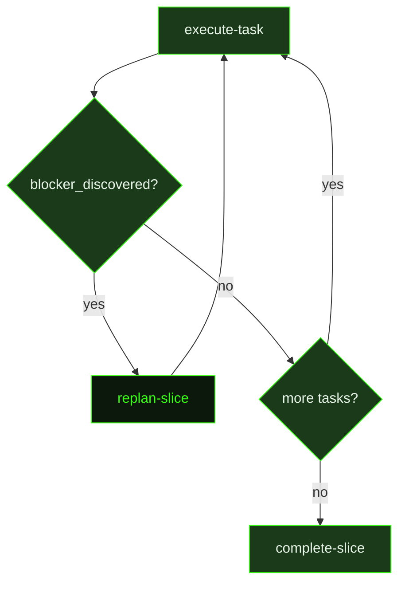

## What It Does

`replan-slice` fires when an executor task reports `blocker_discovered: true` — meaning the existing slice plan cannot continue as written. A blocker is not a bug or a minor deviation; it is a plan-invalidating finding: a wrong API, a missing capability, an architectural mismatch, or a constraint discovered during execution that makes the remaining tasks fundamentally invalid. When this happens, rather than re-dispatching the failing task or abandoning the slice, the dispatcher replans everything that hasn't been completed yet.

The replanner receives the full current slice state — the completed tasks (their summaries and `[x]` checkboxes), the incomplete tasks (their `[ ]` entries), the blocker task summary explaining what was discovered, and any user-captured thoughts that triggered or informed the replan. It reads all of this to understand exactly what the blocker is, then rewrites only the incomplete tasks to address it. Completed tasks are never modified — they are historical records.

The output is a two-part artifact: a `REPLAN.md` document explaining what changed and why, and an updated slice plan with the revised incomplete tasks. New task IDs continue from the highest existing ID to avoid renumbering conflicts. Once the replan is written, the dispatcher resumes `execute-task` dispatch from the first incomplete task in the updated plan.

## Pipeline Position

This prompt fires only on demand — when an executor explicitly signals a blocker. Most slices complete without ever triggering a replan. When it does fire, it sits between `execute-task` and the continuation of `execute-task`, acting as a correction gate that ensures future task dispatches are based on a plan that reflects reality rather than a now-invalid original design.

## Variables

| Variable | Description | Required |
|----------|-------------|----------|
| `sliceId` | Current slice identifier being replanned | Yes |
| `sliceTitle` | Human-readable title of the slice being replanned | Yes |
| `milestoneId` | Current milestone identifier | Yes |
| `workingDirectory` | Absolute path to the project working directory | Yes |
| `inlinedContext` | Pre-assembled context block containing the current slice state and blocker information | Yes |
| `captureContext` | Content or path of the blocker capture that triggered this slice replan | Yes |
| `replanPath` | File path where the new replanned slice plan should be written | Yes |
| `planPath` | File path to the existing slice plan that needs to be replanned | Yes |

## Used By

- [`/gsd auto`](../../commands/auto/) — dispatched only when an executor task signals `blocker_discovered: true` in its summary
