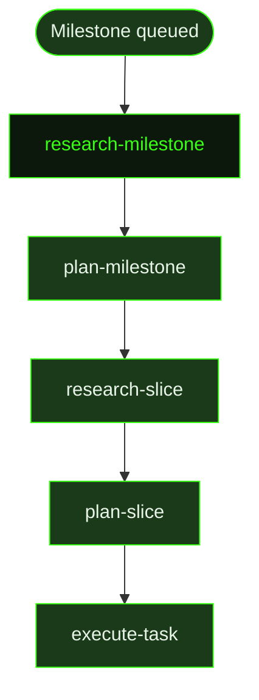

## What It Does

`research-milestone` is the first agent dispatched when a new milestone begins. Its job is to explore the codebase, understand what already exists, identify technology constraints, and assess where the real risks lie — then write a structured research document that the milestone planner reads to make decomposition decisions.

The researcher writes for the roadmap planner downstream. That planner needs to understand: what exists in the codebase, what technology choices matter, where the real risks are, and what the natural boundaries between slices should be. Then individual slice researchers and planners dive deeper into each slice. The research document sets the strategic direction for all of them.

The researcher calibrates effort to actual uncertainty. A milestone adding a small feature to an established codebase needs targeted research — check the relevant code using `rg` and `find`, confirm the approach, note constraints. A milestone introducing new technology, building a new system, or spanning multiple unfamiliar subsystems demands deep research — use `scout` to build a broad map efficiently before diving in, look up library docs with `resolve_library` and `get_library_docs`, and investigate alternatives. Only sections with real content are included; the template is not filled for its own sake.

Downstream agents depend heavily on this output. The `plan-milestone` agent reads the research document in a fresh context with no memory of the exploration phase. If the research doc is vague, the planner will waste context re-exploring code the researcher already read. If it is precise — specifying which files exist, what patterns are already established, where the natural seams are — the planner can decompose immediately and confidently.

The researcher answers a set of strategic questions: what should be proven first, what existing patterns should be reused, what boundary contracts matter, and where known failure modes should shape slice ordering. If a `.gsd/REQUIREMENTS.md` exists, the researcher evaluates it — identifying which active requirements are table stakes, likely omissions, or overbuilt risks — and surfaces candidate requirements rather than silently expanding scope. Research is advisory, not auto-binding.

## Pipeline Position

This prompt fires at the very beginning of the auto-mode pipeline, after a milestone context file exists but before any planning has occurred. The dispatcher evaluates the project state, determines that no research document exists for the active milestone, and dispatches `research-milestone`. Once the research document is written, the dispatcher moves on to [`plan-milestone`](../plan-milestone/).

This stage can be skipped entirely via the `skip_research` preference, in which case `plan-milestone` fires directly with no prior research context.

## Variables

| Variable | Description | Required |
|----------|-------------|----------|
| `milestoneId` | Current milestone identifier to research | Yes |
| `milestoneTitle` | Human-readable title of the milestone being researched | Yes |
| `workingDirectory` | Absolute path to the project working directory | Yes |
| `inlinedContext` | Pre-assembled context block containing existing project state and relevant prior research | Yes |
| `skillActivation` | Injected skill-loading instruction block; activates any skills relevant to the milestone domain before research begins | Yes |
| `skillDiscoveryMode` | Mode string controlling how skill discovery is performed ('auto', 'manual', 'skip') | Yes |
| `skillDiscoveryInstructions` | Instructions for the researcher on how to discover and evaluate relevant skills | Yes |
| `outputPath` | File path where the research document should be written | Yes |

## Used By

- [`/gsd auto`](../../commands/auto/) — dispatched as the first pipeline stage when a milestone enters `pre-planning` phase
