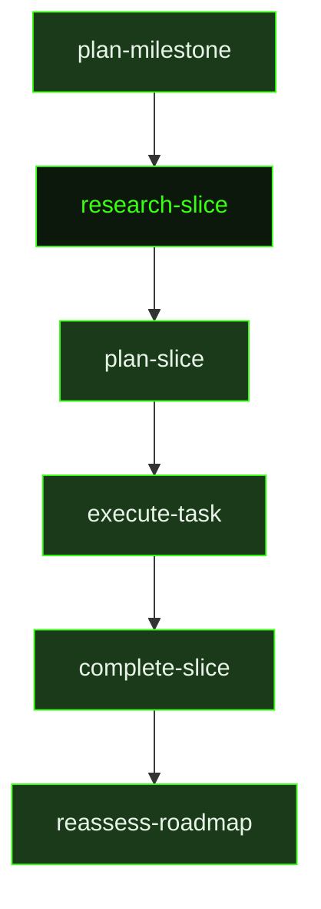

## What It Does

`research-slice` fires at the start of each slice's planning cycle. Where `research-milestone` establishes the strategic landscape, `research-slice` goes narrow and deep — its job is to map the specific files, patterns, and constraints relevant to the slice at hand so the planner can decompose into concrete tasks without having to re-explore.

The researcher calibrates depth to the actual complexity of the work. There are three modes: **deep research** for slices involving new technology, unfamiliar APIs, risky integrations, or genuinely ambiguous scope — the researcher explores broadly, looks up docs, and investigates multiple approaches; **targeted research** for known technology that's new to this codebase, or moderately complex integration; and **light research** for well-understood work using established patterns already present (wiring up existing APIs, adding standard UI components, CRUD operations, configuration changes). A light research doc can be 15–20 lines. An honest "this is straightforward, here's the pattern to follow" is more valuable than invented complexity.

Crucially, the output is written for the planner, not for a human reader. The planner agent receives this document in a fresh context with no memory of the exploration phase. It needs to know: which specific files exist and what they contain, where the natural seams are for dividing work into tasks, what should be built or proved first, and what commands or checks will verify the slice is complete. Precise answers to those four questions allow the planner to decompose immediately. Vague answers force costly re-exploration.

For broader or unfamiliar subsystems the researcher uses the `scout` tool to map the relevant area before reading specific files. For targeted exploration it uses `rg` and `find` directly. Library documentation is fetched via `resolve_library` / `get_library_docs` rather than web search, preserving the web search budget (capped at ~15 per session) for genuinely novel questions.

If `REQUIREMENTS.md` is preloaded into context, the researcher first identifies which active requirements this slice owns or supports, targeting all research toward risks, unknowns, and implementation constraints that could affect whether the slice actually delivers them.

## Pipeline Position

This prompt fires after `plan-milestone` (or after a roadmap reassessment points to the next slice) and before `plan-slice`. It reads the dependency summaries from previously completed slices — particularly their **Forward Intelligence** sections, which contain hard-won knowledge about what's fragile, what assumptions changed, and what constraints emerged during execution. The research document it writes becomes the primary input for [`plan-slice`](../plan-slice/).

This stage can be skipped via the `skip_research` or `skip_slice_research` preferences. When skipped, `plan-slice` fires directly with only the milestone context and dependency summaries as input.

## Variables

| Variable | Description | Required |
|----------|-------------|----------|
| `sliceId` | Current slice identifier to research | Yes |
| `sliceTitle` | Human-readable title of the slice being researched | Yes |
| `milestoneId` | Current milestone identifier | Yes |
| `workingDirectory` | Absolute path to the project working directory | Yes |
| `inlinedContext` | Pre-assembled context block containing milestone context and relevant prior artifacts | Yes |
| `dependencySummaries` | Pre-assembled summaries of completed slices that this slice depends on | Yes |
| `skillActivation` | Injected skill-loading instruction block; activates any skills relevant to this slice's research | Yes |
| `skillDiscoveryMode` | Mode string controlling how skill discovery is performed (`auto`, `manual`, `skip`) | Yes |
| `skillDiscoveryInstructions` | Instructions for the researcher on how to discover and evaluate relevant skills | Yes |
| `outputPath` | File path where the slice research document should be written | Yes |
| `slicePath` | File system path to the slice directory | Yes |

## Used By

- [`/gsd auto`](../../commands/auto/) — dispatched at the start of each slice's planning cycle in `planning` phase
