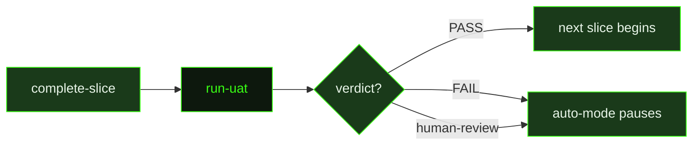

## What It Does

`run-uat` is the slice-level acceptance testing agent in the auto-mode pipeline. It runs after a slice completes and before the next slice begins, giving the system a structured opportunity to verify that what was built actually meets the slice's acceptance criteria. The prompt receives all relevant context pre-loaded — slice artifacts, implementation details, the UAT specification file, and metadata about what type of test to run — so it can begin working immediately without re-reading planning files.

The prompt handles two distinct UAT modes. For `artifact-driven` UAT, the prompt acts as an automated test runner: it executes every check defined in the UAT file directly — shell commands, `grep` checks, file reads, script invocations — records the actual result and a PASS or FAIL verdict for each, and computes an overall `PASS`, `FAIL`, or `PARTIAL` verdict. For other UAT types (live-runtime tests, visual verification, manual flows), the prompt cannot mechanically execute the checks and instead writes a structured "surfaced for human review" result, pausing auto-mode so the user can perform the UAT manually. Either way, the result file is always written to `uatResultPath`.

The written result file follows a fixed schema: YAML frontmatter with `sliceId`, `uatType`, `verdict`, and `date`; a checks table with description, result, and notes for each check; and an overall verdict with summary. This structured format ensures the dispatcher can mechanically read the verdict and decide whether to advance to the next slice, pause for human review, or surface a failure for investigation.

## Pipeline Position

`run-uat` is dispatched by auto-mode as a post-slice validation step, not as part of the main task execution pipeline. It runs once per slice that has a UAT specification file, bridging `complete-slice` and the beginning of the next research-plan-execute cycle.

## Variables

| Variable | Description | Required |
|----------|-------------|----------|
| `milestoneId` | Current milestone identifier | Yes |
| `sliceId` | Current slice identifier being tested | Yes |
| `workingDirectory` | Absolute path to the project working directory | Yes |
| `inlinedContext` | Pre-assembled context block containing slice artifacts and implementation details for UAT | Yes |
| `uatPath` | File path to the UAT specification document | Yes |
| `uatType` | Type of UAT being run (e.g. 'smoke', 'full', 'regression') | Yes |
| `uatResultPath` | File path where UAT results should be written | Yes |

## Used By

- [`/gsd auto`](../../commands/auto/) — dispatched as a post-slice validation step when a UAT specification file exists for the completed slice
