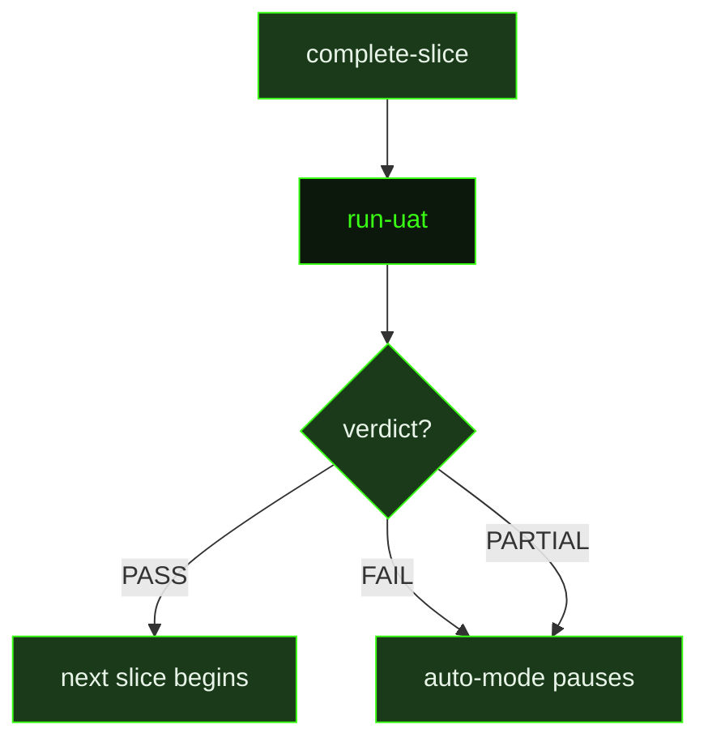

## What It Does

`run-uat` is the slice-level acceptance testing agent in the auto-mode pipeline. It runs after a slice completes and before the next slice begins, giving the system a structured opportunity to verify that what was built actually meets the slice's acceptance criteria. The prompt receives all relevant context pre-loaded — slice artifacts, implementation details, the UAT specification file, skill activations, and metadata about what type of test to run — so it can begin working immediately without re-reading planning files.

The prompt handles six distinct UAT modes, each with different automation rules:

- **`artifact-driven`** — verifies with shell commands, scripts, file reads, and artifact structure checks.
- **`browser-executable`** — uses browser tools to navigate to a target URL, verify expected behavior, and capture screenshots as evidence.
- **`runtime-executable`** — executes a specified command or script, captures stdout/stderr, and records pass/fail based on exit code and output.
- **`live-runtime`** — exercises the real runtime path by starting or connecting to the app/service and verifying observable behavior.
- **`mixed`** — runs all automatable artifact-driven and live-runtime checks, then separates any remaining human-only checks explicitly.
- **`human-experience`** — automates setup, preconditions, screenshots, and objective checks, but marks taste-based or experiential checks as `NEEDS-HUMAN` rather than inventing subjective PASS results.

For each check the prompt records a description, the evidence mode used (`artifact`, `runtime`, or `human-follow-up`), the command or action taken, the actual result observed, and a per-check verdict of `PASS`, `FAIL`, or `NEEDS-HUMAN`.

After running all checks, an overall verdict is computed: `PASS` if all required checks passed, `FAIL` if any check failed, or `PARTIAL` if some checks were skipped, inconclusive, or still require human judgment. The result is always written to `uatResultPath` in a fixed schema — YAML frontmatter with `sliceId`, `uatType`, `verdict`, and `date`; a checks table; and an overall verdict with summary. This structured format lets the dispatcher mechanically read the verdict and decide whether to advance to the next slice or pause for human review.

## Pipeline Position

`run-uat` is dispatched by auto-mode as a post-slice validation step, not as part of the main task execution pipeline. It runs once per slice that has a UAT specification file, bridging `complete-slice` and the beginning of the next research-plan-execute cycle. A `PARTIAL` verdict — indicating `NEEDS-HUMAN` checks that cannot be mechanically verified — pauses auto-mode in the same way a `FAIL` does, surfacing the remaining checks for the user to perform manually.

## Variables

| Variable | Description | Required |
|----------|-------------|----------|
| `milestoneId` | Current milestone identifier | Yes |
| `sliceId` | Current slice identifier being tested | Yes |
| `workingDirectory` | Absolute path to the project working directory | Yes |
| `inlinedContext` | Pre-assembled context block containing slice artifacts and implementation details for UAT | Yes |
| `skillActivation` | Injected skill-loading instruction block; activates any skills that match the current UAT context | Yes |
| `uatPath` | File path to the UAT specification document | Yes |
| `uatResultPath` | File path where UAT results should be written | Yes |
| `uatType` | Automation mode for this UAT run — one of `artifact-driven`, `browser-executable`, `runtime-executable`, `live-runtime`, `mixed`, or `human-experience` | Yes |

## Used By

- [`/gsd auto`](../../commands/auto/) — dispatched as a post-slice validation step when a UAT specification file exists for the completed slice
