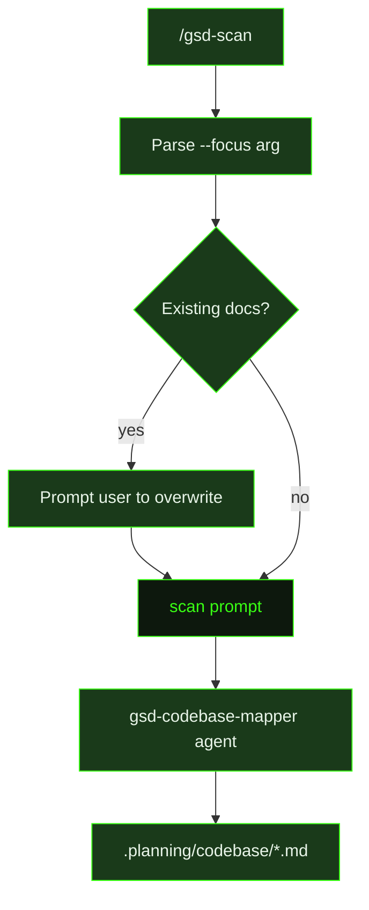

## What It Does

`scan` is the executor prompt behind the `/gsd-scan` skill. It dispatches a single `gsd-codebase-mapper` agent to explore the codebase and produce a small, focused set of structured Markdown documents in `.planning/codebase/`. Every run targets exactly one focus area — `tech`, `arch`, `quality`, `concerns`, or the default `tech+arch` — and writes only the documents that area calls for.

Unlike the full `/gsd-map-codebase` command (which runs four parallel focus areas), `scan` is intentionally lightweight: one agent, one focus, targeted output. This makes it useful when you need a fast read on a specific dimension of a codebase without triggering a full audit.

The mapper agent receives a clear brief: the focus area, the list of documents to produce, and the output directory. It explores the codebase, then writes each document as a clean, standalone Markdown file — factual, scannable, and grounded in what it observes rather than what might be ideal. Source files are never modified.

The seven possible output documents each have a defined schema:

- **STACK.md** — languages, runtimes, frameworks, build tools, package manager
- **INTEGRATIONS.md** — third-party APIs, databases, auth providers, infrastructure, communication services
- **ARCHITECTURE.md** — architectural style, core data flow, design patterns, module boundaries
- **STRUCTURE.md** — top-level directory layout, source and test organization, config file locations
- **CONVENTIONS.md** — naming conventions, code style, import/export patterns, error handling, language-specific conventions
- **TESTING.md** — test frameworks, file naming and location, helpers and fixtures, coverage requirements, how to run tests
- **CONCERNS.md** — technical debt, fragile code, missing coverage, outdated dependencies, performance and security risks

The focus-to-document mapping is fixed:

| Focus | Documents Produced |
|-------|-------------------|
| `tech` | STACK.md, INTEGRATIONS.md |
| `arch` | ARCHITECTURE.md, STRUCTURE.md |
| `quality` | CONVENTIONS.md, TESTING.md |
| `concerns` | CONCERNS.md |
| `tech+arch` | STACK.md, INTEGRATIONS.md, ARCHITECTURE.md, STRUCTURE.md |

Before spawning the agent, the skill checks whether any target documents already exist and prompts the user to confirm before overwriting.

## Pipeline Position

`scan` fires once per `/gsd-scan` invocation. The skill resolves the focus area, checks for existing documents, creates `.planning/codebase/` if needed, then dispatches the prompt. The prompt in turn drives a single `gsd-codebase-mapper` agent and reports back with the names and line counts of documents written.

## Variables

| Variable | Description | Required |
|----------|-------------|----------|
| `focus` | The focus area to scan (`tech`, `arch`, `quality`, `concerns`, or `tech+arch`) | Yes |
| `documents` | Comma-separated list of document names to produce for the selected focus | Yes |
| `outputDir` | Directory where output documents will be written (typically `.planning/codebase`) | Yes |
| `workingDirectory` | Absolute path to the project working directory | Yes |
| `skillActivation` | Injected skill-loading instruction block; activates any skills matching the current task context | Yes |

## Used By

- [`/gsd-scan`](../../commands/scan/) — the primary entry point; parses `--focus`, checks for existing docs, then dispatches this prompt with a `gsd-codebase-mapper` agent
