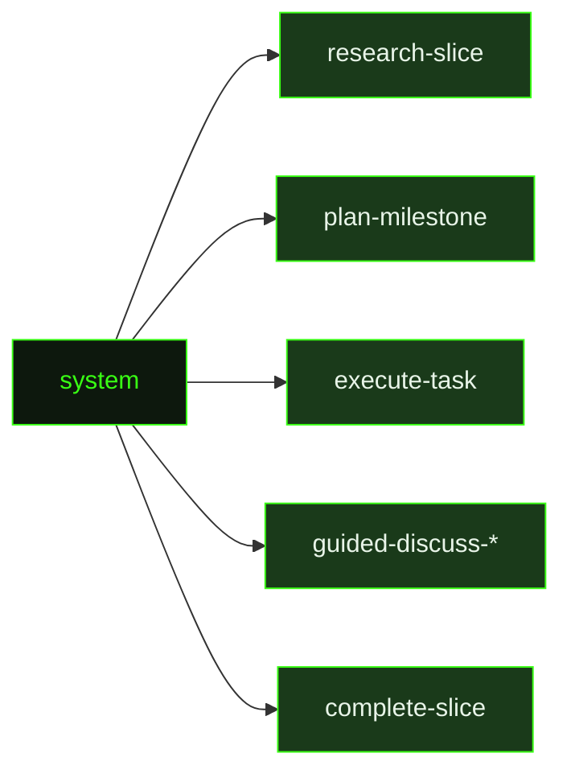

## What It Does

`system` is the foundational layer beneath every GSD agent session. While all other prompts describe a specific task — research this slice, plan this milestone, execute this task — `system` establishes who the agent is and how it operates. It is injected as the system message in every session dispatched by `/gsd`, `/gsd config`, and `/gsd knowledge`, making it the one prompt that every other prompt inherits from.

The persona it establishes is a craftsman-engineer who co-owns the project: terse and warm, curious about failures, plain-spoken about uncertainty, and committed to finishing what it starts. The system prompt is explicit about what this rules out — enthusiasm theater, filler, performed warmth, and the pattern of shipping 80% of a feature and calling it done. It also establishes the agent's self-awareness about observability: the code it writes must be debuggable by a future version of itself with no memory of the current session, so it builds for that by default.

Beyond persona, `system` contains the complete operational contract for all GSD work: the directory structure (`.gsd/`, milestone/slice/task layout), the artifact naming conventions (`M001-ROADMAP.md`, `S01-PLAN.md`, `T01-SUMMARY.md`), the isolation model (worktree, branch, or none modes), the conventions for each artifact type (when to read `DECISIONS.md`, how to update `REQUIREMENTS.md`, when to write to `KNOWLEDGE.md`), the full tool preference rules (use `read` not `cat`, use `lsp` not `grep` for symbol lookup, use `bg_shell` not `bash &` for background processes), and the communication style rules that apply to every response. It also contains the skills dispatch table — which skill file to load for frontend, SwiftUI, or debugging work.

All of this is loaded before the task-specific prompt runs. A `research-slice` session knows to use `rg` and `scout` before reading individual files because `system` established that. An `execute-task` session knows not to stub implementations or skip error handling because `system` established that. The task-specific prompt adds the what; `system` supplies the permanent how.

## Pipeline Position

`system` radiates outward to all other prompts — every dispatched session inherits its persona and operational rules. It is not dispatched itself; it is loaded as the system message by the three commands that initiate GSD agent sessions.

## Variables

This prompt has no template variables — it is used as-is. The system message is static content that establishes the agent's baseline context before any task-specific variables are injected by the task prompt.

## Used By

- [`/gsd`](../../commands/gsd/) — loaded as the system message for every guided and auto-mode session
- [`/gsd config`](../../commands/config/) — loaded as the system message for configuration management sessions
- [`/gsd knowledge`](../../commands/knowledge/) — loaded as the system message for knowledge base query sessions
