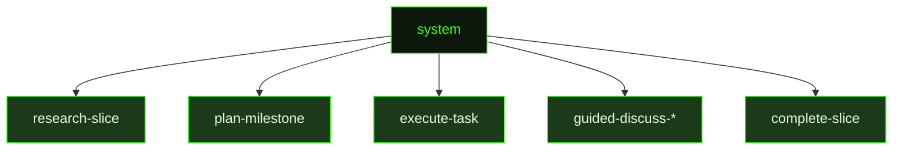

## What It Does

`system` is the foundational layer beneath every GSD agent session. While all other prompts describe a specific task — research this slice, plan this milestone, execute this task — `system` establishes who the agent is and how it operates. It is injected as the system message in every session dispatched by GSD commands, making it the one prompt that every other prompt inherits from.

The persona it establishes is a craftsman-engineer who co-owns the project: terse and warm, curious about failures, plain-spoken about uncertainty, and committed to finishing what it starts. The system prompt is explicit about what this rules out — enthusiasm theater, filler, performed warmth, and the pattern of shipping 80% of a feature and calling it done. It also establishes the agent's self-awareness about observability: the code it writes must be debuggable by a future version of itself with no memory of the current session, so it builds for that by default.

Beyond persona, `system` contains the complete operational contract for all GSD work: the directory structure (`.gsd/`, milestone/slice/task layout), the artifact naming conventions (`M001-ROADMAP.md`, `S01-PLAN.md`, `T01-SUMMARY.md`), the isolation model (worktree, branch, or none modes), and the conventions for each artifact type — when to read `DECISIONS.md`, how to update `REQUIREMENTS.md`, when to append to `KNOWLEDGE.md`, how to treat `OVERRIDES.md` and `QUEUE.md`. It also covers `CODEBASE.md` (a generated structural cache auto-refreshed when tracked files change), `CONTEXT.md` files at the milestone and slice level (the authoritative source for scope, goals, and constraints when present), and `S01-UAT.md` (the acceptance test record produced at slice completion). The full directory tree includes system-managed directories for dispatch state (`runtime/`), execution logs (`activity/`), and worktree checkouts (`worktrees/`).

The system prompt contains the full tool preference rules: use `read` not `cat` for file inspection, use `lsp` not `grep` for symbol lookup, use `bg_shell` not `bash &` for background processes, use `async_bash` with `await_job` for builds and tests, and `cancel_job` before re-running after source changes. It also covers the database access rule: never query `.gsd/gsd.db` directly via `sqlite3` or raw Node — the DB uses a single-writer WAL connection managed by the engine, so all reads and writes must go through `gsd_*` tools exclusively.

The Hard Rules section is particularly significant: it covers secrets handling (`secure_env_collect`, never print credential values), and the requirement that external-facing GitHub actions — creating issues, merging PRs, posting comments, pushing to remote branches — require explicit user confirmation before execution. This rule applies to any outward-facing action on any external service, not just GitHub. Read-only operations are always fine; writes require a clear "yes" from the user first. The rule is non-bypassable: a missing "yes" is a "no."

`system` also contains the skills dispatch table — a rendered table of bundled skills, loaded at injection time, that tells the agent which skill file to load for frontend, debugging, and other domain work.

All of this is loaded before the task-specific prompt runs. A `research-slice` session knows to use `rg` and `scout` before reading individual files because `system` established that. An `execute-task` session knows not to stub implementations or skip error handling because `system` established that. The task-specific prompt adds the what; `system` supplies the permanent how.

## Pipeline Position

```mermaid
flowchart TD
    SystemPrompt["system"]
    SystemPrompt --> ResearchSlice["research-slice"]
    SystemPrompt --> PlanMilestone["plan-milestone"]
    SystemPrompt --> ExecuteTask["execute-task"]
    SystemPrompt --> GuidedDiscuss["guided-discuss-*"]
    SystemPrompt --> CompleteSlice["complete-slice"]

    style SystemPrompt fill:#0d180d,stroke:#39ff14,color:#39ff14
    style ResearchSlice fill:#1a3a1a,stroke:#39ff14,color:#e8f4e8
    style PlanMilestone fill:#1a3a1a,stroke:#39ff14,color:#e8f4e8
    style ExecuteTask fill:#1a3a1a,stroke:#39ff14,color:#e8f4e8
    style GuidedDiscuss fill:#1a3a1a,stroke:#39ff14,color:#e8f4e8
    style CompleteSlice fill:#1a3a1a,stroke:#39ff14,color:#e8f4e8
```

`system` radiates outward to all other prompts — every dispatched session inherits its persona and operational rules. It is not dispatched itself; it is assembled and injected as the system message by the dispatcher before any task-specific prompt runs.

## Variables

| Variable | Description | Required |
|----------|-------------|----------|
| `bundledSkillsTable` | Rendered table of bundled skills available to the agent, used to populate the Skills section so the agent knows which skill files to load for frontend, debugging, and other domain work | Yes |
| `templatesDir` | Absolute path to the artifact templates directory, injected so the agent can read the correct template before writing any roadmap, plan, or summary artifact | Yes |
| `shortcutDashboard` | Keyboard shortcut string for toggling the GSD dashboard overlay, injected into the Commands reference section | Yes |
| `shortcutShell` | Keyboard shortcut string for showing shell processes, injected into the Commands reference section | Yes |

## Used By

- [`/gsd`](../../commands/gsd/) — loaded as the system message for every guided and auto-mode session
- [`/gsd auto`](../../commands/auto/) — loaded as the system message for every agent session dispatched during auto-mode execution
- [`/gsd quick`](../../commands/quick/) — loaded as the system message for quick task execution sessions
