## What It Does

`triage-captures` processes the backlog of user-captured thoughts accumulated during a GSD execution session. When a user runs `/gsd capture` during work, the capture is logged to `CAPTURES.md` with a pending status. This prompt runs when the user invokes `/gsd triage` or when `/gsd capture` triggers an automatic triage — reading the full pending list and classifying each item against the current slice plan and roadmap.

Each capture is evaluated against five classification criteria. A **quick-task** is small and self-contained — fixable in minutes without modifying the plan. An **inject** belongs in the current slice but wasn't planned, requiring a new task entry. A **defer** belongs in a future slice or milestone. A **replan** changes the shape of remaining incomplete tasks in the current slice, not just adds to them. A **note** is informational with no action required. The prompt applies decision guidelines to choose the least disruptive classification: `inject` over `replan` when only a new task is needed, `defer` over `inject` when the work doesn't belong in the current slice's scope, and `note` or `defer` are auto-confirmed without asking.

After classifying, the prompt presents its proposals to the user via `ask_user_questions` for any quick-task, inject, or replan items. Once confirmed, it updates `CAPTURES.md` for each capture — setting `Status: resolved`, adding the confirmed classification, resolution description, rationale, and a timestamp. Critically, the prompt does NOT execute any resolutions: quick-tasks are not run, injected tasks are not added. Execution happens separately, keeping the triage step focused and auditable.

## Pipeline Position

```mermaid
flowchart LR
    CaptureCommand["/gsd capture or triage"] --> TriageCaptures["triage-captures"]
    TriageCaptures --> Classification["classify each capture"]
    Classification --> UserConfirm["user confirms proposals"]
    UserConfirm --> UpdateCaptures["CAPTURES.md updated"]
    UpdateCaptures --> ExecutionPending["resolutions queued for execution"]

    style TriageCaptures fill:#0d180d,stroke:#39ff14,color:#39ff14
    style CaptureCommand fill:#1a3a1a,stroke:#39ff14,color:#e8f4e8
    style Classification fill:#1a3a1a,stroke:#39ff14,color:#e8f4e8
    style UserConfirm fill:#1a3a1a,stroke:#39ff14,color:#e8f4e8
    style UpdateCaptures fill:#1a3a1a,stroke:#39ff14,color:#e8f4e8
    style ExecutionPending fill:#1a3a1a,stroke:#39ff14,color:#e8f4e8
```

`triage-captures` runs outside the auto-mode pipeline. It is invoked interactively whenever captures have accumulated, giving the user visibility into informal thoughts captured during work before they decide how to act on them.

## Variables

| Variable | Description | Required |
|----------|-------------|----------|
| `pendingCaptures` | List of pending capture items to be triaged and prioritized | Yes |
| `currentPlan` | Current project plan or roadmap content for context during capture triage | Yes |
| `roadmapContext` | Roadmap context content providing project state for intelligent triage decisions | Yes |

## Used By

- [`/gsd capture`](../../commands/capture/) — triggers triage automatically when captures accumulate past a threshold
- [`/gsd triage`](../../commands/triage/) — explicit triage invocation; processes all pending captures in `CAPTURES.md`
