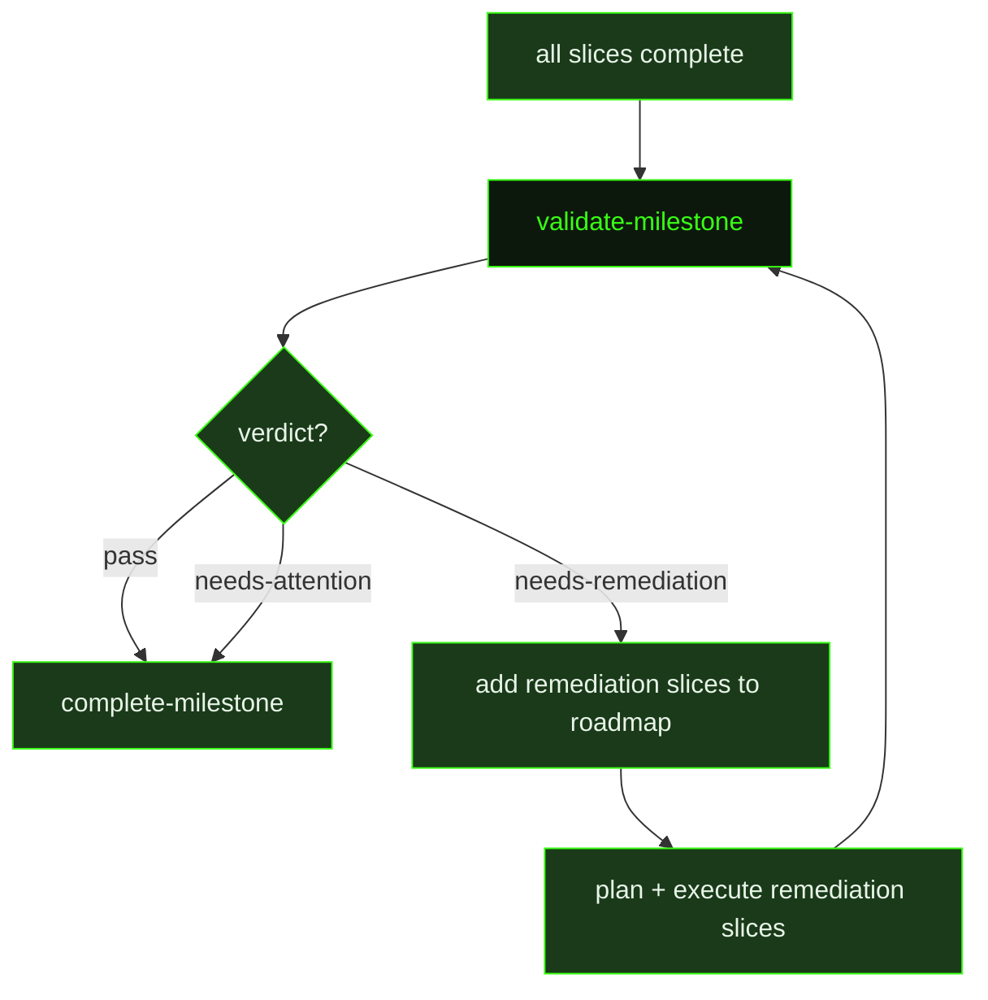

## What It Does

`validate-milestone` sits between all-slices-complete and milestone-completion as an explicit quality gate. Its job is not to re-execute work, but to audit what was delivered against what was promised. For every success criterion in the milestone roadmap, it checks whether the slice summaries and UAT results provide evidence that the criterion was actually met. For every slice, it checks whether the delivery claim in the roadmap matches what the slice summary reports. It also verifies cross-slice integration points — confirming that boundary map `produces`/`consumes` entries align with what was actually built.

The validator's verdict determines what happens next. A `pass` verdict means all criteria are met, all slices delivered, and no integration gaps exist — the pipeline advances to `complete-milestone`. A `needs-attention` verdict means minor gaps exist that do not block completion but should be documented. A `needs-remediation` verdict means material gaps were found — the validator adds new remediation slices to the roadmap, those slices are planned and executed, and then validation re-runs as a new remediation round.

This prompt is designed to catch the failure mode where individual tasks and slices all pass their own verification but the assembled milestone as a whole does not deliver its promised user-facing capability. It is also the check that ensures requirement coverage — every active requirement must be addressed by at least one slice by the time this gate runs. All context (roadmap, slice summaries, UAT results, requirements, decisions, project context) is preloaded inline so the validator can start working immediately without re-reading files. The validation pass is the last substantive review before the milestone branch is merged and the worktree is torn down.

## Pipeline Position

This prompt fires after all planned slices are complete. The `remediationRound` variable tracks how many validation cycles have run — on the first pass it is `0`, and it increments with each `needs-remediation` verdict. When remediation slices are added, they are planned and executed before validation re-runs with an incremented round number. The validation can be skipped entirely via the `skip_milestone_validation` preference, in which case `complete-milestone` fires directly.

The output is a structured validation report written to `{{validationPath}}` containing a success criteria checklist, a slice delivery audit table, cross-slice integration findings, requirement coverage check, verdict rationale, and (if needed) a remediation plan listing new slices to add to the roadmap.

## Variables

| Variable | Description | Required |
|----------|-------------|----------|
| `milestoneId` | Current milestone identifier being validated | Yes |
| `milestoneTitle` | Human-readable title of the milestone being validated | Yes |
| `workingDirectory` | Absolute path to the project working directory | Yes |
| `remediationRound` | Current remediation attempt number — `0` on first pass, increments with each needs-remediation cycle | Yes |
| `inlinedContext` | Pre-assembled context block containing the roadmap, all slice summaries, UAT results, requirements, decisions, and project context | Yes |
| `roadmapPath` | File path to the project roadmap, used for cross-referencing success criteria and adding remediation slices | Yes |
| `validationPath` | File path where the validation report must be written before the prompt finishes | Yes |

## Used By

- [`/gsd auto`](../../commands/auto/) — dispatched after all planned slices are complete, in the `validating-milestone` phase
