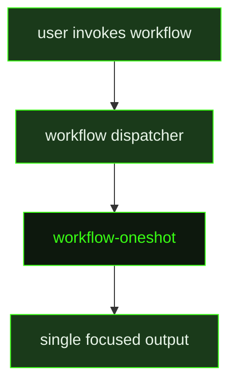

## What It Does

`workflow-oneshot` is the execution wrapper for **oneshot workflows** — lightweight, stateless workflows that run a single focused prompt and return. Unlike phased workflows, there is no `STATE.json`, no phase tracking, no artifact directory, and no resume mechanism. The dispatcher assembles the workflow name, display name, user arguments, and the workflow body into this prompt, then fires it as a single agent session.

The executor's job is to read the inlined workflow instructions and carry them out in one turn, producing a focused output: a report, a summary, a code change, a PR comment, or whatever the workflow body specifies. The prompt enforces four hard rules: no scaffolding (don't create `.gsd/workflows/` directories or run directories unless explicitly instructed), no branch switching, produce a single concise output, and ask only when genuinely blocked on information that can't be discovered.

If `{{userArgs}}` is empty, the executor falls back to sensible defaults from the workflow body rather than halting to ask.

## Pipeline Position

`workflow-oneshot` is a terminal prompt — it fires once, produces its output, and completes. There is no follow-on prompt, no looping, and no state written back to the dispatcher.

## Variables

| Variable | Description | Required |
|----------|-------------|----------|
| `name` | Internal identifier of the oneshot workflow being executed | Yes |
| `displayName` | Human-readable display name of the workflow | Yes |
| `userArgs` | Arguments supplied by the user when invoking the workflow; empty string if none provided | Yes |
| `body` | Full workflow instructions inlined into the prompt — the actual task definition the executor follows | Yes |

## Used By

- [`/gsd do`](../../commands/do/) — dispatches oneshot workflows when the selected workflow has no phase structure
