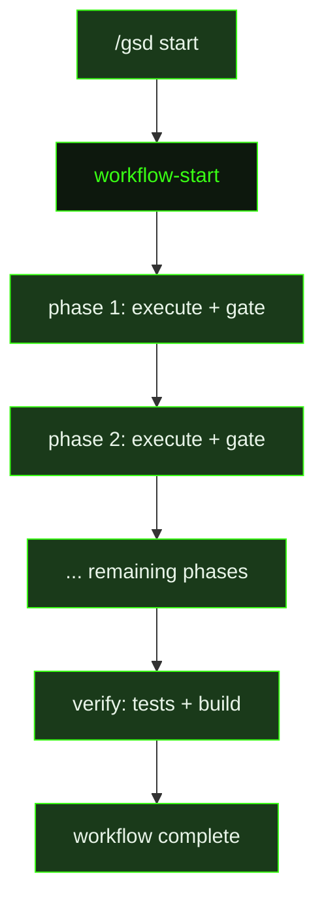

## What It Does

`workflow-start` initializes a templated GSD workflow — a structured, multi-phase process defined in a reusable template. Where milestones are GSD's primary vehicle for product work, workflows are purpose-built sequences for recurring processes like bug fixes, dependency upgrades, spikes, or security audits. This prompt loads the selected template, binds it to the user's context (description, issue reference, branch, artifact directory, complexity level), and begins executing the phases defined in the workflow definition.

The execution contract is phase-ordered but not uniformly gate-heavy: phases always run in sequence, and a phase must complete before the next begins. How much the agent pauses between phases depends on complexity. For `low` and `medium` complexity workflows, the agent keeps moving by default — it only pauses at true decision gates, where the user must choose between materially different directions, an outward-facing action requires approval, or the workflow explicitly requires a human checkpoint. For `high` complexity workflows, the agent confirms before advancing to each new phase unless the workflow explicitly marks a gate as skip-safe. After each phase the agent summarizes what changed, then either proceeds or waits depending on that complexity rule.

Artifact discipline and commit hygiene apply uniformly regardless of complexity. All planning and summary documents go into the artifact directory. Code changes are committed atomically after each meaningful change using conventional commit format. Before the workflow is marked complete, the agent runs the project's test suite and build — the workflow is not done until the implementation is verified.

The full workflow definition is provided inline via `{workflowContent}`, which contains the actual phase specifications, acceptance criteria, and completion conditions the agent must follow. The prompt does not improvise beyond what the template defines — the template is the authoritative contract, and the agent's role is to execute it faithfully while calibrating ceremony to the stated complexity level.

## Pipeline Position

`workflow-start` is dispatched by `/gsd start` when a user selects a workflow template. The command resolves the template by name or auto-detects it from the description, creates a timestamped artifact directory, checks out a dedicated git branch, writes a `STATE.json` for resume support, and then dispatches this prompt with all context assembled inline. If the user runs `/gsd start resume`, the same prompt is dispatched again with a resume-mode preamble indicating which phase to pick up from.

## Variables

| Variable | Description | Required |
|----------|-------------|----------|
| `templateName` | Human-readable name of the workflow template (e.g. "Bug Fix") | Yes |
| `templateId` | Identifier of the workflow template being instantiated (e.g. `bugfix`) | Yes |
| `description` | User-provided plain-language description of what this workflow instance is for | Yes |
| `issueRef` | GitHub issue reference associated with this workflow (e.g. `#123`), or `(none)` | Yes |
| `date` | Current date string for temporal context in the workflow prompt | Yes |
| `branch` | Git branch name created for this workflow run (e.g. `gsd/bugfix/fix-login-button`) | Yes |
| `artifactDir` | Directory path where workflow artifacts (state, outputs) are stored, or `(none)` for minimal templates | Yes |
| `phases` | Formatted phase list showing the workflow execution sequence (e.g. `Triage → Fix → Verify → Ship`) | Yes |
| `complexity` | Complexity level of the workflow (`low`, `medium`, `high`, or `minimal`) | Yes |
| `workflowContent` | Full content of the workflow template inlined into the prompt for the agent to follow | Yes |

## Used By

- `/gsd start <template> [description]` — dispatched when a user starts a new workflow template instance, after the artifact directory and branch are created
- `/gsd start resume` — dispatched again with resume context when the user resumes an in-progress workflow
