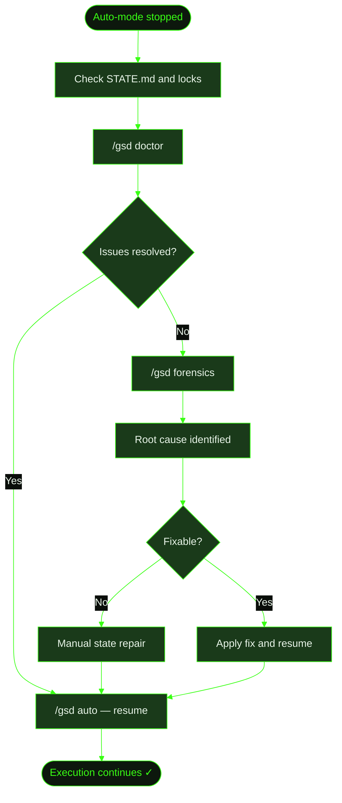

## When to Use This

GSD auto-mode has stopped unexpectedly. Maybe the agent hit a context limit, an API went down, a tool call timed out, or something else interrupted execution mid-task. The terminal shows no progress, and you're not sure what state the project is in.

This recipe walks through the recovery process — from recognizing the problem through automatic healing and, if needed, deeper investigation.

## Prerequisites

- GSD installed and available in your terminal
- A project that was running auto-mode (`/gsd auto`) when the failure occurred
- Familiarity with the [/gsd doctor](../../commands/doctor/) and [/gsd forensics](../../commands/forensics/) commands

## Steps

**The scenario:** Cookmate was mid-execution on the recipe image upload feature (M002, S01, T02) when the agent hit a rate limit on tool calls. Auto-mode stopped. The terminal just sits there — no error message, no completion.

### 1. Recognize the problem

The first sign is usually silence — auto-mode stops producing output. You might also see:

- A stale `auto.lock` file in `.gsd/`
- `STATE.md` showing a task as `in_progress` with no recent activity
- An incomplete task — `T02-PLAN.md` exists but `T02-SUMMARY.md` doesn't

Check the current state:

```
> cat .gsd/STATE.md

milestone: M002
slice: S01
task: T02
status: in_progress
```

The lock file confirms auto-mode was running and didn't shut down cleanly:

```
.gsd/
├── auto.lock              ← stale lock — auto-mode crashed
├── STATE.md               ← shows T02 in_progress
└── milestones/
    └── M002/
        └── slices/
            └── S01/
                ├── S01-PLAN.md
                └── tasks/
                    ├── T01-PLAN.md
                    ├── T01-SUMMARY.md    ← T01 completed
                    ├── T02-PLAN.md       ← T02 was in progress
                    └── (no T02-SUMMARY)  ← T02 never finished
```

### 2. Run `/gsd doctor`

The doctor command scans your `.gsd/` state for inconsistencies and applies automatic fixes:

```
> /gsd doctor
```

Doctor performs deterministic checks first — things it can fix without judgment:

- **Stale locks** — removes `auto.lock` if auto-mode isn't actually running
- **Missing artifacts** — detects that T02 has a plan but no summary
- **State inconsistencies** — `STATE.md` says `in_progress` but no process is running
- **Broken references** — plan files referencing tasks that don't exist

After the deterministic scan, doctor may enter heal mode to resolve issues that need more context — like reconstructing what T02 accomplished before it crashed by reading partial output from activity logs.

### 3. Resume auto-mode

If doctor resolves the issues cleanly, resume execution:

```
> /gsd auto
```

Auto-mode picks up where it left off. Since T02 never wrote a summary, GSD re-executes T02 from scratch — it reads T01's summary for context and continues the slice.

### 4. If doctor isn't enough — run `/gsd forensics`

When the crash is unusual or keeps happening, use forensics for a deeper investigation:

```
> /gsd forensics

What happened?
> Auto-mode keeps crashing on T02 of the image upload slice.
> It stops after about 5 minutes with no error output.
```

Forensics gathers a structured report automatically:

- **Activity logs** — the sequence of tool calls and their results from the crashed session
- **State snapshots** — what `.gsd/` looked like before and after the failure
- **Error traces** — any error messages or stack traces captured
- **Environment details** — GSD version, model, system context

The forensics agent then analyzes the report, identifies the root cause (in this case: the agent was making too many sequential tool calls and hitting a rate limit), and explains:

- **What happened** — the failure sequence
- **Why it happened** — root cause in GSD's logic or the environment
- **How to recover** — specific steps to fix the immediate problem

Forensics also offers to create a GitHub issue if the problem is a GSD bug rather than an environmental issue.

### 5. Manual state repair (last resort)

If both doctor and forensics can't automatically resolve the state, you can repair manually:

1. **Remove the stale lock:** `rm .gsd/auto.lock`
2. **Reset the task state:** Edit `STATE.md` to reflect reality — if T02 made no progress, leave it as the current task
3. **Clean partial artifacts:** If T02 left behind half-written files in the project, review and remove them
4. **Resume:** Run `/gsd auto` to restart execution

## What Gets Created

The recovery process may produce:

```
.gsd/
├── STATE.md                ← updated to reflect recovered state
└── milestones/
    └── M002/
        └── slices/
            └── S01/
                └── tasks/
                    ├── T01-SUMMARY.md     ← untouched — completed before crash
                    ├── T02-PLAN.md        ← untouched — will be re-executed
                    └── T02-SUMMARY.md     ← written after successful re-execution
```

Doctor's fixes are applied directly to the `.gsd/` state. Forensics saves a detailed report locally for future reference.

## Flow Diagram


