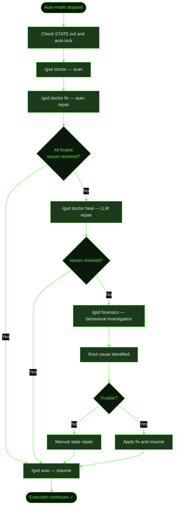

## When to Use This

GSD auto-mode has stopped unexpectedly. Maybe the agent hit a context limit, an API went down, a tool call timed out, or something else interrupted execution mid-task. The terminal shows no progress, and you're not sure what state the project is in.

This recipe walks through the recovery process — from recognizing the problem through automatic healing and, if needed, deeper investigation.

## Prerequisites

- GSD installed and available in your terminal
- A project that was running auto-mode (`/gsd auto`) when the failure occurred
- Familiarity with the [/gsd doctor](../../commands/doctor/) and [/gsd forensics](../../commands/forensics/) commands

## Steps

**The scenario:** Cookmate was mid-execution on the recipe image upload feature (M002, S01, T02) when the agent hit a rate limit on tool calls. Auto-mode stopped. The terminal just sits there — no error message, no completion.

### 1. Recognize the problem

The first sign is usually silence — auto-mode stops producing output. You might also see:

- A stale `auto.lock` file in `.gsd/`
- `STATE.md` showing an in-progress phase with no recent activity
- An incomplete task — `T02-PLAN.md` exists but `T02-SUMMARY.md` doesn't

Check the current state:

```
> cat .gsd/STATE.md

# GSD State

**Active Milestone:** M002: Recipe Image Upload
**Active Slice:** S01: Storage and Upload API
**Phase:** executing
...
```

The `auto.lock` file confirms auto-mode was running and didn't shut down cleanly. It's a JSON file that records the PID, which unit was dispatched, and when:

```json
{
  "pid": 48221,
  "startedAt": "2025-01-15T10:00:00.000Z",
  "unitType": "execute-task",
  "unitId": "M002/S01/T02",
  "unitStartedAt": "2025-01-15T10:24:00.000Z",
  "completedUnits": 3
}
```

The directory structure confirms T02 never finished:

```
.gsd/
├── auto.lock              ← stale lock — auto-mode crashed
├── STATE.md               ← shows executing phase, S01 active
└── milestones/
    └── M002/
        └── slices/
            └── S01/
                ├── S01-PLAN.md
                └── tasks/
                    ├── T01-PLAN.md
                    ├── T01-SUMMARY.md    ← T01 completed
                    ├── T02-PLAN.md       ← T02 was in progress
                    └── (no T02-SUMMARY)  ← T02 never finished
```

### 2. Run `/gsd doctor`

Start by scanning for issues without making any changes:

```
> /gsd doctor
```

Doctor runs checks across four categories:

- **Structure** — Missing summaries, UAT files, unchecked roadmap entries, missing `tasks/` directories
- **Git health** — Orphaned worktrees, stale milestone branches, corrupt merge or rebase state, runtime files tracked by git
- **Runtime state** — Stale `auto.lock` (PID check), orphaned completed-unit keys, stale hook state, activity log bloat, STATE.md staleness, gitignore drift
- **Requirements** — Active requirements without an owning slice, blocked requirements without a reason

The report shows what's wrong before anything is repaired:

```
GSD doctor report.
Scope: M002/S01
Issues: 2 total · 1 error(s) · 1 warning(s) · 2 fixable
Priority issues:
- [ERROR] project: stale auto.lock — PID 48221 is dead
- [WARN] M002/S01/T02: summary exists but task not checked in plan
```

### 3. Run `/gsd doctor fix`

Once you understand what's wrong, apply automatic repairs:

```
> /gsd doctor fix
```

Fix mode repairs everything marked as fixable: removes the stale crash lock, marks T02 done in the plan if a summary now exists, creates placeholder summaries for missing slice artifacts, regenerates STATE.md from current disk state, and more. It only touches issues with `fixable: true` — it won't rewrite plan content or make judgment calls.

```
GSD doctor report.
Scope: M002/S01
Issues: 2 total · 1 error(s) · 1 warning(s) · 2 fixable
Fixes applied:
- cleared stale auto.lock
- marked T02 done in .gsd/milestones/M002/slices/S01/S01-PLAN.md
```

### 4. Resume auto-mode

If doctor fix resolves the issues cleanly, resume execution:

```
> /gsd auto
```

Auto-mode re-derives state from disk on startup. If T02 never wrote a summary, auto-mode re-executes T02 from scratch — it reads T01's summary for context and continues the slice. If T02's summary exists but the plan checkbox was unchecked, doctor already fixed that and auto-mode picks up the next task.

Auto-mode also runs lightweight self-healing on every startup: it scans runtime records and clears any where the expected artifact already exists on disk (recovering from incomplete closeouts after prior crashes), and checks for leftover git merge state — finalizing clean merges or aborting conflicted ones.

### 5. If structural issues remain — use heal mode

When auto-fix can't resolve everything (non-fixable issues, missing artifacts that need real content), use heal mode to dispatch remaining issues to the LLM:

```
> /gsd doctor heal
```

Heal mode first applies all fixable repairs, then filters the remaining issues — all errors plus UAT-related warnings — and dispatches them to the LLM as a structured list. The LLM receives the full doctor report with issue codes, unit IDs, and file paths, and is instructed to generate real artifacts from existing context (task summaries, plan files) rather than leaving placeholders when possible.

```
GSD doctor heal prep.
Scope: M002/S01
Issues: 1 total · 1 error(s) · 0 warning(s) · 0 fixable
Doctor heal dispatched 1 issue(s) to the LLM.

● Investigating: all_tasks_done_missing_slice_uat for M002/S01...
  Reading task summaries to build UAT script...
  Wrote .gsd/milestones/M002/slices/S01/S01-UAT.md

GSD doctor heal complete.
```

### 6. If the crash is unusual — run `/gsd forensics`

When the failure is behavioral (keeps happening, unusual cost spikes, stuck loops) rather than structural, use forensics for a deeper investigation:

```
> /gsd forensics auto-mode keeps crashing on T02 of the image upload slice
```

Forensics gathers a structured report from five data sources:

- **Activity logs** — Tool calls, reasoning traces, and errors from the crashed session
- **Metrics ledger** — Cost and timing data to detect spikes or excessive retries
- **Crash lock** — PID liveness to confirm the crash
- **Doctor checks** — Full structural scan run internally
- **Completed keys** — Cross-referenced against expected artifacts to find stale completions

Forensics then detects anomalies — stuck loops, cost spikes, timeouts, missing artifacts, error traces — and dispatches the full report to the LLM for interactive root-cause analysis. The LLM explains what happened, why it happened, and how to recover. It also offers to create a GitHub issue at `gsd-build/gsd-2` if the problem is a GSD bug.

Every forensic report is saved as a timestamped file in `.gsd/forensics/` for future reference.

### 7. Manual state repair (last resort)

If both doctor and forensics can't automatically resolve the state, you can repair manually. When auto-mode detects a stuck loop, it provides concrete remediation steps — for example, for a stuck `execute-task`:

1. **Write the task summary** — Even a partial summary in `T02-SUMMARY.md` is sufficient to unblock the pipeline
2. **Mark the task done** — Change `- [ ] **T02:` → `- [x] **T02:` in the slice plan
3. **Reconcile state** — Run `/gsd doctor fix` to rebuild STATE.md and clear any stale runtime records
4. **Resume** — Run `/gsd auto` to restart execution from the next task

For a stuck `complete-slice`:

1. Write the slice summary and UAT file
2. Mark the slice `[x]` in the milestone roadmap
3. Run `/gsd doctor fix`
4. Resume auto-mode

## What Gets Created

The recovery process may produce:

### From `/gsd doctor fix`

| File | Purpose |
|------|---------|
| `.gsd/STATE.md` | Regenerated from current disk state |
| `.gsd/auto.lock` | Removed (stale lock cleared) |
| `.gsd/milestones/*/slices/*/tasks/*-SUMMARY.md` | Stub summary if task was done but summary missing |
| `.gsd/milestones/*/slices/*/S*-PLAN.md` | Task checkbox updated if summary exists |
| `.gsd/milestones/*/M*-ROADMAP.md` | Slice checkbox updated if all tasks done |

### From `/gsd doctor heal`

| File | Purpose |
|------|---------|
| `.gsd/milestones/*/slices/*/S*-SUMMARY.md` | Reconstructed from task summaries |
| `.gsd/milestones/*/slices/*/S*-UAT.md` | Generated from slice plan and task context |

### From `/gsd forensics`

| File | Purpose |
|------|---------|
| `.gsd/forensics/report-*.md` | Timestamped, redacted forensic report |

## Flow Diagram



## Related Commands

- [`/gsd doctor`](../../commands/doctor/) — Structural health checks, auto-repair, and LLM-assisted heal mode
- [`/gsd forensics`](../../commands/forensics/) — Behavioral investigation of stuck loops, cost spikes, and crash analysis
- [`/gsd status`](../../commands/status/) — View current project state
- [`/gsd auto`](../../commands/auto/) — Resume auto-mode after recovery
- [`/gsd skip`](../../commands/skip/) — Skip a stuck unit and advance the pipeline
