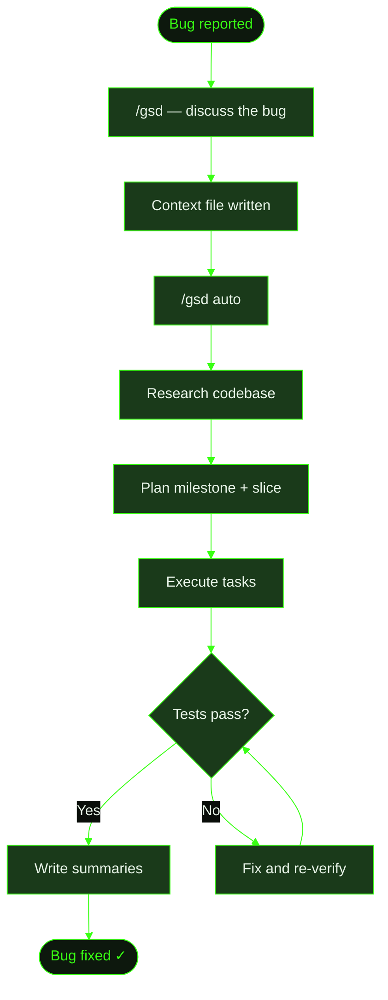

## When to Use This

A bug has been reported or you've discovered an issue that needs investigation. You want GSD to manage the full lifecycle: discuss the problem, research the codebase, plan a fix, execute it, and verify the result. This recipe walks through a real example using the full milestone flow.

Use the full lifecycle when the bug might be non-trivial — when you're not sure of the root cause, when the fix might touch multiple files, or when you want GSD's structured verification to confirm the fix works. For simple one-line fixes, consider the [small change recipe](../small-change/) instead.

## Prerequisites

- GSD installed and available in your terminal
- A project with a `.gsd/` directory (run `/gsd` to start one if needed)
- A bug to fix — either a report from a user or an issue you've noticed

## Steps

**The scenario:** A Cookmate user reports that searching for "Pasta" returns no results, but searching for "pasta" (lowercase) works fine. The search is case-sensitive when it shouldn't be.

### 1. Start a discussion

Run `/gsd` to open the GSD wizard. Describe the bug:

```
> /gsd

What's the vision?

> Users are reporting that search in Cookmate is case-sensitive.
> Searching for "Pasta" returns nothing, but "pasta" works.
> This should be a case-insensitive search.
```

GSD reflects back what it understood, estimates the scope (likely a single milestone with one slice), and asks clarifying questions — such as whether the issue is in the API query, the database index, or both.

### 2. Discussion produces a context file

After the conversation, GSD writes the milestone brief:

```
.gsd/
└── milestones/
    └── M003/
        └── M003-CONTEXT.md    ← bug scope, root cause hypothesis, fix approach
```

The context file captures what was discussed: the symptoms, the suspected root cause (PostgreSQL `LIKE` is case-sensitive by default), and the agreed approach (switch to `ILIKE` or add a `LOWER()` wrapper).

### 3. Research and planning

Run `/gsd auto` to start autonomous execution. GSD will:

1. **Research** — scout the codebase for search-related code, check Prisma docs for case-insensitive query options
2. **Plan the milestone** — create a roadmap (likely a single slice for this fix)
3. **Plan the slice** — break the slice into tasks (update query, add tests, verify)

```
.gsd/
└── milestones/
    └── M003/
        ├── M003-CONTEXT.md
        ├── M003-RESEARCH.md    ← found: searchRecipes() in lib/search.ts uses where: { title: { contains: query } }
        ├── M003-ROADMAP.md     ← S01: Fix case-sensitive search
        └── slices/
            └── S01/
                ├── S01-PLAN.md
                └── tasks/
                    ├── T01-PLAN.md    ← update query to use case-insensitive mode
                    └── T02-PLAN.md    ← add test cases for mixed-case search
```

### 4. Execution

GSD executes each task in a fresh context window. For this bug fix:

- **T01** updates the Prisma query from `contains: query` to `contains: query, mode: 'insensitive'`
- **T02** adds test cases verifying that "Pasta", "PASTA", and "pasta" all return the same results

Each task writes a summary when done, documenting what changed and what was verified.

### 5. Verification and completion

After the last task, GSD runs slice-level verification:

- Executes the test suite — confirms mixed-case searches return results
- Writes a slice summary compressing all task work
- Writes a UAT script with concrete test cases
- Marks the slice done in the roadmap

```
.gsd/
└── milestones/
    └── M003/
        ├── M003-CONTEXT.md
        ├── M003-RESEARCH.md
        ├── M003-ROADMAP.md         ← S01 ✓ checked off
        ├── M003-SUMMARY.md         ← milestone completion record
        └── slices/
            └── S01/
                ├── S01-PLAN.md
                ├── S01-SUMMARY.md   ← compressed slice record
                ├── S01-UAT.md       ← test script for manual verification
                └── tasks/
                    ├── T01-PLAN.md
                    ├── T01-SUMMARY.md
                    ├── T02-PLAN.md
                    └── T02-SUMMARY.md
```

## What Gets Created

The full `.gsd/` tree after a bug fix milestone:

```
.gsd/
├── PROJECT.md                    ← updated with current state
├── STATE.md                      ← reflects M003 complete
├── DECISIONS.md                  ← any decisions made during the fix
├── KNOWLEDGE.md                  ← gotchas discovered (e.g. Prisma mode flag)
└── milestones/
    └── M003/
        ├── M003-CONTEXT.md       ← bug scope and approach
        ├── M003-RESEARCH.md      ← codebase findings
        ├── M003-ROADMAP.md       ← slice(s) with checkboxes
        ├── M003-SUMMARY.md       ← milestone record
        └── slices/
            └── S01/
                ├── S01-PLAN.md
                ├── S01-SUMMARY.md
                ├── S01-UAT.md
                └── tasks/
                    ├── T01-PLAN.md
                    ├── T01-SUMMARY.md
                    ├── T02-PLAN.md
                    └── T02-SUMMARY.md
```

## Flow Diagram


