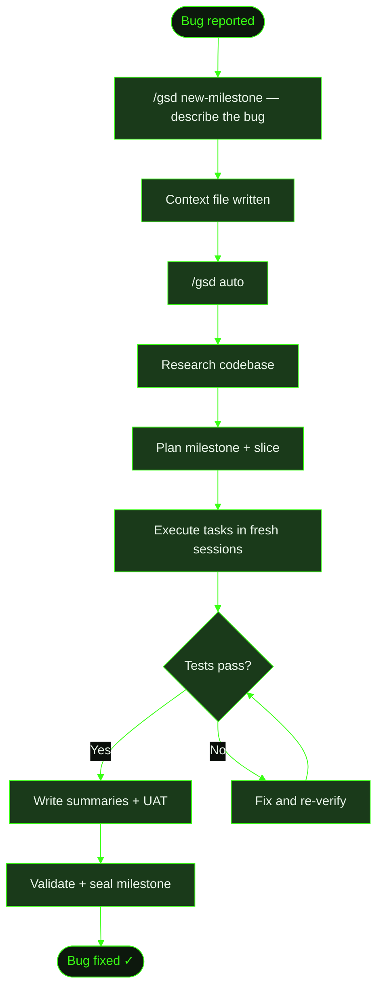

## When to Use This

A bug has been reported or you've discovered an issue that needs investigation. You want GSD to manage the full lifecycle: create a milestone, research the codebase, plan a fix, execute it, and verify the result. This recipe walks through a real example using the full milestone flow.

Use the full lifecycle when the bug might be non-trivial — when you're not sure of the root cause, when the fix might touch multiple files, or when you want GSD's structured verification to confirm the fix works. For simple one-line fixes, consider the [small change recipe](../small-change/) instead.

## Prerequisites

- GSD installed and available in your terminal
- A project with a `.gsd/` directory (run `/gsd` to start one if needed)
- A bug to fix — either a report from a user or an issue you've noticed

## Steps

**The scenario:** A Cookmate user reports that searching for "Pasta" returns no results, but searching for "pasta" (lowercase) works fine. The search is case-sensitive when it shouldn't be.

### 1. Create a new milestone for the fix

Run `/gsd new-milestone` and describe the bug:

```
> /gsd new-milestone

What's the goal for this milestone?
> Users are reporting that search in Cookmate is case-sensitive.
> Searching for "Pasta" returns nothing, but "pasta" works.
> This should be a case-insensitive search.
```

GSD asks clarifying questions to lock down scope — such as whether the issue is in the API query, the database index, or the frontend — then writes a milestone context file.

:::tip
If this is your **first ever milestone**, just run `/gsd` instead. The smart entry wizard fires automatically and routes you through the same discussion.
:::

### 2. Discussion produces a context file

After the conversation, GSD writes the milestone brief to disk:

```
.gsd/
└── milestones/
    └── M003/
        └── M003-CONTEXT.md    ← bug scope, root cause hypothesis, fix approach
```

The context file captures what was discussed: the symptoms, the suspected root cause (PostgreSQL `LIKE` is case-sensitive by default), and the agreed approach (switch to `ILIKE` or add a `LOWER()` wrapper).

### 3. Research and planning

Run `/gsd auto` to start autonomous execution. GSD dispatches units in sequence:

1. **Milestone Research** — scouts the codebase for search-related code, checks Prisma docs for case-insensitive query options
2. **Slice Research** — zooms in on the specific slice goal and integration points
3. **Plan the slice** — breaks the slice into tasks (update query, add tests, verify)

```
.gsd/
└── milestones/
    └── M003/
        ├── M003-CONTEXT.md
        ├── M003-RESEARCH.md    ← found: searchRecipes() in lib/search.ts uses where: { title: { contains: query } }
        ├── M003-ROADMAP.md     ← S01: Fix case-sensitive search
        └── slices/
            └── S01/
                ├── S01-PLAN.md
                └── tasks/
                    ├── T01-PLAN.md    ← update query to use case-insensitive mode
                    └── T02-PLAN.md    ← add test cases for mixed-case search
```

:::tip
Want to review decisions before planning begins? Run `/gsd discuss` for a guided interview about the slice — UI, behavior, edge cases — before letting auto mode take over.
:::

### 4. Execution

GSD executes each task in a fresh context window. For this bug fix:

- **T01** updates the Prisma query from `contains: query` to `contains: query, mode: 'insensitive'`
- **T02** adds test cases verifying that "Pasta", "PASTA", and "pasta" all return the same results

Each task writes a summary when done, documenting what changed and what was verified. Each summary is automatically committed with a meaningful commit message.

### 5. Verification and completion

After the last task, GSD runs slice-level completion:

- Executes the test suite — confirms mixed-case searches return results
- Writes a slice summary compressing all task work
- Writes a UAT script with concrete test cases
- Marks the slice done in the roadmap
- Reassesses the roadmap — confirms no further slices are needed
- Validates the milestone against the original success criteria and seals it

```
.gsd/
└── milestones/
    └── M003/
        ├── M003-CONTEXT.md
        ├── M003-RESEARCH.md
        ├── M003-ROADMAP.md         ← S01 ✓ checked off
        ├── M003-SUMMARY.md         ← milestone completion record
        └── slices/
            └── S01/
                ├── S01-PLAN.md
                ├── S01-SUMMARY.md   ← compressed slice record
                ├── S01-UAT.md       ← test script for manual verification
                └── tasks/
                    ├── T01-PLAN.md
                    ├── T01-SUMMARY.md
                    ├── T02-PLAN.md
                    └── T02-SUMMARY.md
```

## What Files It Touches

### Creates

| File | Purpose |
|------|---------|
| `.gsd/milestones/M003/M003-CONTEXT.md` | Bug scope, root cause hypothesis, fix approach |
| `.gsd/milestones/M003/M003-RESEARCH.md` | Codebase findings — what code does what |
| `.gsd/milestones/M003/M003-ROADMAP.md` | Slice structure with completion checkboxes |
| `.gsd/milestones/M003/slices/S01/S01-PLAN.md` | Task breakdown for the fix slice |
| `.gsd/milestones/M003/slices/S01/tasks/T##-PLAN.md` | Individual task plans |
| `.gsd/milestones/M003/slices/S01/tasks/T##-SUMMARY.md` | Task completion records |
| `.gsd/milestones/M003/slices/S01/S01-SUMMARY.md` | Compressed slice record |
| `.gsd/milestones/M003/slices/S01/S01-UAT.md` | Acceptance test script |
| `.gsd/milestones/M003/M003-SUMMARY.md` | Milestone completion record |

### Reads

| File | Purpose |
|------|---------|
| `.gsd/STATE.md` | Current project state to determine next unit |
| `.gsd/KNOWLEDGE.md` | Accumulated gotchas and patterns |
| `.gsd/DECISIONS.md` | Architectural decisions that constrain the fix |

### Writes

| File | Purpose |
|------|---------|
| `.gsd/STATE.md` | Updated after each unit completes |
| `.gsd/KNOWLEDGE.md` | Any new patterns discovered (e.g., Prisma `mode` flag) |
| `.gsd/activity/` | JSONL execution logs per session |
| `.gsd/runtime/` | Session metadata and lock files |

## Flow Diagram



## Related Commands

- [`/gsd quick`](../../commands/quick/) — faster path for bugs you already understand
- [`/gsd discuss`](../../commands/discuss/) — guided interview before a slice executes
- [`/gsd auto`](../../commands/auto/) — autonomous execution reference
- [`/gsd doctor`](../../commands/doctor/) — if execution gets stuck or state looks wrong
- [Recipe: Small Change](../small-change/) — for one-liner fixes without milestone ceremony
- [Recipe: Recover from Errors](../error-recovery/) — if auto mode crashes mid-execution
