## What It Does

Starting a new milestone on an existing GSD project is a single command: [`/gsd:new-milestone`](../../commands/new-milestone/). GSD reads your existing `.planning/` context, detects what shipped previously, and walks you through scoping the next cycle — interactive goal-gathering, optional parallel domain research, requirement scoping by category, and roadmap generation via the `gsd-roadmapper` agent.

Prior milestone work stays completely intact. `MILESTONES.md` keeps the full build history, `PROJECT.md` carries validated requirements forward, and phase numbering **continues** from where the last milestone left off — if v1.0 shipped phases 1–5, v1.1 starts at phase 6.

For large visions that span multiple milestones, you can prepare a `MILESTONE-CONTEXT.md` in advance to skip the goal-gathering Q&A entirely, or name the milestone directly in the command to front-load the label.

## Usage

```
/gsd:new-milestone [milestone name]
```

The milestone name is optional. If omitted, GSD asks what you want to build next and explores features, priorities, and constraints interactively.

```
/gsd:new-milestone
/gsd:new-milestone "v2.0 Social Features"
/gsd:new-milestone v1.1 Notifications
```

## How It Works

### New Milestone Flow

```mermaid
flowchart TD
    Start(["/gsd:new-milestone"]) --> LoadCtx[Load project context\nPROJECT.md · MILESTONES.md · STATE.md]
    LoadCtx --> ContextFile{MILESTONE-CONTEXT.md\nexists?}
    ContextFile -->|Yes| UseCtx[Use pre-gathered context\nPresent summary for confirmation]
    ContextFile -->|No| QA[Ask: What to build next?\nExplore features and constraints]
    UseCtx --> Version[Determine milestone version\nv1.0 → v1.1 · confirm with user]
    QA --> Version
    Version --> UpdateFiles[Update PROJECT.md + STATE.md\nDelete context file if present · Commit]
    UpdateFiles --> Init[Resolve agent models\ngsd-tools init new-milestone]
    Init --> Research{Research\nneeded?}
    Research -->|Yes| Parallel[4 parallel researcher agents\nStack · Features · Architecture · Pitfalls]
    Parallel --> Synth[gsd-research-synthesizer\nWrite SUMMARY.md]
    Synth --> Reqs[Scope requirements by category\nmulti-select per feature group]
    Research -->|No| Reqs
    Reqs --> WriteReqs[Write REQUIREMENTS.md\nREQ-IDs · Commit]
    WriteReqs --> Roadmap[Spawn gsd-roadmapper\nContinue phase numbering from last milestone]
    Roadmap --> Approve{Roadmap\napproved?}
    Approve -->|Adjust| Roadmap
    Approve -->|Yes| Commit[Commit ROADMAP.md · STATE.md\nREQUIREMENTS.md traceability]
    Commit --> Done(["Done — next: /gsd:discuss-phase N\nor /gsd:plan-phase N"])

    style Start fill:#0d180d,stroke:#39ff14,color:#39ff14
    style Done fill:#0d180d,stroke:#39ff14,color:#39ff14
    style ContextFile fill:#0d180d,stroke:#39ff14,color:#39ff14
    style Research fill:#0d180d,stroke:#39ff14,color:#39ff14
    style Approve fill:#0d180d,stroke:#39ff14,color:#39ff14
    style LoadCtx fill:#1a3a1a,stroke:#39ff14,color:#e8f4e8
    style UseCtx fill:#1a3a1a,stroke:#39ff14,color:#e8f4e8
    style QA fill:#1a3a1a,stroke:#39ff14,color:#e8f4e8
    style Version fill:#1a3a1a,stroke:#39ff14,color:#e8f4e8
    style UpdateFiles fill:#1a3a1a,stroke:#39ff14,color:#e8f4e8
    style Init fill:#1a3a1a,stroke:#39ff14,color:#e8f4e8
    style Parallel fill:#1a3a1a,stroke:#39ff14,color:#e8f4e8
    style Synth fill:#1a3a1a,stroke:#39ff14,color:#e8f4e8
    style Reqs fill:#1a3a1a,stroke:#39ff14,color:#e8f4e8
    style WriteReqs fill:#1a3a1a,stroke:#39ff14,color:#e8f4e8
    style Roadmap fill:#1a3a1a,stroke:#39ff14,color:#e8f4e8
    style Commit fill:#1a3a1a,stroke:#39ff14,color:#e8f4e8
```



### Step-by-Step

**1. Load context** — Reads `PROJECT.md` (existing stack, decisions, validated requirements), `MILESTONES.md` (what shipped, last phase number), and `STATE.md` (pending todos, blockers). Checks for `MILESTONE-CONTEXT.md`.

**2. Gather milestone goals** — If `MILESTONE-CONTEXT.md` exists, its features and scope are used directly and presented for confirmation. Otherwise, GSD shows what shipped in the last milestone and asks: "What do you want to build next?" — then follows up with focused questions on features, priorities, and constraints.

**3. Determine milestone version** — Parses the last version from `MILESTONES.md` and suggests the next increment (`v1.0 → v1.1`, or `v2.0` for a major reboot). You confirm the label.

**4. Update planning files** — Adds a `## Current Milestone` section to `PROJECT.md` with the goal and target features. Resets `STATE.md` to `Phase: Not started (defining requirements)`, preserving the Accumulated Context from the previous milestone. Deletes `MILESTONE-CONTEXT.md` if it existed, then commits both files.

**5. Resolve models** — Runs `gsd-tools init new-milestone` to extract agent model assignments (`researcher_model`, `synthesizer_model`, `roadmapper_model`) and workflow config flags.

**6. Research decision** — Asks whether to research the domain ecosystem before defining requirements. The choice is persisted to config so future commands honor it.

**7. Parallel research (optional)** — If research is selected, 4 `gsd-project-researcher` agents run in parallel, each focused on a different dimension:

| Dimension | Question answered |
|-----------|-----------------|
| **Stack** | What library/version additions are needed for the new features? |
| **Features** | How do the target features typically work? Table stakes vs differentiators? |
| **Architecture** | How do new features integrate with the existing architecture? |
| **Pitfalls** | Common mistakes when adding these features to an existing system? |

After all 4 complete, a `gsd-research-synthesizer` agent writes `SUMMARY.md` and key findings are displayed inline.

**8. Define requirements** — Presents features by category (from research or gathered via conversation). For each category, a multi-select prompt lets you scope what's in this milestone vs deferred vs out of scope. Requirements are written with REQ-IDs in `[CATEGORY]-[NUMBER]` format (e.g., `AUTH-01`, `NOTIF-02`), continuing from any existing requirement numbers. You confirm the full list before it's committed.

**9. Create roadmap** — Spawns `gsd-roadmapper` with the starting phase number read from `MILESTONES.md` (so phase numbering is continuous across milestones). The roadmapper maps every requirement to exactly one phase, derives 2–5 success criteria per phase, and validates 100% coverage. The roadmap is presented inline — you can request adjustments and the roadmapper re-runs until you approve.

**10. Final commit** — Commits `ROADMAP.md`, `STATE.md`, and `REQUIREMENTS.md` together (with traceability filled in by the roadmapper). Displays a completion summary and the next command.

### Milestone Version Numbering

GSD reads the last version from `MILESTONES.md` and suggests the next increment:

- `v1.0` → suggests `v1.1` (minor increment)
- Suggest `v2.0` yourself for major reboots

Phase numbering **continues** across milestones — if v1.0 delivered phases 1–5, v1.1's roadmap starts at phase 6. This preserves the full build history in a single continuous phase sequence.

### Context File Shortcut

If a `MILESTONE-CONTEXT.md` file is present in `.planning/` when you run the command, the goal-gathering Q&A step is skipped entirely — GSD uses that file's features and scope directly and presents a confirmation summary. This is the fastest path when the goals are already clear. The file is deleted (consumed) after the milestone is initialized.

### What Research Does

Research findings are **advisory** — they surface candidate requirements rather than silently expanding scope. After research completes, every feature category is presented back to you for explicit in/defer/out-of-scope scoping. Nothing gets added to requirements without your confirmation.

Research agents are milestone-aware: they only investigate what's needed for the **new** features, not the existing validated capabilities.

## What Files It Touches

### Creates

| File | Purpose |
|------|---------|
| `.planning/REQUIREMENTS.md` | Scoped requirements with REQ-IDs, categories, future and out-of-scope sections |
| `.planning/ROADMAP.md` | Phased execution plan with success criteria and continuous phase numbering |
| `.planning/research/STACK.md` | Stack additions needed for new features (research only) |
| `.planning/research/FEATURES.md` | Feature analysis: table stakes vs differentiators (research only) |
| `.planning/research/ARCHITECTURE.md` | Integration points and build order (research only) |
| `.planning/research/PITFALLS.md` | Common mistakes and prevention strategies (research only) |
| `.planning/research/SUMMARY.md` | Synthesized research summary (research only) |

### Writes (updates existing)

| File | Purpose |
|------|---------|
| `.planning/PROJECT.md` | Updated with `## Current Milestone` section and active requirements |
| `.planning/STATE.md` | Reset to `Phase: Not started (defining requirements)` for the new milestone |
| `.planning/REQUIREMENTS.md` | Traceability section filled by roadmapper after roadmap creation |

### Reads

| File | Purpose |
|------|---------|
| `.planning/PROJECT.md` | Existing stack, decisions, validated requirements |
| `.planning/MILESTONES.md` | What shipped previously; last phase number for continuation |
| `.planning/STATE.md` | Pending todos and blockers from the previous milestone |
| `.planning/MILESTONE-CONTEXT.md` | Pre-gathered milestone goals — optional, skips goal Q&A if present |

### Deletes

| File | Purpose |
|------|---------|
| `.planning/MILESTONE-CONTEXT.md` | Consumed and deleted after goals are extracted |

## Examples

**v1.0 complete, starting v1.1 with notifications:**

```
> /gsd:new-milestone

● v1.0 Core Platform — shipped ✓
  No active milestone. What do you want to build next?

> Add push notifications. Users should get alerts when
> someone comments on their post or follows them. Also
> want an in-app notification center so they can review
> past alerts.
```

GSD confirms the milestone version and asks about research:

```
● Milestone: v1.1 Notifications

  Research the domain ecosystem before defining requirements?
  ● Research first (Recommended) — Discover patterns for new capabilities
    Skip research — Go straight to requirements
```

After parallel research completes:

```
━━━━━━━━━━━━━━━━━━━━━━━━━━━━━━━━━━━━━━━━━━━━━━━━━━━━━
 GSD ► RESEARCH COMPLETE ✓
━━━━━━━━━━━━━━━━━━━━━━━━━━━━━━━━━━━━━━━━━━━━━━━━━━━━━

Stack additions: expo-notifications 0.28, @supabase/realtime-js
Feature table stakes: delivery receipts, badge counts, opt-out per type
Watch Out For: APNs certificate expiry, notification permission timing
```

---

**Requirements scoping — selecting what's in vs deferred:**

After research (or Q&A), GSD scopes each category interactively:

```
## Push Notifications
Table stakes: Delivery receipts, Badge counts
Differentiators: Rich media, Scheduled sends

Which features are in scope for v1.1? (multi-select)
✓ Delivery receipts
✓ Badge counts
  Rich media — deferred to v1.2
  Scheduled sends — out of scope
```

After confirmation, the full requirements list is presented:

```
## Milestone v1.1 Requirements

### Notifications
- [ ] NOTIF-01: User receives push alert when someone comments on their post
- [ ] NOTIF-02: User receives push alert when someone follows them
- [ ] NOTIF-03: User can view past notifications in in-app center
- [ ] NOTIF-04: User can opt out of notification types

Does this capture what you're building? (yes / adjust)
```

---

**Roadmap preview after requirements are confirmed:**

```
━━━━━━━━━━━━━━━━━━━━━━━━━━━━━━━━━━━━━━━━━━━━━━━━━━━━━
 GSD ► CREATING ROADMAP
━━━━━━━━━━━━━━━━━━━━━━━━━━━━━━━━━━━━━━━━━━━━━━━━━━━━━

◆ Spawning roadmapper...

## Proposed Roadmap

3 phases | 4 requirements mapped | All covered ✓

| # | Phase | Goal | Requirements | Success Criteria |
|---|-------|------|--------------|------------------|
| 6 | Notification delivery | Push alerts for social events | NOTIF-01, NOTIF-02 | 3 |
| 7 | In-app notification center | Browse and manage past alerts | NOTIF-03 | 2 |
| 8 | Notification preferences | Per-type opt-out controls | NOTIF-04 | 2 |

Approve / Adjust phases / Review full file
```

---

**What the `.planning/` tree looks like after initialization:**

```
.planning/
├── PROJECT.md              ← updated with v1.1 milestone section
├── STATE.md                ← reset for new milestone
├── MILESTONES.md           ← v1.0 history intact
├── REQUIREMENTS.md         ← v1.1 requirements with REQ-IDs
├── ROADMAP.md              ← phases 6–8 added (continues from v1.0's phase 5)
└── research/
    ├── STACK.md
    ├── FEATURES.md
    ├── ARCHITECTURE.md
    ├── PITFALLS.md
    └── SUMMARY.md
```

Phase numbers continue — `v1.0` ended at phase 5, `v1.1` starts at phase 6. The full history is visible in a single `ROADMAP.md` with completed milestones collapsed in `<details>` tags.

## Related Commands

- [`/gsd:new-milestone`](../../commands/new-milestone/) — Full command reference with all options
- [`/gsd:complete-milestone`](../../commands/complete-milestone/) — Archive the current milestone before starting a new one
- [`/gsd:discuss-phase`](../../commands/discuss-phase/) — Clarify implementation decisions for the first phase
- [`/gsd:plan-phase`](../../commands/plan-phase/) — Skip discussion and plan the first phase directly
- [`/gsd:new-project`](../../commands/new-project/) — Greenfield equivalent — initializes a brand-new project from scratch
