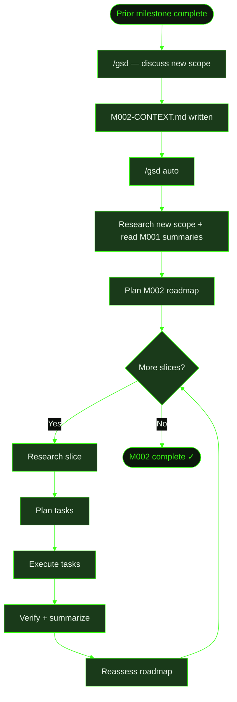

## When to Use This

Your project already has `.gsd/` artifacts from prior work — completed milestones with summaries, an established decisions register, accumulated knowledge. Now you want to add a new phase of work: a major feature, a platform migration, or a new capability.

GSD handles this naturally. Prior milestones stay intact as reference material. The new milestone gets its own discussion, research, and planning cycle while inheriting the project's accumulated context.

## Prerequisites

- GSD installed and available in your terminal
- An existing project with `.gsd/` directory and at least one completed milestone
- A clear idea of the new scope you want to add

## Steps

**The scenario:** Cookmate's M001 (core recipe platform — auth, CRUD, search, image uploads) is complete. Now you want to add social features: following other cooks, activity feeds, recipe comments, and sharing.

### 1. Start a discussion for the new milestone

Run `/gsd`. GSD detects that M001 is complete and prompts for the next milestone:

```
> /gsd

M001: Core Recipe Platform — complete ✓
No active milestone. Ready to discuss a new one.

What's the vision for the next phase?

> I want to add social features to Cookmate. Users should be able to
> follow other cooks, see an activity feed of new recipes from people
> they follow, comment on recipes, and share recipes via link.
```

GSD reflects back the scope, estimates the size (likely one milestone with 4–5 slices), and asks clarifying questions — notification preferences, comment moderation, public vs. private profiles.

### 2. Discussion produces a new context file

After the conversation, GSD creates the M002 milestone directory alongside the completed M001:

```
.gsd/
├── PROJECT.md
├── STATE.md
├── DECISIONS.md                  ← decisions from M001 carry forward
├── KNOWLEDGE.md                  ← patterns discovered in M001 carry forward
└── milestones/
    ├── M001/
    │   ├── M001-CONTEXT.md
    │   ├── M001-ROADMAP.md       ← all slices ✓
    │   ├── M001-SUMMARY.md       ← completion record
    │   └── slices/
    │       ├── S01/              ← completed slice with summaries
    │       ├── S02/
    │       └── ...
    └── M002/
        └── M002-CONTEXT.md       ← new milestone scope and decisions
```

### 3. Research the new scope

Run `/gsd auto`. GSD starts the research phase for M002:

- **Reads M001 summaries** — understands what already exists, what patterns are established
- **Scouts the codebase** — maps the current data model, API routes, and component structure
- **Checks library docs** — investigates activity feed patterns, real-time notification options
- **Identifies risks** — the activity feed query might be expensive at scale; comment moderation adds complexity

The researcher builds on prior work rather than starting from scratch. M001's decisions and knowledge entries provide valuable context.

### 4. Plan the milestone

GSD creates a roadmap with slices ordered by risk:

```
.gsd/
└── milestones/
    └── M002/
        ├── M002-CONTEXT.md
        ├── M002-RESEARCH.md
        └── M002-ROADMAP.md
```

The roadmap might look like:

```markdown
# M002 Roadmap: Social Features

- [ ] **S01: User profiles and following** `risk:high` `depends:[]`
  Demo: User visits another cook's profile and follows them.
- [ ] **S02: Activity feed** `risk:high` `depends:[S01]`
  Demo: User sees new recipes from followed cooks in their feed.
- [ ] **S03: Recipe comments** `risk:medium` `depends:[S01]`
  Demo: User adds a comment to a recipe and sees it appear.
- [ ] **S04: Recipe sharing** `risk:low` `depends:[]`
  Demo: User copies a share link and it opens the recipe for others.
```

### 5. Execute with auto mode

GSD continues through the familiar cycle: research each slice, plan tasks, execute, verify, summarize. Each slice builds on what the prior slices established.

```
.gsd/
└── milestones/
    └── M002/
        ├── M002-CONTEXT.md
        ├── M002-RESEARCH.md
        ├── M002-ROADMAP.md          ← S01 ✓, S02 in progress
        └── slices/
            ├── S01/
            │   ├── S01-PLAN.md
            │   ├── S01-SUMMARY.md   ← completed
            │   ├── S01-UAT.md
            │   └── tasks/
            │       └── ...
            └── S02/
                ├── S02-RESEARCH.md
                ├── S02-PLAN.md       ← planning next slice
                └── tasks/
                    └── ...
```

After each slice completes, GSD reassesses the remaining roadmap — adjusting if discoveries during execution changed the plan.

## What Gets Created

The full `.gsd/` tree with both milestones:

```
.gsd/
├── PROJECT.md                    ← updated to reflect M002 progress
├── STATE.md                      ← active milestone: M002
├── REQUIREMENTS.md               ← requirements spanning both milestones
├── DECISIONS.md                  ← decisions from M001 + M002
├── KNOWLEDGE.md                  ← patterns from M001 + M002
└── milestones/
    ├── M001/                     ← complete, untouched
    │   ├── M001-CONTEXT.md
    │   ├── M001-RESEARCH.md
    │   ├── M001-ROADMAP.md
    │   ├── M001-SUMMARY.md
    │   └── slices/
    │       └── ...
    └── M002/                     ← new work
        ├── M002-CONTEXT.md
        ├── M002-RESEARCH.md
        ├── M002-ROADMAP.md
        └── slices/
            └── ...
```

Key points:

- **M001 stays intact.** Its summaries, plans, and artifacts are preserved as reference material. Nothing is overwritten.
- **DECISIONS.md and KNOWLEDGE.md accumulate.** New entries append below M001's entries. The project's institutional memory grows.
- **REQUIREMENTS.md spans milestones.** Requirements validated in M001 stay validated. New requirements from M002 are added.

## Flow Diagram



## Related

- [Developing with GSD](../../user-guide/developing-with-gsd/) — full lifecycle walkthrough from first milestone
- [Recipe: Fix a Bug](../fix-a-bug/) — single-milestone workflow for bug fixes
