## What It Does

Starting a new milestone on an existing GSD project is a single command: `/gsd new-milestone`. GSD reads your existing `.planning/` context, detects what shipped previously, and walks you through scoping the next cycle — gathering goals from conversation (or a pre-prepared `MILESTONE-CONTEXT.md`), optionally running parallel domain research, writing `REQUIREMENTS.md` with scoped REQ-IDs, and spawning the roadmapper to produce a phased execution plan that continues your phase numbering from where the last milestone left off.

Prior milestone work stays completely intact. `PROJECT.md` carries the project history forward, `MILESTONES.md` records what shipped, and the new milestone gets its own version label (v1.1, v2.0, etc.) with fresh phases inside it.

The command accepts an optional milestone name as an argument. If no `MILESTONE-CONTEXT.md` file exists (a pre-gathered context file you can prepare in advance), it falls back to interactive Q&A — presenting what shipped in the last milestone and asking what you want to build next. Research is optional; if selected, four parallel domain researchers run and a synthesizer agent writes a `SUMMARY.md` before requirements are scoped.

After the roadmap is approved and committed, you get a clear next step: `/gsd:discuss-phase [N]` to clarify the first phase, or `/gsd:plan-phase [N]` to start execution directly.

## Usage

```
/gsd new-milestone [milestone name]
```

The milestone name argument is optional. If provided, it pre-fills the milestone label. If omitted, GSD will prompt for it during the workflow.

```
/gsd new-milestone
/gsd new-milestone "v2.0 Social Features"
/gsd new-milestone v1.1 Notifications
```

## How It Works

### New Milestone Flow

```mermaid
flowchart TD
    Start(["/gsd new-milestone"]) --> LoadCtx[Load project context\nPROJECT.md · MILESTONES.md · STATE.md]
    LoadCtx --> ContextFile{MILESTONE-CONTEXT.md\nexists?}
    ContextFile -->|Yes| UseCtx[Use pre-gathered context\nPresent summary for confirmation]
    ContextFile -->|No| QA[Present last milestone\nAsk: what to build next?]
    UseCtx --> Version[Determine milestone version\nv1.0 → v1.1 · confirm with user]
    QA --> Version
    Version --> UpdateFiles[Update PROJECT.md + STATE.md\nDelete context file · Commit]
    UpdateFiles --> ResearchDecision{Research\nneeded?}
    ResearchDecision -->|Yes| Parallel[4 parallel researcher agents\nStack · Features · Architecture · Pitfalls]
    Parallel --> Synth[Synthesizer agent\nWrite SUMMARY.md · Commit]
    Synth --> Reqs[Scope requirements\nby category with AskUserQuestion]
    ResearchDecision -->|No| Reqs
    Reqs --> WriteReqs[Write REQUIREMENTS.md\nwith REQ-IDs · Commit]
    WriteReqs --> Roadmap[Spawn gsd-roadmapper\nContinue phase numbering]
    Roadmap --> Approve{Roadmap\napproved?}
    Approve -->|Adjust| Roadmap
    Approve -->|Yes| Commit[Commit ROADMAP.md\nSTATE.md · REQUIREMENTS.md]
    Commit --> Done([Done — next: /gsd:discuss-phase N\nor /gsd:plan-phase N])

    style Start fill:#0d180d,stroke:#39ff14,color:#39ff14
    style Done fill:#0d180d,stroke:#39ff14,color:#39ff14
    style ContextFile fill:#0d180d,stroke:#39ff14,color:#39ff14
    style ResearchDecision fill:#0d180d,stroke:#39ff14,color:#39ff14
    style Approve fill:#0d180d,stroke:#39ff14,color:#39ff14
    style LoadCtx fill:#1a3a1a,stroke:#39ff14,color:#e8f4e8
    style UseCtx fill:#1a3a1a,stroke:#39ff14,color:#e8f4e8
    style QA fill:#1a3a1a,stroke:#39ff14,color:#e8f4e8
    style Version fill:#1a3a1a,stroke:#39ff14,color:#e8f4e8
    style UpdateFiles fill:#1a3a1a,stroke:#39ff14,color:#e8f4e8
    style Parallel fill:#1a3a1a,stroke:#39ff14,color:#e8f4e8
    style Synth fill:#1a3a1a,stroke:#39ff14,color:#e8f4e8
    style Reqs fill:#1a3a1a,stroke:#39ff14,color:#e8f4e8
    style WriteReqs fill:#1a3a1a,stroke:#39ff14,color:#e8f4e8
    style Roadmap fill:#1a3a1a,stroke:#39ff14,color:#e8f4e8
    style Commit fill:#1a3a1a,stroke:#39ff14,color:#e8f4e8
```



### Step-by-Step

**1. Load context** — Reads `PROJECT.md` (existing stack, decisions, validated requirements), `MILESTONES.md` (what has shipped), and `STATE.md` (pending todos, blockers). Checks for a pre-existing `MILESTONE-CONTEXT.md`.

**2. Gather milestone goals** — If `MILESTONE-CONTEXT.md` exists (a pre-prepared context file, typically from a prior [`/gsd:discuss-phase`](../../commands/discuss-phase/) session), its features and scope are used and presented for confirmation. Otherwise, GSD shows what shipped in the last milestone and asks inline: "What do you want to build next?" — then probes features, priorities, constraints, and scope via `AskUserQuestion`.

**3. Determine milestone version** — Parses the last version from `MILESTONES.md`, suggests the next increment (e.g., `v1.0 → v1.1`, or `v2.0` for a major), and confirms with you.

**4. Update PROJECT.md and STATE.md** — Adds a `## Current Milestone` section to `PROJECT.md` with the goal and target features. Resets `STATE.md` with `Phase: Not started (defining requirements)`, preserving the Accumulated Context section from the previous milestone.

**5. Consume MILESTONE-CONTEXT.md** — If the context file existed, it's deleted (consumed). Then both updated files are committed.

**6. Research decision** — Asks whether to research the domain ecosystem for new features before defining requirements. The choice is persisted to config so future commands honor it. If "Research first" is selected, 4 parallel `gsd-project-researcher` agents run (see below).

**7. Research (optional)** — Spawns 4 parallel agents, each focused on a different dimension:

| Dimension | Question answered |
|-----------|-----------------|
| **Stack** | What library/version additions are needed for the new features? |
| **Features** | How do the target features typically work? Table stakes vs differentiators? |
| **Architecture** | How do new features integrate with the existing architecture? |
| **Pitfalls** | Common mistakes when adding these features to an existing system? |

After all 4 complete, a `gsd-research-synthesizer` agent writes `SUMMARY.md` with key findings displayed inline.

**8. Define requirements** — Presents features by category (from research or gathered via conversation). For each category, `AskUserQuestion` (multi-select) lets you scope what's in vs deferred vs out of scope. Requirements are written with REQ-IDs in `[CATEGORY]-[NUMBER]` format (e.g., `AUTH-01`, `NOTIF-02`), continuing numbering from existing requirements. You confirm the full list before it's committed.

**9. Create roadmap** — Spawns `gsd-roadmapper` with the phase starting number taken from `MILESTONES.md` (e.g., if v1.0 ended at phase 5, v1.1 starts at phase 6). The roadmapper maps every requirement to exactly one phase, derives 2–5 success criteria per phase, and validates 100% coverage. The roadmap is presented inline for approval — you can request adjustments and the roadmapper is re-spawned until you approve.

**10. Final commit** — Commits `ROADMAP.md`, `STATE.md`, and `REQUIREMENTS.md` together (with the traceability section filled in by the roadmapper). Displays a completion summary with the artifact table and the next command.

### Milestone Version Numbering

GSD reads the last version from `MILESTONES.md` and suggests the next increment:

- `v1.0` → suggests `v1.1` (minor increment)
- Suggest `v2.0` yourself for major reboots

Phase numbering **continues** across milestones — if v1.0 delivered phases 1–5, v1.1's roadmap starts at phase 6. This preserves the full build history in a single continuous phase sequence.

After the first milestone ships, `ROADMAP.md` is reorganized with milestone groupings — completed milestones collapse into `<details>` tags and the new milestone's phases are added below.

### Context File Shortcut

If a `MILESTONE-CONTEXT.md` file is present in `.planning/` when you run `/gsd new-milestone`, the Q&A step is skipped entirely — GSD uses that file's features and scope directly and presents a summary for confirmation. This is the fastest path through new-milestone when the goals are already clear.

### What Research Does

Research findings are advisory, not auto-binding. The LLM surfaces candidate requirements from domain analysis — things that are typically table stakes, common omissions, or known scope traps — and presents them explicitly for your decision via `AskUserQuestion` multi-select. Nothing gets added to `REQUIREMENTS.md` without your confirmation.

## What Files It Touches

### Reads

| File | Purpose |
|------|---------|
| `.planning/PROJECT.md` | Existing stack, decisions, validated requirements |
| `.planning/MILESTONES.md` | What shipped previously; last phase number for continuation |
| `.planning/STATE.md` | Pending todos and blockers from previous milestone |
| `.planning/MILESTONE-CONTEXT.md` | Pre-gathered milestone goals (optional — skips Q&A if present) |
| `.planning/research/SUMMARY.md` | Research findings (if research ran) — used during requirements scoping |

### Creates

| File | Purpose |
|------|---------|
| `.planning/REQUIREMENTS.md` | Scoped requirements with REQ-IDs, categories, future and out-of-scope sections |
| `.planning/ROADMAP.md` | Phased execution plan with success criteria, continuing phase numbering |
| `.planning/research/STACK.md` | Stack additions needed for new features (research only) |
| `.planning/research/FEATURES.md` | Feature analysis: table stakes vs differentiators (research only) |
| `.planning/research/ARCHITECTURE.md` | Integration points and build order (research only) |
| `.planning/research/PITFALLS.md` | Common mistakes and prevention strategies (research only) |
| `.planning/research/SUMMARY.md` | Synthesized research summary (research only) |

### Writes

| File | Purpose |
|------|---------|
| `.planning/PROJECT.md` | Updated with `## Current Milestone` section and active requirements |
| `.planning/STATE.md` | Reset to `Phase: Not started (defining requirements)` for new milestone |
| `.planning/REQUIREMENTS.md` | Traceability section filled by roadmapper after roadmap creation |

### Deletes

| File | Purpose |
|------|---------|
| `.planning/MILESTONE-CONTEXT.md` | Consumed and deleted after goals are extracted |

## Examples

**M001 complete, starting v1.1:**

```
> /gsd new-milestone

● GSD — Get Shit Done
  ━━━━━━━━━━━━━━━━━━━━━━━━━━━━━━━━━━━━━━━━━━━━━━━━━━━━━
   GSD ► MILESTONE: v1.1
  ━━━━━━━━━━━━━━━━━━━━━━━━━━━━━━━━━━━━━━━━━━━━━━━━━━━━━

  v1.0 shipped: Auth, recipe browsing, search, favorites.

  What do you want to build next?
```

After describing the vision:

```
> I want to add push notifications. Users should get alerts when
> someone comments on their post or follows them. Also want an
> in-app notification center so they can review past alerts.
```

GSD probes scope with follow-up questions, determines the version (`v1.1 Notifications`), then continues to the research decision:

```
Research the domain ecosystem for new features before defining requirements?
→ Research first (Recommended)
  Skip research
```

---

**Start with a name — skip the "what to build" question:**

```
> /gsd new-milestone "v2.0 Social Features"
```

GSD loads your project history, shows what shipped in v1.x, and jumps straight to version confirmation and research decision — saving the "what to build" Q&A since you've named the milestone.

---

**Research output example:**

When research is selected, GSD runs 4 parallel agents and shows a summary:

```
━━━━━━━━━━━━━━━━━━━━━━━━━━━━━━━━━━━━━━━━━━━━━━━━━━━━━
 GSD ► RESEARCH COMPLETE ✓
━━━━━━━━━━━━━━━━━━━━━━━━━━━━━━━━━━━━━━━━━━━━━━━━━━━━━

Stack additions: expo-notifications 0.28, @supabase/realtime-js
Feature table stakes: delivery receipts, badge counts, opt-out per type
Watch Out For: APNs certificate expiry, notification permission timing
```

---

**Requirements scoping:**

After research (or Q&A), GSD scopes each category interactively:

```
## Push Notifications
Table stakes: Delivery receipts, Badge counts
Differentiators: Rich media, Scheduled sends

Which features are in scope for v1.1? (multi-select)
✓ Delivery receipts
✓ Badge counts
  Rich media — deferred to v1.2
  Scheduled sends — out of scope
```

---

**Requirements preview before writing:**

```
## Milestone v1.1 Requirements

### Push Notifications
- [ ] **NOTIF-01**: User receives push alert when someone comments on their post
- [ ] **NOTIF-02**: User receives push alert when someone follows them
- [ ] **NOTIF-03**: User can view notification history in in-app center
- [ ] **NOTIF-04**: User can opt out per notification type
- [ ] **NOTIF-05**: App icon badge reflects unread notification count

Does this capture what you're building? (yes / adjust)
```

---

**Roadmap preview before the roadmapper commits:**

```
## Proposed Roadmap

5 phases | 5 requirements mapped | All covered ✓

| # | Phase                      | Goal                                | Requirements            | Success Criteria |
|---|----------------------------|-------------------------------------|-------------------------|-----------------|
| 6 | Push delivery pipeline     | Alerts fire for social events       | NOTIF-01, NOTIF-02      | 3               |
| 7 | Notification center        | In-app history visible              | NOTIF-03                | 2               |
| 8 | Notification preferences   | Per-type opt-out works              | NOTIF-04, NOTIF-05      | 2               |

Approve, adjust, or review full file?
```

---

**What the `.planning/` tree looks like after initialization:**

```
.planning/
├── PROJECT.md              ← updated with v1.1 Current Milestone section
├── MILESTONES.md           ← v1.0 marked shipped, v1.1 added
├── STATE.md                ← reset to "Not started (defining requirements)"
├── REQUIREMENTS.md         ← NOTIF-01 through NOTIF-05 with traceability
├── ROADMAP.md              ← phases 6–8 added, v1.0 phases in <details>
└── research/               ← only present if research was selected
    ├── STACK.md
    ├── FEATURES.md
    ├── ARCHITECTURE.md
    ├── PITFALLS.md
    └── SUMMARY.md
```

---

**Fastest path — pre-prepare context then plan:**

If you've created a `MILESTONE-CONTEXT.md` file in `.planning/` ahead of time, running `/gsd new-milestone` skips the goal-gathering Q&A entirely:

```
> /gsd new-milestone

● Found MILESTONE-CONTEXT.md — using pre-gathered scope
  Milestone: v1.1 Notifications
  Features: Push alerts, in-app notification center, digest emails

  Confirm? (yes / adjust)
```

## Related Commands

- [`/gsd new-project`](../../commands/new-project/) — Greenfield equivalent — initializes a brand-new project from scratch
- [`/gsd complete-milestone`](../../commands/complete-milestone/) — Archive the current milestone before running new-milestone
- [`/gsd discuss-phase`](../../commands/discuss-phase/) — Clarify implementation decisions for a specific phase before planning
- [`/gsd plan-phase`](../../commands/plan-phase/) — Create a detailed phase plan after the roadmap is ready
