## What It Does

Starting a new milestone on an existing GSD project is a single command: run `/gsd`. GSD reads the `.gsd/` state, detects that no milestone is active, and routes to a structured discussion. After discussion, it writes the milestone artifacts — `CONTEXT.md`, `ROADMAP.md`, `REQUIREMENTS.md`, and updates `PROJECT.md` and `DECISIONS.md`. Auto-mode then starts automatically.

Prior milestones stay completely intact. Their summaries, plans, decisions, and knowledge entries remain as reference material. The new milestone inherits that accumulated context — the researcher reads prior summaries before planning the new work.

For multi-milestone visions (social features, platform migrations, large capabilities), GSD maps the full landscape, sequences the milestones, and walks through each one with a readiness gate so you decide whether to discuss now, write a draft for later, or just queue it.

## Usage

```
/gsd
```

No arguments needed. GSD detects that the prior milestone is complete and prompts for the next vision. If you want to add a queued milestone to the stack first, use [`/gsd queue`](../../commands/queue/) before running `/gsd`.

## How It Works

### Discussion Flow

When you run `/gsd` with no active milestone, GSD enters discussion mode. The flow has distinct stages:

1. **"What's the vision?"** — GSD asks once. Whatever you describe becomes the starting point.
2. **Reflection** — Before asking anything, GSD proves it understood: a concrete summary, an honest size read (how many milestones, roughly how many slices), and a capabilities list. You confirm or correct.
3. **Vision mapping** — If the work spans multiple milestones, GSD proposes a milestone sequence for your approval before drilling into details. Single-milestone work goes straight to questioning.
4. **Mandatory investigation** — Before the first question round, GSD scouts the codebase, checks library docs, and runs web searches. Your codebase's existing patterns and constraints shape the questions.
5. **Questioning** — Adaptive Q&A as a thinking partner. GSD probes vague answers, challenges abstract claims, and follows your energy. Questions are about experience, not implementation.
6. **Depth verification** — A structured checkpoint before wrapping up. GSD prints a synthesis of what it understood — your exact terminology, the constraints you emphasized, the trade-offs you shaped — and asks for confirmation.
7. **Wrap-up gate** — GSD lists the capabilities it's planning to build and asks if that matches your vision. You can keep discussing or confirm.

### Requirements Pass

If `.gsd/REQUIREMENTS.md` doesn't exist yet (first milestone on a new project or the file was never created), GSD runs a focused research pass before roadmap creation. It surfaces:

- Table stakes the product space typically expects
- Likely omissions that would make the product feel incomplete
- Domain-standard behaviors you may or may not want
- Scope traps to avoid

Candidate requirements are shown in a markdown table in the terminal — not silently written to a file. You confirm, adjust, or add before they're locked.

### Roadmap Preview

Before writing any files, GSD prints the planned roadmap as a markdown table in your terminal. One row per slice: ID, title, risk, dependencies, demo sentence. You see and approve the full structure before anything is written to disk.

### Auto-Start After Discussion

After writing all artifacts, GSD writes `STATE.md` as the final step. This triggers auto-mode to start automatically — no need to run `/gsd auto` separately. The transition is seamless: discuss, confirm, and auto-mode picks up immediately.

### Multi-Milestone Handling

When the vision spans multiple milestones, GSD processes them sequentially after writing the primary milestone's artifacts. For each remaining milestone, a readiness gate asks:

- **Discuss now** — Run a focused discussion for this milestone in the current session while context is still fresh. Writes a full `CONTEXT.md` with technical assumption verification.
- **Write draft for later** — Capture the seed material as `CONTEXT-DRAFT.md`. When auto-mode reaches this milestone, it pauses and prompts you to run `/gsd` to complete the discussion from the draft.
- **Just queue it** — Create the milestone directory without any context. Auto-mode pauses when it arrives and starts a full discussion from scratch.

GSD writes `.gsd/DISCUSSION-MANIFEST.json` after each gate decision and verifies it's complete before auto-mode starts. Auto-mode will not start if any gates are unresolved.

Milestones that depend on others must have `depends_on` frontmatter in their `CONTEXT.md`:

```yaml
---
depends_on: [M001, M002]
---

# M003: Title
```

The state machine reads this field to enforce execution order. Without it, a milestone may start before its dependencies complete.

### What Research and Planning Do

Once discussion completes and auto-mode starts, the pipeline continues:

- **Research** reads the prior milestone summaries, scouts the codebase, and checks library docs for new technology. Findings are advisory — they surface candidate requirements rather than silently expanding scope.
- **Planning** decomposes the milestone into demoable vertical slices ordered by risk. Each slice is real, shippable product progress — not a foundation layer or spike.
- **Slice execution** follows the familiar research → plan → execute → verify cycle.

Prior milestone artifacts — decisions, knowledge entries, summaries — are available as context throughout.

## What Files It Touches

### Creates

| File | Purpose |
|------|---------|
| `.gsd/milestones/MXXX/` | New milestone directory |
| `.gsd/milestones/MXXX/MXXX-CONTEXT.md` | Milestone scope, goals, constraints, key decisions from discussion |
| `.gsd/milestones/MXXX/MXXX-ROADMAP.md` | Slice plan with risk ordering, success criteria, proof strategy, verification classes, requirement coverage, and boundary map |
| `.gsd/milestones/MXXX/MXXX-RESEARCH.md` | Milestone-level research findings (codebase, libraries, risks) |
| `.gsd/REQUIREMENTS.md` | Capability contract with requirement IDs, status, ownership, and traceability (created if missing) |
| `.gsd/STATE.md` | Active state snapshot — written last during discussion, triggers auto-start |

### Writes (updates existing)

| File | Purpose |
|------|---------|
| `.gsd/PROJECT.md` | Updated to show new milestone in the sequence |
| `.gsd/DECISIONS.md` | New entries appended for architectural decisions made during discussion |

### Creates (conditional)

| File | Purpose |
|------|---------|
| `.gsd/milestones/MXXX/MXXX-CONTEXT-DRAFT.md` | Seed material for a secondary milestone chosen as "write draft for later" |
| `.gsd/DISCUSSION-MANIFEST.json` | Gate tracking for multi-milestone discussions — automatically deleted after auto-start |
| `.gsd/milestones/MXXX/MXXX-SECRETS-MANIFEST.md` | Predicted external API keys required by the milestone (created during planning if detected) |

### Reads

| File | Purpose |
|------|---------|
| `.gsd/milestones/M*/M*-SUMMARY.md` | Prior milestone summaries — read during research for context continuity |
| `.gsd/DECISIONS.md` | Prior decisions carried forward as reference |
| `.gsd/KNOWLEDGE.md` | Patterns and discoveries from prior milestones |

## Examples

**M001 complete, starting M002 with social features:**

```
> /gsd

● M001: Core Recipe Platform — complete ✓
  No active milestone. Ready to discuss the next one.

  What's the vision?

> I want to add social features to Cookmate. Users should be
> able to follow other cooks, see an activity feed of new
> recipes from people they follow, comment on recipes, and
> share recipes via link.
```

GSD reflects back the scope and size estimate before questioning:

```
● Got it. Here's what I'm hearing:
  - Follow system between users
  - Activity feed showing new recipes from followed cooks
  - Recipe comments
  - Shareable recipe links

  Size read: probably 1 milestone, 4 slices. The feed query
  is the technical risk — worth proving early.

  Does that capture it? If not, tell me what I missed.
```

After discussion and confirmation, GSD shows the roadmap preview:

```
● Roadmap for M002: Social Features

  | Slice | Title                   | Risk   | Depends | Demo |
  |-------|-------------------------|--------|---------|------|
  | S01   | User profiles + following | high  | []      | User visits another cook's profile and follows them |
  | S02   | Activity feed           | high   | [S01]   | User sees new recipes from followed cooks in their feed |
  | S03   | Recipe comments         | medium | [S01]   | User adds a comment and sees it appear immediately |
  | S04   | Recipe sharing          | low    | []      | User copies a share link that opens the recipe for others |

  Ready to write the plan, or want to adjust?
```

After confirmation, files are written and auto-mode starts:

```
● Milestone M002 ready.
● Auto-mode starting...
```

---

**Multi-milestone vision — three milestones with sequential gates:**

```
> /gsd

> I want to build a marketplace: buyers browse and purchase,
> sellers list inventory and manage orders, and then add a
> recommendation engine that learns from purchase history.

● Got it. Three distinct capabilities with clear sequencing...
  [reflection + milestone sequence proposal]

  Milestone sequence:
  - M001: Core marketplace (browse, purchase, seller listings) — 6 slices
  - M002: Order management + seller dashboard — 4 slices
  - M003: Recommendation engine — 3 slices

  Does this split match your thinking?
```

After discussing M001 in depth, GSD walks the readiness gates:

```
● M002: Order management + seller dashboard

  Discuss now — full discussion in this session
  Write draft for later — capture seed material, discuss in next session
  Just queue it — create the milestone, discuss when auto-mode arrives

> Write draft for later

● M002-CONTEXT-DRAFT.md written with seed material from today's discussion.
  When auto-mode reaches M002, you'll be prompted to run /gsd to finalize.
```

---

**Checking what the new milestone produced:**

After discussion completes and auto-mode is running, the `.gsd/` tree shows:

```
.gsd/
├── PROJECT.md                    ← updated with M002 in sequence
├── STATE.md                      ← active milestone: M002
├── REQUIREMENTS.md               ← capability contract updated
├── DECISIONS.md                  ← new decisions from discussion appended
├── KNOWLEDGE.md                  ← patterns from M001 intact
└── milestones/
    ├── M001/                     ← complete, untouched
    │   ├── M001-CONTEXT.md
    │   ├── M001-ROADMAP.md       ← all slices ✓
    │   ├── M001-SUMMARY.md
    │   └── slices/
    └── M002/
        ├── M002-CONTEXT.md       ← scope, goals, constraints from discussion
        ├── M002-ROADMAP.md       ← slices with risk ordering
        └── M002-RESEARCH.md      ← written by auto-mode's first unit
```

## Flow Diagram

```mermaid
%%{init: {'theme': 'base', 'themeVariables': {'primaryColor': '#1a3a1a', 'primaryTextColor': '#e8f4e8', 'primaryBorderColor': '#39ff14', 'lineColor': '#39ff14', 'secondaryColor': '#0d180d', 'tertiaryColor': '#0d180d', 'background': '#0a0e0a', 'mainBkg': '#1a3a1a', 'nodeBorder': '#39ff14', 'clusterBkg': '#0d180d', 'titleColor': '#39ff14', 'edgeLabelBackground': '#0a0e0a'}}}%%
flowchart TD
    Start([Prior milestone complete]) --> GSD["/gsd — no active milestone"]
    GSD --> Reflect[Reflect scope back to user]
    Reflect --> VisionMap{Multi-milestone?}
    VisionMap -->|Yes| MilestoneSeq[Propose milestone sequence]
    MilestoneSeq --> Confirm[User confirms split]
    Confirm --> Investigate
    VisionMap -->|No| Investigate[Mandatory codebase investigation]
    Investigate --> QA[Adaptive Q&A rounds]
    QA --> DepthCheck[Depth verification checkpoint]
    DepthCheck --> ReqPass[Requirements pass + roadmap preview]
    ReqPass --> WriteFiles[Write CONTEXT · ROADMAP · REQUIREMENTS · PROJECT]
    WriteFiles --> MultiGate{More milestones?}
    MultiGate -->|Yes| Gate["Sequential readiness gate\n(discuss / draft / queue)"]
    Gate --> MultiGate
    MultiGate -->|No| AutoStart[Auto-mode starts automatically]
    AutoStart --> Research[Research milestone]
    Research --> Plan[Plan roadmap → slices]
    Plan --> SliceLoop{More slices?}
    SliceLoop -->|Yes| Execute[Plan + execute + verify slice]
    Execute --> SliceLoop
    SliceLoop -->|No| Done([Milestone complete ✓])

    style Start fill:#0d180d,stroke:#39ff14,color:#39ff14
    style GSD fill:#1a3a1a,stroke:#39ff14,color:#e8f4e8
    style Reflect fill:#1a3a1a,stroke:#39ff14,color:#e8f4e8
    style VisionMap fill:#0d180d,stroke:#39ff14,color:#39ff14
    style MilestoneSeq fill:#1a3a1a,stroke:#39ff14,color:#e8f4e8
    style Confirm fill:#1a3a1a,stroke:#39ff14,color:#e8f4e8
    style Investigate fill:#1a3a1a,stroke:#39ff14,color:#e8f4e8
    style QA fill:#1a3a1a,stroke:#39ff14,color:#e8f4e8
    style DepthCheck fill:#1a3a1a,stroke:#39ff14,color:#e8f4e8
    style ReqPass fill:#1a3a1a,stroke:#39ff14,color:#e8f4e8
    style WriteFiles fill:#1a3a1a,stroke:#39ff14,color:#e8f4e8
    style MultiGate fill:#0d180d,stroke:#39ff14,color:#39ff14
    style Gate fill:#1a3a1a,stroke:#39ff14,color:#e8f4e8
    style AutoStart fill:#1a3a1a,stroke:#39ff14,color:#e8f4e8
    style Research fill:#1a3a1a,stroke:#39ff14,color:#e8f4e8
    style Plan fill:#1a3a1a,stroke:#39ff14,color:#e8f4e8
    style SliceLoop fill:#0d180d,stroke:#39ff14,color:#39ff14
    style Execute fill:#1a3a1a,stroke:#39ff14,color:#e8f4e8
    style Done fill:#0d180d,stroke:#39ff14,color:#39ff14
```



## Related Commands

- [`/gsd`](../../commands/gsd/) — The main entry point that routes to discussion when no milestone is active
- [`/gsd queue`](../../commands/queue/) — Add a future milestone to the stack before discussing
- [`/gsd discuss`](../../commands/discuss/) — Re-run discussion for the current milestone
- [`/gsd auto`](../../commands/auto/) — Start auto-mode manually after discussion (normally starts automatically)
- [Developing with GSD](../../user-guide/developing-with-gsd/) — Full lifecycle walkthrough from first milestone
