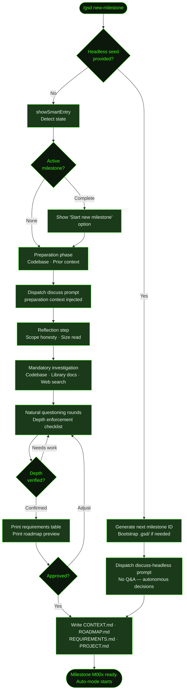

## What It Does

`/gsd new-milestone` starts the next milestone cycle on an existing GSD project. It reads project state, detects that no active milestone is running, and opens the milestone discussion wizard — gathering goals through a structured conversation, running a preparation phase that analyzes the codebase and prior context, writing `REQUIREMENTS.md` with scoped `R###` requirements, and calling `gsd_plan_milestone` to produce a sliced roadmap inside a new milestone directory.

Prior milestone work stays completely intact. `PROJECT.md` carries forward the full capability contract. `REQUIREMENTS.md` accumulates requirements across milestones. The new milestone gets its own directory (e.g., `M002/`) with a `CONTEXT.md` and `ROADMAP.md`, and slice numbering within each milestone always starts at `S01`.

There are two entry paths:

- **Standard path** — No headless seed is present. GSD opens the interactive discussion wizard, runs a preparation phase (codebase brief, prior context brief), and dispatches the discuss prompt. The discuss flow reflects what's already been built before asking what to build next.
- **Headless path** — A specification is passed via `gsd headless new-milestone --context <file>`, `/gsd auto --yolo <file>`, or equivalent. GSD dispatches a non-interactive flow that makes planning decisions autonomously from the spec and documents every assumption in `CONTEXT.md`.

After the roadmap is approved and "Milestone M00x ready." is printed, auto-mode starts automatically.

## Usage

```
/gsd new-milestone
```

No arguments are accepted — the milestone ID and title are determined during the discussion. To trigger the headless path without any Q&A, use `gsd headless new-milestone --context <file>` (from the terminal) or `/gsd auto --yolo <file>` (from Claude).

## How It Works

### New Milestone Flow


```mermaid
flowchart TD
    Start(["/gsd new-milestone"]) --> CheckHeadless{Headless seed\nprovided?}
    CheckHeadless -->|Yes| HeadlessDiscover[Generate next milestone ID\nBootstrap .gsd/ if needed]
    CheckHeadless -->|No| SmartEntry[showSmartEntry\nDetect state]
    HeadlessDiscover --> HeadlessDispatch[Dispatch discuss-headless prompt\nNo Q&A — autonomous decisions]
    SmartEntry --> StateCheck{Active\nmilestone?}
    StateCheck -->|None| PrepPhase[Preparation phase\nCodebase · Prior context]
    PrepPhase --> DiscussPrompt[Dispatch discuss prompt\npreparation context injected]
    StateCheck -->|Complete| NewMilestone[Show 'Start new milestone'\noption]
    NewMilestone --> PrepPhase
    DiscussPrompt --> Reflect[Reflection step\nScope honesty · Size read]
    Reflect --> Investigate[Mandatory investigation\nCodebase · Library docs · Web search]
    Investigate --> QA[Natural questioning rounds\nDepth enforcement checklist]
    QA --> DepthVerify{Depth\nverified?}
    DepthVerify -->|Needs work| QA
    DepthVerify -->|Confirmed| Preview[Print requirements table\nPrint roadmap preview]
    Preview --> Approve{Approved?}
    Approve -->|Adjust| QA
    Approve -->|Yes| WriteFiles[Write CONTEXT.md · ROADMAP.md\nREQUIREMENTS.md · PROJECT.md]
    HeadlessDispatch --> WriteFiles
    WriteFiles --> AutoStart([Milestone M00x ready.\nAuto-mode starts])

    style Start fill:#0d180d,stroke:#39ff14,color:#39ff14
    style AutoStart fill:#0d180d,stroke:#39ff14,color:#39ff14
    style CheckHeadless fill:#0d180d,stroke:#39ff14,color:#39ff14
    style StateCheck fill:#0d180d,stroke:#39ff14,color:#39ff14
    style Approve fill:#0d180d,stroke:#39ff14,color:#39ff14
    style DepthVerify fill:#0d180d,stroke:#39ff14,color:#39ff14
    style HeadlessDiscover fill:#1a3a1a,stroke:#39ff14,color:#e8f4e8
    style SmartEntry fill:#1a3a1a,stroke:#39ff14,color:#e8f4e8
    style HeadlessDispatch fill:#1a3a1a,stroke:#39ff14,color:#e8f4e8
    style PrepPhase fill:#1a3a1a,stroke:#39ff14,color:#e8f4e8
    style DiscussPrompt fill:#1a3a1a,stroke:#39ff14,color:#e8f4e8
    style NewMilestone fill:#1a3a1a,stroke:#39ff14,color:#e8f4e8
    style Reflect fill:#1a3a1a,stroke:#39ff14,color:#e8f4e8
    style Investigate fill:#1a3a1a,stroke:#39ff14,color:#e8f4e8
    style QA fill:#1a3a1a,stroke:#39ff14,color:#e8f4e8
    style Preview fill:#1a3a1a,stroke:#39ff14,color:#e8f4e8
    style WriteFiles fill:#1a3a1a,stroke:#39ff14,color:#e8f4e8
```

### Step-by-Step

**1. Check for headless seed** — Determines whether a headless seed was provided (via `gsd headless new-milestone --context` or the `--yolo` flag). If yes, routes to the headless path. Otherwise, routes through `showSmartEntry`.

**2. Detect project state** — `showSmartEntry` derives current state. If no active milestone exists (or the previous milestone is fully complete), it presents a "Create next milestone" option. Selecting it starts the preparation phase.

**3. Preparation phase** — Before the discussion prompt is dispatched, GSD runs an automated preparation pass that produces two briefs:

| Brief | What it captures |
|-------|-----------------|
| **Codebase brief** | Technology stack, key modules, established patterns, constraints current code imposes |
| **Prior context brief** | Existing requirements, decisions, completed milestone summaries — what was built before |

These briefs are injected as background context into the discuss prompt. The discuss flow still opens with "What's the vision?" — preparation gives the agent grounding, not the scope. If preparation is disabled or fails, the discuss prompt runs without this context.

**4. Reflection and Investigation** — The discuss prompt opens with a reflection step: the agent summarizes what it understood, gives an honest size read (milestone and slice counts), and invites correction before asking anything. This prevents runaway questioning by forcing comprehension proof first.

After reflection is confirmed, the agent does a mandatory investigation pass: scouts the codebase with `ls`, `find`, and `rg`, checks library docs with `resolve_library` / `get_library_docs`, and runs targeted web searches. This happens once before the first question round so every question reflects what's actually true.

**5. Questioning and Depth Verification** — The agent questions as a thinking partner, not an interviewer. It follows the user's energy, challenges vagueness, and makes abstract things concrete. Questioning depth matches scope — simple work needs 1-2 rounds, large ambiguous visions need more. The agent tracks a depth enforcement checklist internally:

- What they're building (concrete enough to explain to a stranger)
- Why it needs to exist
- Who it's for
- What "done" looks like
- The biggest technical unknowns / risks
- What external systems this touches

Before offering to proceed, the agent presents a depth summary referencing the user's specific terminology and framing. It then presents a confirmation gate — this gate is **non-bypassable**: the system mechanically blocks `CONTEXT.md` writes until the user confirms the depth summary is correct.

**6. Requirements contract** — Before writing the roadmap, the agent produces or updates `.gsd/REQUIREMENTS.md` with requirements organized into Active, Deferred, Out of Scope, and Traceability sections. Each requirement gets a stable `R###` ID, class, status, source, and primary owning slice. Requirements are printed as a table in chat for confirmation before any files are written. This gate is also non-bypassable.

**7. Roadmap preview and creation** — The planned roadmap is printed as a table in chat (Slice, Title, Risk, Depends, Demo) before any files are written. The user can request adjustments. Once approved, the agent calls `gsd_plan_milestone` to persist the roadmap — slices use `S01/`, `S02/` naming inside the milestone directory.

**8. Write artifacts** — In a single pass: creates the milestone directory and slices/ subdirectory, writes `CONTEXT.md`, calls `gsd_plan_milestone` to render `ROADMAP.md`, updates `PROJECT.md` with the current milestone sequence, and calls `gsd_decision_save` for any architectural decisions made during discussion.

**9. Auto-start** — The agent says "Milestone M00x ready." — this phrase is mechanically detected, which triggers auto-mode to start immediately.

### Milestone ID Numbering

GSD generates sequential milestone IDs (`M001`, `M002`, `M003`, ...) automatically using `gsd_milestone_generate_id`. The IDs are never invented manually — calling the tool ensures the next ID accounts for any already-reserved IDs from in-flight sessions. Slice numbering within each milestone always starts at `S01` regardless of which milestone it is.

### Multi-Milestone Vision

If you describe a project spanning multiple milestones during the discussion, the agent proposes a milestone sequence, walks each remaining milestone through a sequential readiness gate, and decides per-milestone whether to:

- **Discuss now** — Run a focused discussion for that milestone in the current session, while context is still fresh. Produces a full `CONTEXT.md`.
- **Write draft for later** — Write a `CONTEXT-DRAFT.md` with seed material; auto-mode pauses at that milestone and prompts you to run `/gsd` to finalize it.
- **Just queue it** — Create the directory only; auto-mode starts a full discussion when it reaches this milestone.

A `DISCUSSION-MANIFEST.json` file is written after each gate decision and mechanically blocks auto-start until all gates are complete.

### Headless Path

When a seed specification is provided via `gsd headless new-milestone --context <file>` (terminal) or `/gsd auto --yolo <file>` (Claude), the command runs without any Q&A. The agent:

1. Reads and summarizes the specification
2. Scouts the codebase and checks library docs for any tech mentioned
3. Resolves ambiguities autonomously using best-judgment calls
4. Documents every assumption in an "Assumptions" section in `CONTEXT.md`
5. Writes `PROJECT.md`, `REQUIREMENTS.md`, `CONTEXT.md`, and calls `gsd_plan_milestone`

This path is useful for CI-driven or scripted milestone creation from a prepared spec. The headless prompt enforces an anti-reduction rule — if the spec describes a big vision, the full vision is planned rather than quietly trimmed.

### Preparation Phase Settings

The preparation phase can be configured via preferences:

- `discuss_preparation: false` — Disables preparation entirely; falls back to the discuss prompt without injected briefs
- `discuss_web_research: false` — Skips web research during preparation
- `discuss_depth` — Controls how deeply the preparation explores the codebase

## What Files It Touches

### Creates

| File | Purpose |
|------|---------|
| `.gsd/milestones/MXXX/` | New milestone directory |
| `.gsd/milestones/MXXX/slices/` | Slice subdirectory |
| `.gsd/milestones/MXXX/MXXX-CONTEXT.md` | Milestone context — goals, architecture, acceptance criteria, decisions |
| `.gsd/milestones/MXXX/MXXX-ROADMAP.md` | Sliced execution plan rendered by `gsd_plan_milestone` |
| `.gsd/REQUIREMENTS.md` | Created on first milestone; updated on subsequent ones |
| `.gsd/DECISIONS.md` | Created or updated with architectural decisions from discussion |

### Reads

| File | Purpose |
|------|---------|
| `.gsd/PROJECT.md` | Existing stack, decisions, milestone sequence |
| `.gsd/REQUIREMENTS.md` | Prior requirements to continue numbering and traceability |
| `.gsd/DECISIONS.md` | Prior decisions to surface as context during discussion |
| `.gsd/milestones/MXXX/MXXX-SUMMARY.md` | Completed milestone summaries — loaded as prior context brief |
| `.gsd/milestones/MXXX/slices/SXX/SXX-SUMMARY.md` | Completed slice summaries — loaded as prior context brief |
| `.gsd/STATE.md` | Current state; rebuilt from derived state before dispatch |

### Writes

| File | Purpose |
|------|---------|
| `.gsd/PROJECT.md` | Updated with new milestone in the sequence table |
| `.gsd/REQUIREMENTS.md` | New Active requirements added; traceability updated after roadmap creation |
| `.gsd/STATE.md` | Rebuilt from derived state before discuss prompt is dispatched |

### Deletes

| File | Purpose |
|------|---------|
| `.gsd/milestones/MXXX/MXXX-CONTEXT-DRAFT.md` | Deleted when draft milestone context is promoted to full context |

## Examples

**Previous milestone complete, starting the next one:**

```
> /gsd new-milestone

● GSD — Get Shit Done
  ━━━━━━━━━━━━━━━━━━━━━━━━━━━━━━━━━━━━━━━━━━━━━━━━━━━━━
   GSD ► No active milestone
  ━━━━━━━━━━━━━━━━━━━━━━━━━━━━━━━━━━━━━━━━━━━━━━━━━━━━━

  → Create next milestone — Define what to build next.
```

After selecting "Create next milestone", GSD runs the preparation phase and dispatches the discuss prompt:

```
What's the vision?
> Push notifications for social events — comments, follows, likes.
  Also an in-app notification center with per-type opt-out.

Here's my read:

This is primarily API/backend work with a native push layer.

From the codebase: you have an existing Express router with JWT auth
in auth.ts. The users table has id, email, hashedPassword columns.

Here's what I'm hearing:
- Delivery pipeline (APNs/FCM integration)
- In-app notification history
- Per-type opt-out preferences

Estimated scope: 1 milestone, 3 slices. Correct anything important I missed.
```

---

**Requirements table printed before roadmap:**

```
## M002 Requirements

| ID   | Title                        | Status  | Owner | Source |
|------|------------------------------|---------|-------|--------|
| R006 | Push delivery pipeline       | Active  | S01   | user   |
| R007 | In-app notification center   | Active  | S02   | user   |
| R008 | Per-type opt-out             | Active  | S02   | user   |
| R009 | Delivery receipts            | Active  | S01   | infer  |
| R010 | Badge count sync             | Active  | S03   | infer  |

Confirm, adjust, or add?
```

---

**Roadmap preview before files are written:**

```
| Slice | Title                      | Risk   | Depends | Demo                               |
|-------|----------------------------|--------|---------|------------------------------------|
| S01   | Push delivery pipeline     | high   | []      | Alert fires when comment is posted |
| S02   | Notification center        | medium | [S01]   | In-app history renders real events |
| S03   | Preferences + badges       | low    | [S01]   | Opt-out persists; badge updates    |

Milestone definition of done:
- User receives push alert for comment and follow events end-to-end
- Notification history visible in-app
- Per-type opt-out persists across sessions
- Badge count stays in sync

Ready to write, or want to adjust?
```

---

**What the `.gsd/` tree looks like after initialization:**

```
.gsd/
├── PROJECT.md              ← updated with M002 in milestone sequence
├── REQUIREMENTS.md         ← R006–R010 added with traceability
├── DECISIONS.md            ← architectural decisions from discussion
└── milestones/
    ├── M001/               ← prior milestone, untouched
    └── M002/
        ├── M002-CONTEXT.md ← goals, architecture, acceptance criteria
        ├── M002-ROADMAP.md ← S01–S03 with risk, depends, demo lines
        └── slices/
            ├── S01/
            ├── S02/
            └── S03/
```

---

**Headless path from a spec file:**

```bash
# From the terminal — creates milestone from a spec file, then starts auto mode
gsd headless new-milestone --context ./push-notifications-spec.md --auto

# From Claude — use the --yolo flag with /gsd auto
/gsd auto --yolo ./push-notifications-spec.md
```

The headless agent works through the spec autonomously:

```
● Found headless seed — running autonomous milestone creation

  Reflection: Building a push notification system for social events.
  Estimated scope: 3 slices, medium complexity.
  ...

  Assumptions made:
  - APNs + FCM via expo-notifications (no web push in scope)
  - Badge count driven by server-side unread count
  ...

  Milestone M002 ready.
```

## Related Commands

- [`/gsd`](../../commands/gsd/) — The same smart entry flow; routes based on current state
- [`/gsd discuss`](../../commands/discuss/) — Start or resume a guided milestone or slice discussion
- [`/gsd auto`](../../commands/auto/) — Autonomous execution after the roadmap is ready
- [`/gsd headless`](../../commands/headless/) — Programmatic milestone creation from a spec file, without user interaction
- [`/gsd doctor`](../../commands/doctor/) — Diagnose and repair .gsd/ state if something looks wrong
