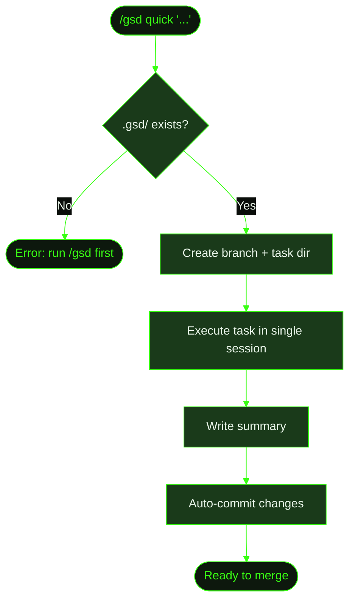

## When to Use This

You need to make a small, well-understood change — the kind where planning overhead isn't worth it. Adding a button, fixing a color, updating a config value, writing a utility function. You know what needs to happen and it fits in a single task.

`/gsd quick` skips the full milestone/slice/task hierarchy. No roadmap, no slice planning, no multi-unit dispatch. It creates a branch, executes the task, writes a summary, and commits — with the full GSD guarantees (atomic commits, state tracking, summaries) but without the ceremony.

For bugs that need investigation or changes that touch multiple concerns, use the [full lifecycle](../fix-a-bug/) instead.

## Prerequisites

- GSD installed and available in your terminal
- An existing project with a `.gsd/` directory (quick tasks need the project structure)
- A clear idea of what you want to change

## Steps

**The scenario:** Cookmate recipe pages are long, and users have to scroll back to the top manually. You want to add a "back to top" button.

### 1. Run the quick command

Describe what you want in plain English:

```
> /gsd quick "add a back-to-top button to recipe pages"
```

GSD immediately starts working — no discussion phase, no research phase, no planning phase.

### 2. What happens behind the scenes

GSD performs these steps automatically:

1. **Validates** that `.gsd/` exists
2. **Generates a slug** from your description: `add-a-back-to-top-button-to-recipe-pages`
3. **Creates a branch**: `gsd/quick/1-add-a-back-to-top-button-to-recipe-pages`
4. **Creates a task directory**: `.gsd/quick/1-add-a-back-to-top-button-to-recipe-pages/`
5. **Dispatches the task** with your description plus project context (KNOWLEDGE.md, DECISIONS.md, project brief)
6. **Executes** in a single agent session — builds the real thing, not a stub

```
● Generating quick task
  Slug: add-a-back-to-top-button-to-recipe-pages
  Branch: gsd/quick/1-add-a-back-to-top-button-to-recipe-pages
  Task dir: .gsd/quick/1-add-a-back-to-top-button-to-recipe-pages/

● Switched to branch gsd/quick/1-add-a-back-to-top-button-to-recipe-pages
  ─────────────────────────────────

  ... agent executes task ...

  ✓ Created BackToTopButton component
  ✓ Added to RecipePage layout
  ✓ Smooth scroll behavior with fade-in on scroll
  ✓ Task summary written

● Quick task complete
  ┌──────────────────────────────────────────┐
  │ Branch: gsd/quick/1-add-a-back-to-...   │
  │ Files changed: 3                         │
  │ Ready to merge                           │
  └──────────────────────────────────────────┘
```

### 3. Review and merge

The quick branch is ready. Review the diff and merge when satisfied:

```bash
git diff main
git checkout main
git merge gsd/quick/1-add-a-back-to-top-button-to-recipe-pages
```

GSD doesn't auto-merge quick branches — that's your call.

## What Gets Created

The `.gsd/` tree after a quick task:

```
.gsd/
├── PROJECT.md
├── STATE.md          ← updated with quick task record
└── quick/
    └── 1-add-a-back-to-top-button-to-recipe-pages/
        └── SUMMARY.md    ← what changed, files modified, verification
```

Quick tasks live in `.gsd/quick/` — separate from the milestone hierarchy. Each gets a numbered directory with a summary documenting what was done.

## Flow Diagram



## Related

- [/gsd quick command](../../commands/quick/) — full command reference with options and examples
- [Recipe: Fix a Bug](../fix-a-bug/) — when the change needs investigation and planning
