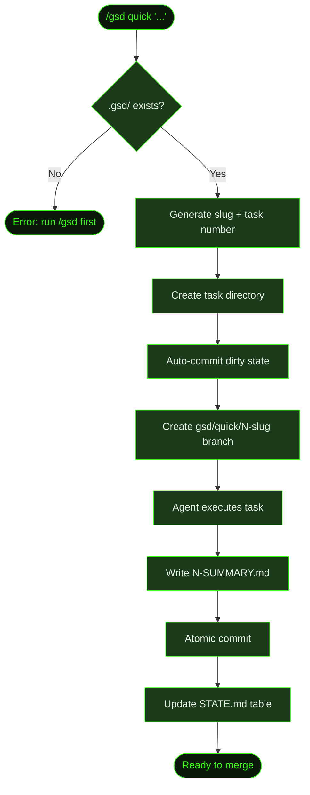

## What It Does

`/gsd quick` executes a focused, self-contained task without the full milestone/slice/plan ceremony. You describe what you want in plain English, and GSD creates a branch, dispatches the work to an agent, commits atomically, and writes a summary — all in one shot.

Use it when the change is well-understood, bounded, and doesn't need investigation or coordination across multiple concerns. Adding a button, fixing a label, updating a config value, writing a utility function — these are quick tasks. For anything that requires digging into root causes or touching multiple layers of the system, use the [full lifecycle](../fix-a-bug/) instead.

## Usage

```
/gsd quick <task description>
```

Quotes are optional.

```
/gsd quick add a back-to-top button to recipe pages
/gsd quick "fix the off-by-one in pagination"
/gsd quick update the API timeout to 30 seconds
```

## How It Works

### Execution Flow

1. **Validate** — Checks that `.gsd/` exists. Fails fast with a clear error if the project hasn't been initialized.
2. **Generate slug** — Lowercases and hyphenates the description, truncated to 40 characters.
3. **Number the task** — Scans `.gsd/quick/` for existing directories and increments from the highest number found.
4. **Create task directory** — Creates `.gsd/quick/<N>-<slug>/` to hold the summary.
5. **Create branch** — Auto-commits any dirty working state, then creates `gsd/quick/<N>-<slug>`. If branch creation fails (e.g., detached HEAD), execution continues on the current branch with a warning.
6. **Dispatch** — Sends the quick-task prompt to the agent with your description, the task directory, branch name, and date.
7. **Execute** — The agent reads existing code, builds the real thing (no stubs), runs tests where applicable, and commits atomically with conventional commit messages.
8. **Write summary** — Agent writes `<N>-SUMMARY.md` to the task directory documenting what changed, files modified, and what was verified.
9. **Update STATE.md** — Agent appends a row to the "Quick Tasks Completed" table in `.gsd/STATE.md` with the task number, description, date, commit hash, and directory link.

### Flow Diagram



### Summary File Format

The agent writes a numbered summary file (e.g., `1-SUMMARY.md`) to the task directory:

```markdown
# Quick Task: add a back-to-top button to recipe pages

**Date:** 2026-03-19
**Branch:** gsd/quick/1-add-a-back-to-top-button-to-re

## What Changed
- Added BackToTopButton component with smooth scroll
- Integrated into RecipePage layout
- Fades in after 300px scroll

## Files Modified
- src/components/BackToTopButton.tsx (created)
- src/pages/RecipePage.tsx (modified)

## Verification
- Renders correctly on desktop and mobile viewports
- Scroll listener cleaned up on unmount
```

### STATE.md Tracking

After completion, the agent updates `.gsd/STATE.md` with a new row in the "Quick Tasks Completed" table:

```markdown
| # | Description | Date | Commit | Directory |
|---|-------------|------|--------|-----------|
| 1 | add a back-to-top button to recipe pages | 2026-03-19 | a1b2c3d | [1-add-a-back-to-top-button-to-re](./quick/1-add-a-back-to-top-button-to-re/) |
```

## What Files It Touches

### Creates

| File | Purpose |
|------|---------|
| `.gsd/quick/<N>-<slug>/` | Task directory created before dispatch |
| `.gsd/quick/<N>-<slug>/<N>-SUMMARY.md` | Summary written by agent after execution |

### Reads

| File | Purpose |
|------|---------|
| `.gsd/STATE.md` | Read to append the quick tasks table |
| `.gsd/quick/` | Scanned to determine the next task number |

### Writes

| File | Purpose |
|------|---------|
| `.gsd/STATE.md` | "Quick Tasks Completed" table updated |
| Source files | Whatever the task requires |

## Examples

**Scenario:** Cookmate recipe pages are long and users have to scroll back to the top manually. You want to add a "back to top" button.

```
> /gsd quick add a back-to-top button to recipe pages
```

GSD starts working immediately — no discussion, no research phase, no planning phase:

```
● Quick task 1: add a back-to-top button to recipe pages
  Directory: .gsd/quick/1-add-a-back-to-top-button-to-re
  Branch: gsd/quick/1-add-a-back-to-top-button-to-re

● Switched to branch gsd/quick/1-add-a-back-to-top-button-to-re
  ─────────────────────────────────────────────────────────

  ✓ Created BackToTopButton component
  ✓ Added to RecipePage layout
  ✓ Smooth scroll with fade-in on scroll
  ✓ Summary written to .gsd/quick/1-.../1-SUMMARY.md
  ✓ STATE.md updated

  Quick task 1 complete.
```

Once the agent finishes, review the diff and merge when satisfied:

```bash
git diff main
git checkout main
git merge gsd/quick/1-add-a-back-to-top-button-to-re
```

GSD doesn't auto-merge quick branches — that's your call.

## Related Commands

- [`/gsd quick`](../../commands/quick/) — full command reference
- [Recipe: Fix a Bug](../fix-a-bug/) — when the change needs investigation and planning
- [`/gsd capture`](../../commands/capture/) — fire-and-forget thought capture for ideas to act on later
