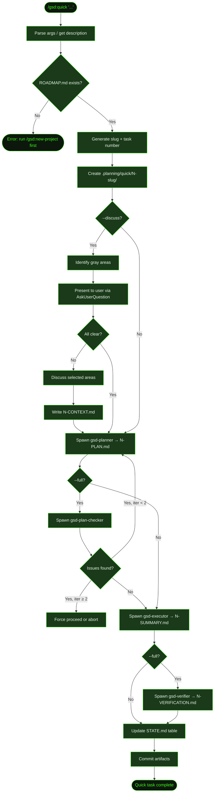

## What It Does

`/gsd:quick` executes a focused, self-contained task without the full milestone/phase/plan ceremony. You describe what you want in plain English, and GSD spawns a planner agent to create a minimal plan, then an executor agent to implement it — with atomic commits and STATE.md tracking throughout.

Use it when the change is well-understood, bounded, and doesn't need investigation or coordination across multiple concerns. Adding a button, fixing a label, updating a config value, writing a utility function — these are quick tasks. For anything that requires digging into root causes or touching multiple layers of the system, use the [full lifecycle](../fix-a-bug/) instead.

Quick tasks live in `.planning/quick/` and are tracked separately from planned phases. They don't modify `ROADMAP.md`.

## Usage

```
/gsd:quick [--discuss] [--full] <task description>
```

Quotes are optional. If no description is provided, GSD prompts you interactively.

```
/gsd:quick add a back-to-top button to recipe pages
/gsd:quick "fix the off-by-one in pagination"
/gsd:quick update the API timeout to 30 seconds
/gsd:quick --discuss add a user avatar to the nav bar
/gsd:quick --full refactor the auth token refresh logic
/gsd:quick --discuss --full redesign the checkout summary component
```

The flags are independent and composable:

| Flag | What it adds |
|------|-------------|
| `--discuss` | Lightweight discussion phase before planning — surfaces gray areas, captures decisions in `N-CONTEXT.md`, and locks them so the planner doesn't revisit them |
| `--full` | Plan-checking (up to 2 revision iterations) and post-execution verification via gsd-verifier |
| Both | Discussion + plan-checking + verification |

## How It Works

### Execution Flow

1. **Parse arguments** — Strips `--discuss` and `--full` flags if present. If no description remains, prompts you interactively.
2. **Initialize** — Runs `gsd-tools init quick`. Validates that `.planning/ROADMAP.md` exists — quick mode requires an active project. Generates a slug (lowercased, hyphenated, max 40 chars) and determines the next task number by scanning `.planning/quick/`.
3. **Create task directory** — Creates `.planning/quick/<N>-<slug>/` to hold all artifacts.
4. **(--discuss) Discussion phase** — Identifies 2–4 gray areas in your description, presents them via `AskUserQuestion`, asks 1–2 focused questions per selected area, and writes decisions to `<N>-CONTEXT.md`. If you select "All clear", skips CONTEXT.md entirely.
5. **Spawn planner** — Dispatches to gsd-planner (quick mode) with your description and STATE.md as context. When `--discuss` is active, passes the CONTEXT.md as locked decisions. Planner creates a focused `<N>-PLAN.md` with 1–3 atomic tasks.
6. **(--full) Plan-checker loop** — gsd-plan-checker validates the plan. If issues are found, the planner revises — up to 2 iterations. After 2 failed iterations, you can force-proceed or abort.
7. **Spawn executor** — gsd-executor reads the plan and STATE.md, implements the work, commits each task atomically, and writes `<N>-SUMMARY.md`.
8. **(--full) Verification** — gsd-verifier checks the `must_haves` in the plan against the actual codebase and writes `<N>-VERIFICATION.md`.
9. **Update STATE.md** — Appends a row to the "Quick Tasks Completed" table (with a Status column when `--full`). Updates the "Last activity" line.
10. **Final commit** — Commits all artifacts: plan, summary, STATE.md, and (if applicable) context and verification files.

### Flow Diagram



### Discussion Phase (`--discuss`)

When `--discuss` is active, GSD pauses before planning to surface implementation decisions that would change the outcome. It identifies 2–4 gray areas using a domain-aware heuristic — concrete decisions specific to your task, not generic categories.

Examples of gray areas:
- Something users **see** → layout, density, interactions, states
- Something users **call** → API responses, errors, auth behavior
- Something users **run** → output format, flags, error handling
- Something users **read** → structure, tone, depth

For each gray area you select, GSD asks 1–2 focused questions with concrete options. If you choose "You decide", that's recorded as Claude's discretion. Selecting "All clear" skips the entire discussion and no CONTEXT.md is written.

Decisions captured in CONTEXT.md are passed to the planner as **locked** — the planner treats them as given, not open questions.

### Summary File Format

The executor writes a numbered summary file (e.g., `1-SUMMARY.md`) to the task directory:

```markdown
# Quick Task: add a back-to-top button to recipe pages

**Date:** 2026-03-19

## What Changed
- Added BackToTopButton component with smooth scroll
- Integrated into RecipePage layout
- Fades in after 300px scroll

## Files Modified
- src/components/BackToTopButton.tsx (created)
- src/pages/RecipePage.tsx (modified)

## Verification
- Renders correctly on desktop and mobile viewports
- Scroll listener cleaned up on unmount
```

### STATE.md Tracking

After completion, the agent updates `.planning/STATE.md` with a new row in the "Quick Tasks Completed" table and updates the "Last activity" line. If the section doesn't exist yet, it is inserted after the "Blockers/Concerns" section.

**Default mode** (no `--full`):

```markdown
### Quick Tasks Completed

| # | Description | Date | Commit | Directory |
|---|-------------|------|--------|-----------|
| 1 | add a back-to-top button to recipe pages | 2026-03-19 | a1b2c3d | [1-add-a-back-to-top-button-to-re](./quick/1-add-a-back-to-top-button-to-re/) |
```

**Full mode** (`--full`) adds a Status column populated by the verifier result (`Verified`, `Needs Review`, or `Gaps`):

```markdown
| # | Description | Date | Commit | Status | Directory |
|---|-------------|------|--------|--------|-----------|
| 2 | refactor auth token refresh logic | 2026-03-20 | b2c3d4e | Verified | [2-refactor-auth-token-refresh-lo](./quick/2-refactor-auth-token-refresh-lo/) |
```

## What Files It Touches

### Creates

| File | Purpose |
|------|---------|
| `.planning/quick/<N>-<slug>/` | Task directory created before dispatch |
| `.planning/quick/<N>-<slug>/<N>-CONTEXT.md` | Discussion decisions written by orchestrator (`--discuss` only, skipped if user selects "All clear") |
| `.planning/quick/<N>-<slug>/<N>-PLAN.md` | Plan created by gsd-planner |
| `.planning/quick/<N>-<slug>/<N>-SUMMARY.md` | Summary written by gsd-executor |
| `.planning/quick/<N>-<slug>/<N>-VERIFICATION.md` | Verification report written by gsd-verifier (`--full` only) |

### Reads

| File | Purpose |
|------|---------|
| `.planning/quick/` | Scanned to determine the next task number |
| `.planning/ROADMAP.md` | Validated to exist before proceeding |
| `.planning/STATE.md` | Read before updating the quick tasks table |
| `CLAUDE.md` | Project-specific guidelines passed to planner and executor |
| `.claude/skills/` or `.agents/skills/` | Project skill rules read by planner and executor if either directory exists |

### Writes

| File | Purpose |
|------|---------|
| `.planning/quick/<N>-<slug>/<N>-CONTEXT.md` | Discussion decisions (`--discuss` only) |
| `.planning/quick/<N>-<slug>/<N>-PLAN.md` | Task plan written by planner |
| `.planning/quick/<N>-<slug>/<N>-SUMMARY.md` | Task summary written by executor |
| `.planning/quick/<N>-<slug>/<N>-VERIFICATION.md` | Verification report (`--full` only) |
| `.planning/STATE.md` | "Quick Tasks Completed" table row added; "Last activity" line updated |
| Source files | Whatever the task requires |

## Examples

**Scenario:** Cookmate recipe pages are long and users have to scroll back to the top manually. You want to add a "back to top" button.

```
> /gsd:quick add a back-to-top button to recipe pages
```

GSD starts working immediately — no discussion, no research phase:

```
Creating quick task 1: add a back-to-top button to recipe pages
Directory: .planning/quick/1-add-a-back-to-top-button-to-re

Plan created: .planning/quick/1-add-a-back-to-top-button-to-re/1-PLAN.md

---

GSD > QUICK TASK COMPLETE

Quick Task 1: add a back-to-top button to recipe pages

Summary: .planning/quick/1-add-a-back-to-top-button-to-re/1-SUMMARY.md
Commit: a1b2c3d

---

Ready for next task: /gsd:quick
```

**Scenario:** The task has design decisions you want to lock in before planning — use `--discuss`:

```
> /gsd:quick --discuss add a user avatar to the nav bar
```

GSD surfaces gray areas before spawning the planner:

```
━━━━━━━━━━━━━━━━━━━━━━━━━━━━━━━━━━━━━━━━━━━━━━━━━━━━━
 GSD ► QUICK TASK (DISCUSS)
━━━━━━━━━━━━━━━━━━━━━━━━━━━━━━━━━━━━━━━━━━━━━━━━━━━━━

◆ Discussion phase enabled — surfacing gray areas before planning
```

GSD asks about avatar fallback behavior, click destination, and size/placement — then writes your answers to `1-CONTEXT.md` before the planner sees them.

**Scenario:** You want the extra quality guarantees of plan-checking and verification:

```
> /gsd:quick --full refactor the auth token refresh logic

━━━━━━━━━━━━━━━━━━━━━━━━━━━━━━━━━━━━━━━━━━━━━━━━━━━━━
 GSD ► QUICK TASK (FULL MODE)
━━━━━━━━━━━━━━━━━━━━━━━━━━━━━━━━━━━━━━━━━━━━━━━━━━━━━

◆ Plan checking + verification enabled
```

After planning, checking, execution, and verification:

```
---

GSD > QUICK TASK COMPLETE (FULL MODE)

Quick Task 2: refactor the auth token refresh logic

Summary: .planning/quick/2-refactor-auth-token-refresh-lo/2-SUMMARY.md
Verification: .planning/quick/2-refactor-auth-token-refresh-lo/2-VERIFICATION.md (Verified)
Commit: b2c3d4e

---

Ready for next task: /gsd:quick
```

**Scenario:** A complex UI change where you want both decisions locked and verification checked:

```
> /gsd:quick --discuss --full redesign the checkout summary component

━━━━━━━━━━━━━━━━━━━━━━━━━━━━━━━━━━━━━━━━━━━━━━━━━━━━━
 GSD ► QUICK TASK (DISCUSS + FULL)
━━━━━━━━━━━━━━━━━━━━━━━━━━━━━━━━━━━━━━━━━━━━━━━━━━━━━

◆ Discussion + plan checking + verification enabled
```

## Related Commands

- [`/gsd:quick`](../../commands/quick/) — Full command reference
- [Recipe: Fix a Bug](../fix-a-bug/) — When the change needs investigation and planning
- [`/gsd:capture`](../../commands/capture/) — Fire-and-forget thought capture for ideas to act on later
