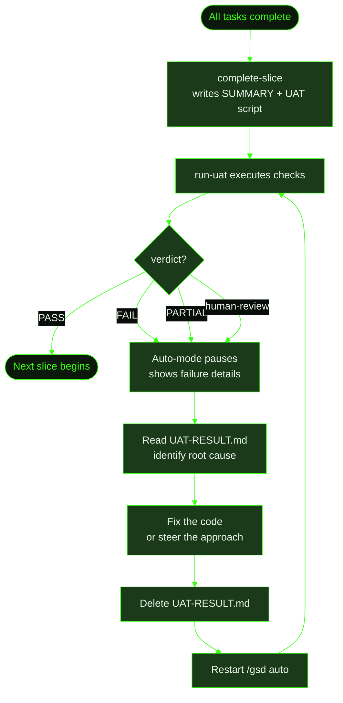

## When to Use This

You're running GSD auto-mode and a slice completes all its tasks, but the UAT (User Acceptance Test) step fails or surfaces checks for manual review. Auto-mode pauses and shows the failure details — it doesn't automatically replan or retry. This recipe walks through how to read the failure, understand your options, and get the pipeline moving again.

This covers three UAT pause scenarios:
- **Artifact-driven UAT fails** — automated checks ran and one or more returned FAIL
- **Artifact-driven UAT partial** — some checks passed, some failed; auto-mode pauses for investigation
- **Non-artifact-driven UAT** — visual tests, live-runtime checks, or manual flows that can't be mechanically executed; auto-mode surfaces them for you to perform manually

## Prerequisites

- GSD installed and available in your terminal
- A project running in auto-mode ([`/gsd auto`](../../commands/auto/))
- Understanding of slices and UAT from the [auto-mode command reference](../../commands/auto/)

## Steps

**The scenario:** Cookmate's recipe search slice (S01) passes all its implementation tasks — search works for normal queries. But UAT reveals that searching for recipe names with special characters (like "Grandma's Cookies" or "Mac & Cheese") returns no results. The apostrophe and ampersand break the query.

### 1. Auto-mode completes all tasks

GSD finishes executing T01 (build search API), T02 (build search UI), and T03 (add test coverage). Each task passes its own verification — unit tests pass, the API responds, the UI renders results.

```
.gsd/
└── milestones/
    └── M002/
        └── slices/
            └── S01/
                ├── S01-PLAN.md           ← all tasks checked off
                ├── S01-SUMMARY.md        ← slice summary written
                ├── S01-UAT.md            ← UAT checks script written by complete-slice
                └── tasks/
                    ├── T01-PLAN.md
                    ├── T01-SUMMARY.md     ← ✓ search API built
                    ├── T02-PLAN.md
                    ├── T02-SUMMARY.md     ← ✓ search UI built
                    ├── T03-PLAN.md
                    └── T03-SUMMARY.md     ← ✓ tests written
```

### 2. Auto-mode runs UAT

After `complete-slice` finishes, GSD automatically dispatches a `run-uat` unit. Because `S01-UAT.md` is `artifact-driven`, the runner executes every check mechanically — shell commands, `grep` checks, file reads, script invocations — and records the actual result and a PASS or FAIL verdict for each. The overall result is PASS (all checks passed), FAIL (one or more failed), or PARTIAL (some passed, some failed).

In this case, the UAT includes a check for special characters in search queries. That check fails:

```
| Check                              | Result | Notes                                    |
|------------------------------------|--------|------------------------------------------|
| Search returns results for "pasta" | PASS   | 3 results returned                       |
| Search handles pagination          | PASS   | Page 2 shows next batch                  |
| Search for "Grandma's Cookies"     | FAIL   | SQL error: unterminated string literal    |
| Search for "Mac & Cheese"          | FAIL   | Returns 0 results, expected 1            |
```

GSD writes the result to `S01-UAT-RESULT.md` with verdict: **FAIL**.

### 3. Auto-mode pauses

When UAT verdict is FAIL, PARTIAL, or `human-review`, auto-mode **pauses** — it does not automatically replan or retry. You'll see output like:

```
● UAT result: FAIL — S01 (Recipe Search)
  2 of 4 checks failed. See .gsd/milestones/M002/slices/S01/S01-UAT-RESULT.md

⚠ Auto-mode paused. Investigate the failures and restart with /gsd auto.
```

The `S01-UAT-RESULT.md` file contains the full structured result:

```yaml
---
sliceId: S01
uatType: artifact-driven
verdict: FAIL
date: 2025-01-15T14:30:00.000Z
---
```

followed by the checks table and a summary of what failed.

Non-artifact-driven UAT (live-runtime, visual, manual flows) also pauses auto-mode — but instead of FAIL, the verdict is `human-review`. In this case, GSD can't execute the checks itself; it surfaces them so you can perform them manually.

### 4. Investigate the failure

Read the UAT result file to understand exactly which checks failed and why:

```
> cat .gsd/milestones/M002/slices/S01/S01-UAT-RESULT.md
```

For the special-character case, the failure notes make it clear: the search query is interpolated directly into a SQL string without sanitization. Special characters break the query.

### 5. Fix the issue

With the cause identified, fix the underlying code. In this case, add input sanitization — escape apostrophes and ampersands before they reach the database query, and add test coverage for the specific inputs that failed.

You have a few options depending on how significant the fix is:

**Option A — Fix it directly.** If the fix is straightforward, make the code changes yourself (or in a new [`/gsd quick`](../../commands/quick/) task), then proceed to step 6.

**Option B — Use `/gsd steer`.** If the fix requires updating the slice plan or task approach, register a steering override before restarting. When auto-mode is not running, steer tells the agent to update plan documents immediately in the current conversation:

```
/gsd steer sanitize special characters in search queries before database interpolation
```

This writes the override to `OVERRIDES.md` and propagates it across active plan documents so the next task dispatch reflects the corrected approach.

**Option C — Manual UAT (`human-review` verdict).** Perform the surfaced checks yourself. Once you've verified the behavior (or determined whether it passes), either fix and proceed to step 6, or skip the UAT unit entirely if you're satisfied the slice is complete:

```
/gsd skip run-uat/M002/S01
```

### 6. Delete the UAT result and restart

Once the fix is in place, delete the result file so GSD re-runs the UAT check from scratch:

```bash
rm .gsd/milestones/M002/slices/S01/S01-UAT-RESULT.md
```

Then restart auto-mode:

```
/gsd auto
```

GSD derives state, sees the slice is complete but has no UAT result, and dispatches `run-uat` again against the fixed code.

### 7. UAT passes — next slice begins

This time all checks pass, including the special character queries. GSD writes the updated result with verdict: **PASS** and advances to the next slice.

```
.gsd/
└── milestones/
    └── M002/
        └── slices/
            └── S01/
                ├── S01-PLAN.md            ← T01–T03 ✓
                ├── S01-SUMMARY.md
                ├── S01-UAT.md
                └── S01-UAT-RESULT.md      ← verdict: PASS
```

## What Gets Created

Key artifacts involved in a UAT failure cycle:

| File | Role |
|------|------|
| `.gsd/milestones/<MID>/slices/<SID>/<SID>-UAT.md` | UAT checks script — written by `complete-slice`, read by `run-uat` |
| `.gsd/milestones/<MID>/slices/<SID>/<SID>-UAT-RESULT.md` | UAT execution results — written by `run-uat` with YAML frontmatter and checks table |
| `.gsd/OVERRIDES.md` | Written if you use `/gsd steer` to guide the fix |
| `.gsd/completed-units.json` | Updated if you use `/gsd skip` to bypass the UAT unit |

The result file uses YAML frontmatter with four fields: `sliceId`, `uatType`, `verdict`, and `date`. The dispatcher reads `verdict` mechanically to decide whether to advance or pause. Only a `PASS` verdict advances auto-mode to the next slice.

## Flow Diagram



## Related Commands

- [`/gsd auto`](../../commands/auto/) — Restart after resolving the failure
- [`/gsd steer`](../../commands/steer/) — Inject a course-correction before restarting
- [`/gsd skip`](../../commands/skip/) — Bypass the UAT unit entirely if you've verified manually
- [`/gsd capture`](../../commands/capture/) — Record a follow-up thought without blocking the pipeline
- [`/gsd status`](../../commands/status/) — Check current state and the active unit key for skip/steer
