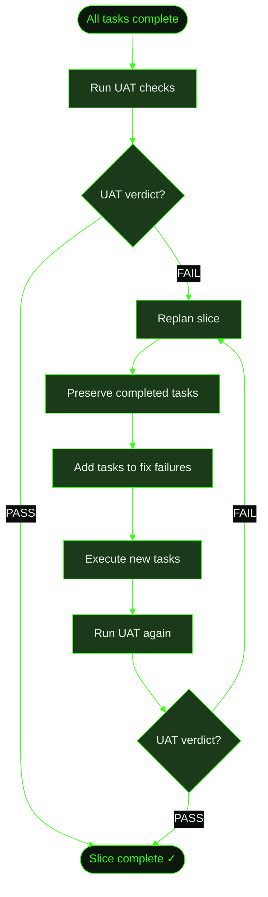

## When to Use This

You're running GSD auto-mode and a slice completes all its tasks, but the UAT (User Acceptance Test) fails. This happens when the implementation passes task-level verification but doesn't meet the slice's acceptance criteria — a gap between "the code works" and "the feature works correctly."

GSD handles this automatically: when UAT fails, it triggers a replan of the slice, then re-executes the updated tasks. This recipe walks through what that cycle looks like and what artifacts it produces.

## Prerequisites

- GSD installed and available in your terminal
- A project running in auto-mode (`/gsd auto`)
- Understanding of slices and UAT from the [auto-mode command reference](../../commands/auto/)

## Steps

**The scenario:** Cookmate's recipe search slice (S01) passes all its implementation tasks — search works for normal queries. But UAT reveals that searching for recipe names with special characters (like "Grandma's Cookies" or "Mac & Cheese") returns no results. The apostrophe and ampersand break the query.

### 1. Auto-mode completes all tasks

GSD finishes executing T01 (build search API), T02 (build search UI), and T03 (add test coverage). Each task passes its own verification — unit tests pass, the API responds, the UI renders results.

```
.gsd/
└── milestones/
    └── M002/
        └── slices/
            └── S01/
                ├── S01-PLAN.md           ← all tasks checked off
                ├── S01-UAT.md            ← acceptance criteria defined
                └── tasks/
                    ├── T01-PLAN.md
                    ├── T01-SUMMARY.md     ← ✓ search API built
                    ├── T02-PLAN.md
                    ├── T02-SUMMARY.md     ← ✓ search UI built
                    ├── T03-PLAN.md
                    └── T03-SUMMARY.md     ← ✓ tests written
```

### 2. Auto-mode runs UAT

After the last task completes, GSD automatically dispatches a UAT unit. The UAT runner reads `S01-UAT.md` and executes every check defined in it — running shell commands, checking file contents, verifying behaviors.

Each check gets a verdict: PASS or FAIL. The overall result is PASS (all checks passed), FAIL (one or more failed), or PARTIAL.

In this case, the UAT includes a check for special characters in search queries. That check fails:

```
| Check                              | Result | Notes                                    |
|------------------------------------|--------|------------------------------------------|
| Search returns results for "pasta" | PASS   | 3 results returned                       |
| Search handles pagination          | PASS   | Page 2 shows next batch                  |
| Search for "Grandma's Cookies"     | FAIL   | SQL error: unterminated string literal    |
| Search for "Mac & Cheese"          | FAIL   | Returns 0 results, expected 1            |
```

GSD writes the result to `S01-UAT-RESULT.md` with verdict: **FAIL**.

### 3. GSD triggers a replan

When UAT fails, auto-mode doesn't just retry — it replans the slice. The replan unit:

1. Reads the UAT failure details from the result file
2. Reads all completed task summaries to understand what was built
3. **Preserves all completed tasks** — their IDs, descriptions, and summaries stay untouched
4. Rewrites or adds new incomplete tasks to address the failures
5. Writes a replan log documenting what changed and why

```
.gsd/
└── milestones/
    └── M002/
        └── slices/
            └── S01/
                ├── S01-PLAN.md            ← updated: T04 added for special char handling
                ├── S01-REPLAN.md           ← new: documents what changed and why
                ├── S01-UAT.md
                ├── S01-UAT-RESULT.md       ← verdict: FAIL
                └── tasks/
                    ├── T01-PLAN.md          ← untouched
                    ├── T01-SUMMARY.md
                    ├── T02-PLAN.md          ← untouched
                    ├── T02-SUMMARY.md
                    ├── T03-PLAN.md          ← untouched
                    ├── T03-SUMMARY.md
                    └── T04-PLAN.md          ← new: sanitize special chars in search queries
```

### 4. Re-execution

Auto-mode continues by executing the new tasks. In this case, T04 adds input sanitization — escaping apostrophes and ampersands before they reach the database query. It also adds test cases for the specific failures UAT caught.

### 5. UAT runs again

After T04 completes, GSD runs UAT again. This time all checks pass, including the special character queries. The UAT result file is updated with verdict: **PASS**.

```
.gsd/
└── milestones/
    └── M002/
        └── slices/
            └── S01/
                ├── S01-PLAN.md            ← T01–T03 ✓, T04 ✓
                ├── S01-REPLAN.md
                ├── S01-SUMMARY.md          ← written on successful completion
                ├── S01-UAT.md
                ├── S01-UAT-RESULT.md       ← verdict: PASS
                └── tasks/
                    ├── T01-SUMMARY.md
                    ├── T02-SUMMARY.md
                    ├── T03-SUMMARY.md
                    └── T04-SUMMARY.md       ← special char fix verified
```

## What Gets Created

Key artifacts produced during a UAT failure cycle:

```
.gsd/
└── milestones/
    └── M002/
        └── slices/
            └── S01/
                ├── S01-PLAN.md           ← modified: new tasks added by replan
                ├── S01-REPLAN.md          ← replan log: what changed and why
                ├── S01-SUMMARY.md         ← final summary after passing UAT
                ├── S01-UAT.md             ← acceptance criteria (unchanged)
                ├── S01-UAT-RESULT.md      ← final verdict: PASS
                └── tasks/
                    └── T04-PLAN.md        ← new task(s) from replan
```

## Flow Diagram


