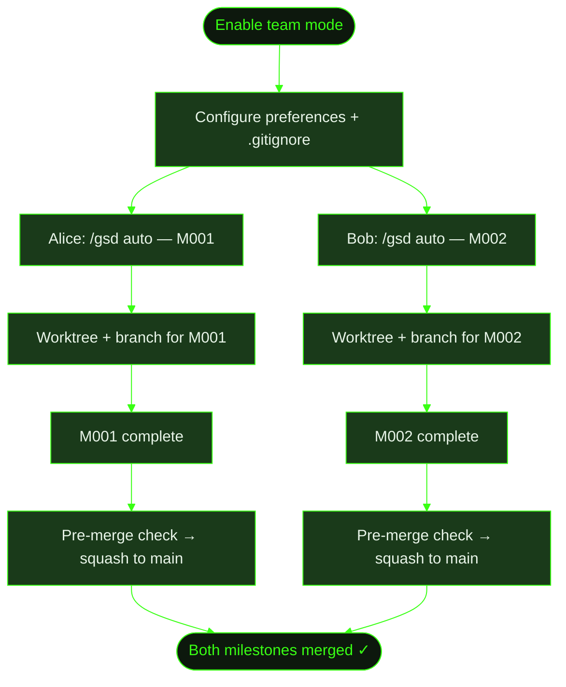

## When to Use This

Multiple developers are working on the same project and want to use GSD simultaneously. Each person needs their own milestone running in auto-mode without stepping on each other's work. This recipe covers the one-time team setup and the daily workflow for parallel development. For the full reference on all team settings, see the [Working in Teams guide](../../working-in-teams/).

## Prerequisites

- GSD installed and available for each team member
- A shared git repository (GitHub, GitLab, etc.)
- Familiarity with [/gsd prefs](../../commands/prefs/) for configuring project preferences

## Steps

**The scenario:** Two developers are working on Cookmate simultaneously. Alice is building user authentication (M001) and Bob is adding recipe search (M002). Both want to use GSD auto-mode at the same time.

### 1. Enable team mode

One developer sets up the project preferences and commits them. This is a one-time setup:

```
> /gsd prefs
```

Set `mode: team` in the project preferences:

```yaml
# .gsd/preferences.md
---
version: 1
mode: team
---
```

This enables several settings at once:

- **Unique milestone IDs** — milestones get a random suffix (e.g., `M001-eh88as`) to prevent ID collisions when two developers create milestones independently
- **Push branches** — each milestone works on a `milestone/<MID>` branch that gets pushed to the remote
- **Pre-merge checks** — GSD verifies state integrity before merging a milestone branch back to main

### 2. Configure `.gitignore`

Share planning artifacts while keeping runtime state local:

```bash
# .gitignore — GSD team setup

# ── Runtime / Ephemeral (per-developer) ──
.gsd/auto.lock
.gsd/completed-units.json
.gsd/STATE.md
.gsd/metrics.json
.gsd/activity/
.gsd/runtime/
.gsd/worktrees/
.gsd/milestones/**/continue.md
.gsd/milestones/**/*-CONTINUE.md
```

**What gets shared** (committed): `preferences.md`, `PROJECT.md`, `REQUIREMENTS.md`, `DECISIONS.md`, `KNOWLEDGE.md`, and all milestone plans, roadmaps, and summaries.

**What stays local** (gitignored): lock files, state cache, activity logs, and worktrees.

```
> git add .gsd/preferences.md .gitignore
> git commit -m "chore: enable GSD team workflow"
> git push
```

### 3. Alice starts her milestone

Alice discusses the auth feature and starts auto-mode:

```
> /gsd

What's the vision?
> Build user authentication for Cookmate — signup, login, sessions.

> /gsd auto
```

GSD creates a milestone with a unique ID and works in an isolated worktree:

```
.gsd/
├── worktrees/
│   └── M001-eh88as/          ← Alice's worktree (gitignored)
└── milestones/
    └── M001-eh88as/
        ├── M001-eh88as-CONTEXT.md
        ├── M001-eh88as-ROADMAP.md
        └── slices/
            └── S01/
                └── ...
```

Her work happens on the `milestone/M001-eh88as` branch, isolated from main.

### 4. Bob starts his milestone (concurrently)

Bob starts his search feature on the same repo — even while Alice's auto-mode is running:

```
> /gsd

What's the vision?
> Add recipe search to Cookmate — full-text search with filters.

> /gsd auto
```

Bob gets his own unique milestone ID and worktree:

```
.gsd/
├── worktrees/
│   ├── M001-eh88as/          ← Alice's worktree
│   └── M002-k4m9px/          ← Bob's worktree
└── milestones/
    ├── M001-eh88as/           ← Alice's milestone
    └── M002-k4m9px/           ← Bob's milestone
```

The unique ID suffixes (`eh88as`, `k4m9px`) prevent collisions — even if both developers happen to create their first milestone at the same time, the IDs won't conflict.

### 5. Milestones complete and merge

When Alice's milestone finishes, GSD squash-merges her `milestone/M001-eh88as` branch to main. Pre-merge checks verify that:

- All slices are marked complete
- No orphaned tasks or missing summaries
- State is internally consistent

```
> git log --oneline main
a1b2c3d M001-eh88as: User authentication (squash)
```

Bob's milestone merges independently when it completes:

```
> git log --oneline main
f5e6d7c M002-k4m9px: Recipe search (squash)
a1b2c3d M001-eh88as: User authentication (squash)
```

### 6. Handle milestone dependencies

If Bob's search feature depends on Alice's auth (e.g., search results should be personalized for logged-in users), declare the dependency in the milestone context:

```yaml
# .gsd/milestones/M002-k4m9px/M002-k4m9px-CONTEXT.md
---
depends_on: [M001-eh88as]
---
```

GSD enforces that dependent milestones complete before starting downstream work.

## What Gets Created

The git and `.gsd/` structure after both milestones complete:

```
main branch:
├── (squash) M002-k4m9px: Recipe search
└── (squash) M001-eh88as: User authentication

.gsd/
├── preferences.md             ← mode: team (shared)
├── PROJECT.md                 ← updated by both milestones
├── DECISIONS.md               ← decisions from both milestones
├── KNOWLEDGE.md               ← learnings from both milestones
└── milestones/
    ├── M001-eh88as/           ← Alice's completed milestone
    │   ├── M001-eh88as-SUMMARY.md
    │   └── slices/...
    └── M002-k4m9px/           ← Bob's completed milestone
        ├── M002-k4m9px-SUMMARY.md
        └── slices/...
```

Worktrees are cleaned up after merge. Planning artifacts remain in `milestones/` as a historical record.

## Flow Diagram


