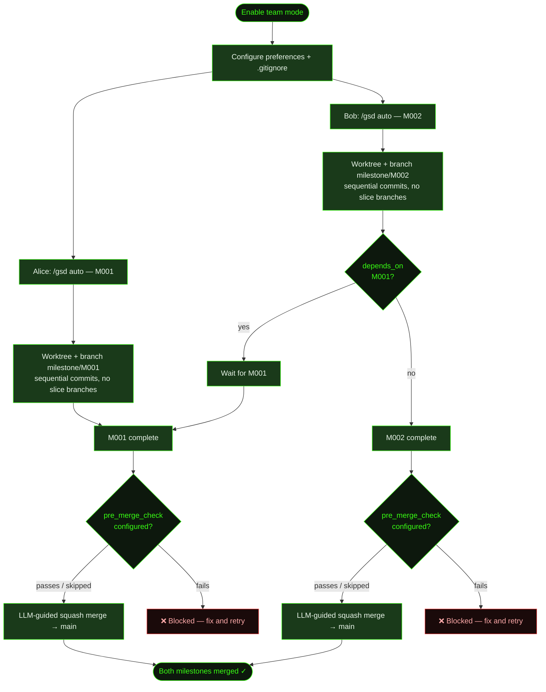

## When to Use This

Multiple developers are working on the same project and want to use GSD simultaneously. Each person needs their own milestone running in auto-mode without stepping on each other's work. This recipe covers the one-time team setup and the daily workflow for parallel development. For the full reference on all team settings, see the [Working in Teams guide](../../working-in-teams/).

## Prerequisites

- GSD installed and available for each team member
- A shared git repository (GitHub, GitLab, etc.)
- Familiarity with [/gsd mode](../../commands/mode/) or [/gsd prefs](../../commands/prefs/) for configuring project preferences

## Steps

**The scenario:** Two developers are working on Cookmate simultaneously. Alice is building user authentication (M001) and Bob is adding recipe search (M002). Both want to use GSD auto-mode at the same time.

### 1. Enable team mode

The fastest way is `/gsd mode`:

```
> /gsd mode project

Workflow mode:
  ❯ solo — auto-push, squash, simple IDs (personal projects)
    team — unique IDs, push branches, pre-merge checks (shared repos)
    (none) — configure everything manually
    (keep current)

  → team

Mode: team — defaults: auto_push=false, push_branches=true,
  pre_merge_check=true, merge_strategy=squash, isolation=worktree,
  unique_milestone_ids=true
```

Alternatively, open the full wizard with `/gsd prefs project` and select **Workflow Mode → team**.

Either way, setting `mode: team` in `.gsd/preferences.md` applies a coordinated set of defaults for shared repos:

| Setting | Team default | What it does |
|---------|-------------|--------------|
| `unique_milestone_ids` | `true` | Adds random 6-char suffix to milestone IDs (e.g. `M001-eh88as`) to prevent collisions |
| `git.push_branches` | `true` | Pushes milestone branches to the remote for visibility |
| `git.pre_merge_check` | `true` | Runs a test command before squash-merging to main |
| `git.merge_strategy` | `squash` | Squashes all milestone commits into one clean commit on main |
| `git.isolation` | `worktree` | Each milestone runs in an isolated git worktree |
| `git.auto_push` | `false` | Commits stay local until milestone branch is pushed on completion |

Mode defaults are the **lowest-priority layer**. Any setting you explicitly configure in the preferences file overrides the mode default.

### 2. Configure `.gitignore`

Share planning artifacts while keeping runtime state local:

```bash
# .gitignore — GSD team setup

# ── Runtime / Ephemeral (per-developer) ──
.gsd/auto.lock
.gsd/completed-units.json
.gsd/STATE.md
.gsd/metrics.json
.gsd/gsd.db
.gsd/activity/
.gsd/runtime/
.gsd/worktrees/
.gsd/DISCUSSION-MANIFEST.json
.gsd/milestones/**/continue.md
.gsd/milestones/**/*-CONTINUE.md
```

**What gets shared** (committed): `preferences.md`, `PROJECT.md`, `REQUIREMENTS.md`, `DECISIONS.md`, `KNOWLEDGE.md`, `QUEUE.md`, and all milestone plans, roadmaps, and summaries.

**What stays local** (gitignored): lock files, SQLite cache, state cache, activity logs, runtime records, and worktrees.

```
> git add .gsd/preferences.md .gitignore
> git commit -m "chore: enable GSD team workflow"
> git push
```

If you manage your own `.gitignore` and don't want GSD touching it, set `git.manage_gitignore: false` in your preferences — GSD will not add or modify any `.gitignore` entries.

### 3. Alice starts her milestone

Alice discusses the auth feature and starts auto-mode:

```
> /gsd

What's the vision?
> Build user authentication for Cookmate — signup, login, sessions.

> /gsd auto
```

GSD creates a milestone with a unique ID and works in an isolated worktree on a single branch. All execution — research, planning, implementation — happens via sequential commits on `milestone/M001-eh88as`. No per-slice branches are created in the shared branch namespace:

```
.gsd/
├── worktrees/
│   └── M001-eh88as/          ← Alice's worktree (gitignored)
│       └── (sequential commits on milestone/M001-eh88as)
└── milestones/
    └── M001-eh88as/
        ├── M001-eh88as-CONTEXT.md
        ├── M001-eh88as-ROADMAP.md
        └── slices/
            └── S01/
                └── ...
```

Her work builds up as tagged commits on the milestone branch:

```
feat(M001/S01): research
feat(M001/S01): plan
feat(S01/T01): implement signup endpoint
feat(S01/T02): implement session handling
feat(M001/S01): summary + UAT
feat(M001/S02): research
...
```

### 4. Bob starts his milestone (concurrently)

Bob starts his search feature on the same repo — even while Alice's auto-mode is running:

```
> /gsd

What's the vision?
> Add recipe search to Cookmate — full-text search with filters.

> /gsd auto
```

Bob gets his own unique milestone ID and worktree:

```
.gsd/
├── worktrees/
│   ├── M001-eh88as/          ← Alice's worktree
│   └── M002-k4m9px/          ← Bob's worktree
└── milestones/
    ├── M001-eh88as/           ← Alice's milestone
    └── M002-k4m9px/           ← Bob's milestone
```

The unique ID suffixes (`eh88as`, `k4m9px`) prevent collisions — even if both developers happen to create their first milestone at the same time, the IDs won't conflict.

### 5. Milestone dependencies (optional)

If Bob's search feature depends on Alice's auth work, declare it in the milestone's `CONTEXT.md` frontmatter:

```yaml
---
depends_on: [M001-eh88as]
---

# M002-k4m9px: Recipe Search
```

GSD checks `depends_on` during state derivation. A milestone whose dependencies haven't completed yet is held as `pending` — auto-mode won't start it until the dependency is done. You can use `/gsd queue` to reorder milestones and manage dependencies interactively.

### 6. Milestones complete and merge

When Alice's milestone finishes, GSD squash-merges her `milestone/M001-eh88as` branch to main using an LLM-guided merge process. Before committing, GSD categorizes all changes — new source files, modified code, updated GSD artifacts — and assesses any conflicts between the worktree and main. If both branches have changed the same file, GSD flags the divergence and proposes a reconciliation before applying anything.

The pre-merge check runs if configured — this executes a test command to verify the work passes. By default the check is skipped; enable it with a custom command or let GSD auto-detect `npm test` from `package.json`:

```yaml
# .gsd/preferences.md
---
git:
  pre_merge_check: "npm test"    # or any shell command
---
```

If the check passes, the squash merge lands on main:

```
> git log --oneline main
a1b2c3d M001-eh88as: User authentication (squash)
```

Bob's milestone merges independently when it completes:

```
> git log --oneline main
f5e6d7c M002-k4m9px: Recipe search (squash)
a1b2c3d M001-eh88as: User authentication (squash)
```

After the merge, GSD removes the worktree directory and branch. Planning artifacts remain in `milestones/` as a historical record and travel with the squash commit to `main`.

### Optional: Auto-create pull requests

If your team uses a code-review workflow before merging to main, set `auto_pr: true`. GSD will open a pull request after the milestone branch is pushed, targeting the configured `pr_target_branch` (defaults to `main`). This requires `auto_push: true` and the `gh` CLI installed and authenticated:

```yaml
# .gsd/preferences.md
---
git:
  auto_push: true
  push_branches: true
  auto_pr: true
  pr_target_branch: "develop"   # optional, defaults to main
---
```

### Optional: Post-create hook for worktrees

If your project needs setup work each time a worktree is created (e.g. copying `.env` files, installing local dependencies, configuring IDE settings), set a hook script:

```yaml
# .gsd/preferences.md
---
git:
  worktree_post_create: ".gsd/hooks/post-worktree-create"
---
```

The script receives `SOURCE_DIR` and `WORKTREE_DIR` as environment variables. Failure is non-fatal — GSD logs a warning and continues.

### Optional: Keep planning artifacts local

For teams where only some members use GSD, or when company policy requires a clean repo, set `commit_docs: false`:

```yaml
# .gsd/preferences.md
---
git:
  commit_docs: false
---
```

This adds `.gsd/` to `.gitignore` entirely and keeps all planning artifacts local. The developer gets the benefits of structured planning without affecting teammates who don't use GSD.

## Git Isolation Modes

By default, GSD isolates each milestone in a git worktree (`isolation: "worktree"`). Two alternatives exist for edge cases:

| Mode | Behavior | When to use |
|------|---------|------------|
| `worktree` | Creates `.gsd/worktrees/<MID>/` with its own branch | Default — best isolation for most projects |
| `branch` | Works in the project root, commits to a milestone branch directly | Repos with submodules that don't work inside worktrees |
| `none` | No git isolation — commits land on the user's current branch | Monorepos with pre-existing branch strategies |

```yaml
# .gsd/preferences.md
---
git:
  isolation: "branch"   # or "none"
---
```

## How the Worktree Merge Works

When a milestone completes, GSD runs a structured, LLM-guided merge from the worktree branch into `main`. This is not a raw `git merge` — it's a five-step process that prevents silently discarding changes from either side:

1. **Categorize changes** — Every file in the diff is classified: new source files, modified code, config changes, deleted files, new GSD artifacts (roadmaps, summaries, decisions, requirements, plans), and updated existing artifacts.
2. **Assess conflicts** — For each modified file, GSD checks whether `main` has also changed since the worktree branched off (using `git merge-base` for the common ancestor). Diverged files are flagged as conflicts that need reconciliation; untouched files are marked as clean merges.
3. **Present a merge plan** — GSD shows clean merges, side-by-side conflict comparisons with a proposed reconciliation, new files to add, and deletions to confirm. Nothing is applied until the merge plan is approved.
4. **Execute the merge** — From the main tree path, GSD applies any pre-reconciled files, runs `git merge --squash`, reviews staged changes, and commits with a `merge(worktree/<name>):` message.
5. **Clean up** — The worktree directory and milestone branch are removed. Planning artifacts remain in `.gsd/milestones/` as a historical record.

The LLM never silently discards changes. When a conflict is ambiguous, it shows both versions and asks.

## What Gets Created

The git and `.gsd/` structure after both milestones complete:

```
main branch:
├── (squash) M002-k4m9px: Recipe search
└── (squash) M001-eh88as: User authentication

.gsd/
├── preferences.md             ← mode: team (shared)
├── PROJECT.md                 ← updated by both milestones
├── DECISIONS.md               ← decisions from both milestones
├── KNOWLEDGE.md               ← learnings from both milestones
├── QUEUE.md                   ← work queue
└── milestones/
    ├── M001-eh88as/           ← Alice's completed milestone
    │   ├── M001-eh88as-SUMMARY.md
    │   └── slices/...
    └── M002-k4m9px/           ← Bob's completed milestone
        ├── M002-k4m9px-SUMMARY.md
        └── slices/...
```

Worktrees are cleaned up after merge. Planning artifacts remain in `milestones/` as a historical record. Because planning artifacts are tracked in git (not gitignored), they travel with each milestone branch and merge cleanly to `main` as part of the squash commit.

## Flow Diagram



## Related Commands

- [`/gsd mode`](../../commands/mode/) — Quick solo/team toggle
- [`/gsd prefs`](../../commands/prefs/) — Configure project preferences including team mode and git settings
- [`/gsd auto`](../../commands/auto/) — Start auto-mode to execute a milestone
- [`/gsd queue`](../../commands/queue/) — Manage milestone order and dependencies
