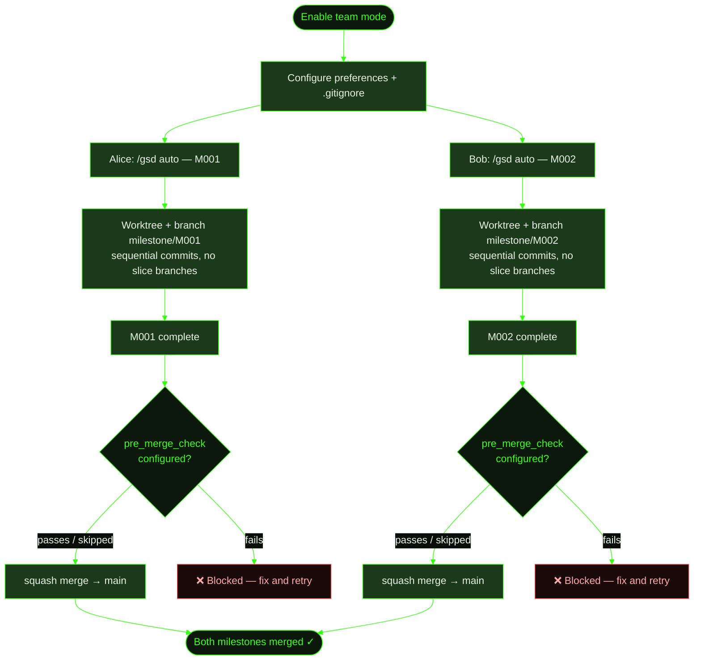

## When to Use This

Multiple developers are working on the same project and want to use GSD simultaneously. Each person needs their own milestone running in auto-mode without stepping on each other's work. This recipe covers the one-time team setup and the daily workflow for parallel development. For the full reference on all team settings, see the [Working in Teams guide](../../working-in-teams/).

## Prerequisites

- GSD installed and available for each team member
- A shared git repository (GitHub, GitLab, etc.)
- Familiarity with [/gsd prefs](../../commands/prefs/) for configuring project preferences

## Steps

**The scenario:** Two developers are working on Cookmate simultaneously. Alice is building user authentication (M001) and Bob is adding recipe search (M002). Both want to use GSD auto-mode at the same time.

### 1. Enable team mode

One developer sets up the project preferences and commits them. This is a one-time setup:

```
> /gsd prefs
```

Set `mode: team` in the project preferences:

```yaml
# .gsd/preferences.md
---
version: 1
mode: team
---
```

This enables several settings at once:

- **Unique milestone IDs** — milestones get a random suffix (e.g., `M001-eh88as`) to prevent ID collisions when two developers create milestones independently
- **Push branches** — each milestone works on a `milestone/<MID>` branch that gets pushed to the remote
- **Pre-merge checks** — GSD runs a test command before merging a milestone branch back to main

### 2. Configure `.gitignore`

Share planning artifacts while keeping runtime state local:

```bash
# .gitignore — GSD team setup

# ── Runtime / Ephemeral (per-developer) ──
.gsd/auto.lock
.gsd/completed-units.json
.gsd/STATE.md
.gsd/metrics.json
.gsd/gsd.db
.gsd/activity/
.gsd/runtime/
.gsd/worktrees/
.gsd/DISCUSSION-MANIFEST.json
.gsd/milestones/**/continue.md
.gsd/milestones/**/*-CONTINUE.md
```

**What gets shared** (committed): `preferences.md`, `PROJECT.md`, `REQUIREMENTS.md`, `DECISIONS.md`, `KNOWLEDGE.md`, `QUEUE.md`, and all milestone plans, roadmaps, and summaries.

**What stays local** (gitignored): lock files, SQLite cache, state cache, activity logs, runtime records, and worktrees.

```
> git add .gsd/preferences.md .gitignore
> git commit -m "chore: enable GSD team workflow"
> git push
```

### 3. Alice starts her milestone

Alice discusses the auth feature and starts auto-mode:

```
> /gsd

What's the vision?
> Build user authentication for Cookmate — signup, login, sessions.

> /gsd auto
```

GSD creates a milestone with a unique ID and works in an isolated worktree on a single branch. All execution — research, planning, implementation — happens via sequential commits on `milestone/M001-eh88as`. No per-slice branches are created in the shared branch namespace:

```
.gsd/
├── worktrees/
│   └── M001-eh88as/          ← Alice's worktree (gitignored)
│       └── (sequential commits on milestone/M001-eh88as)
└── milestones/
    └── M001-eh88as/
        ├── M001-eh88as-CONTEXT.md
        ├── M001-eh88as-ROADMAP.md
        └── slices/
            └── S01/
                └── ...
```

Her work builds up as tagged commits on the milestone branch:

```
feat(M001/S01): research
feat(M001/S01): plan
feat(S01/T01): implement signup endpoint
feat(S01/T02): implement session handling
feat(M001/S01): summary + UAT
feat(M001/S02): research
...
```

### 4. Bob starts his milestone (concurrently)

Bob starts his search feature on the same repo — even while Alice's auto-mode is running:

```
> /gsd

What's the vision?
> Add recipe search to Cookmate — full-text search with filters.

> /gsd auto
```

Bob gets his own unique milestone ID and worktree:

```
.gsd/
├── worktrees/
│   ├── M001-eh88as/          ← Alice's worktree
│   └── M002-k4m9px/          ← Bob's worktree
└── milestones/
    ├── M001-eh88as/           ← Alice's milestone
    └── M002-k4m9px/           ← Bob's milestone
```

The unique ID suffixes (`eh88as`, `k4m9px`) prevent collisions — even if both developers happen to create their first milestone at the same time, the IDs won't conflict.

### 5. Milestones complete and merge

When Alice's milestone finishes, GSD squash-merges her `milestone/M001-eh88as` branch to main. Before the squash, GSD runs the pre-merge check if configured — this executes a test command to verify the work passes. By default the check is skipped; you can enable it with a custom command or let GSD auto-detect `npm test` from `package.json`:

```yaml
# .gsd/preferences.md
---
git:
  pre_merge_check: "npm test"    # or any shell command
---
```

If the check passes, the squash merge lands on main:

```
> git log --oneline main
a1b2c3d M001-eh88as: User authentication (squash)
```

Bob's milestone merges independently when it completes:

```
> git log --oneline main
f5e6d7c M002-k4m9px: Recipe search (squash)
a1b2c3d M001-eh88as: User authentication (squash)
```

### Optional: Auto-create pull requests

If your team uses a code-review workflow before merging to main, set `auto_pr: true`. GSD will open a pull request after the milestone branch is pushed, targeting the configured `pr_target_branch` (defaults to `main`):

```yaml
# .gsd/preferences.md
---
git:
  push_branches: true
  auto_pr: true
  pr_target_branch: "develop"   # optional, defaults to main
---
```

### Optional: Post-create hook for worktrees

If your project needs setup work each time a worktree is created (e.g. copying `.env` files, installing local dependencies, configuring IDE settings), set a hook script:

```yaml
# .gsd/preferences.md
---
git:
  worktree_post_create: "./scripts/setup-worktree.sh"
---
```

The script receives `SOURCE_DIR` and `WORKTREE_DIR` as environment variables. Failure is non-fatal — GSD logs a warning and continues.

## Git Isolation Modes

By default, GSD isolates each milestone in a git worktree (`isolation: "worktree"`). Two alternatives exist for edge cases:

| Mode | Behavior | When to use |
|------|---------|------------|
| `worktree` | Creates `.gsd/worktrees/<MID>/` with its own branch | Default — best isolation for most projects |
| `branch` | Works in the project root, commits to a milestone branch directly | Repos with submodules that don't work inside worktrees |
| `none` | No git isolation — commits land on the user's current branch | Monorepos with pre-existing branch strategies |

```yaml
# .gsd/preferences.md
---
git:
  isolation: "branch"   # or "none"
---
```

## What Gets Created

The git and `.gsd/` structure after both milestones complete:

```
main branch:
├── (squash) M002-k4m9px: Recipe search
└── (squash) M001-eh88as: User authentication

.gsd/
├── preferences.md             ← mode: team (shared)
├── PROJECT.md                 ← updated by both milestones
├── DECISIONS.md               ← decisions from both milestones
├── KNOWLEDGE.md               ← learnings from both milestones
├── QUEUE.md                   ← work queue
└── milestones/
    ├── M001-eh88as/           ← Alice's completed milestone
    │   ├── M001-eh88as-SUMMARY.md
    │   └── slices/...
    └── M002-k4m9px/           ← Bob's completed milestone
        ├── M002-k4m9px-SUMMARY.md
        └── slices/...
```

Worktrees are cleaned up after merge. Planning artifacts remain in `milestones/` as a historical record. Because planning artifacts are tracked in git (not gitignored), they travel with each milestone branch and merge cleanly to `main` as part of the squash commit.

## Merging a General Worktree

The worktree system is also available outside of auto-mode for any parallel work stream. When you run `/worktree merge`, GSD dispatches an LLM-guided merge session that:

1. **Categorizes changes** — classifies each file as new code, modified code, new GSD artifacts, updated plans, decisions, requirements, etc.
2. **Assesses conflicts** — for each modified file, checks whether `main` has also changed since the worktree branched off. Flags diverged files that need manual reconciliation.
3. **Presents a merge plan** — shows clean merges, conflicts (both versions side-by-side with a proposed reconciliation), new files to add, and removals to confirm. Asks for user approval before proceeding.
4. **Executes the merge** — runs `git merge --squash <worktree-branch>` from the main tree and commits with a descriptive message.
5. **Offers cleanup** — asks whether to remove the worktree directory and branch, or keep it for continued parallel work.

The LLM never silently discards changes. When a conflict is ambiguous, it shows both versions and asks.

## Flow Diagram



## Related Commands

- [`/gsd prefs`](../../commands/prefs/) — Configure project preferences including team mode and git settings
- [`/gsd auto`](../../commands/auto/) — Start auto-mode to execute a milestone
- [`/worktree`](../../commands/worktree/) — Create, list, merge, and remove parallel worktrees
