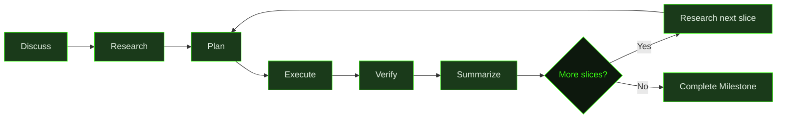
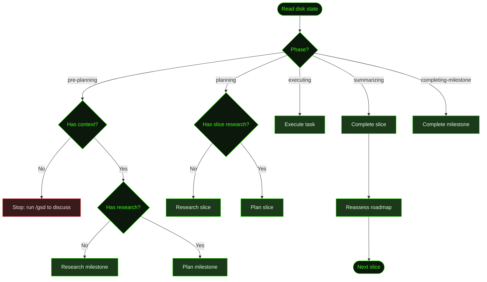

GSD structures work into **milestones**, **slices**, and **tasks** — each progressively more concrete. You describe what you want to build, and GSD guides it through discussion, research, planning, execution, and verification. This page walks through the full lifecycle using a real example.

## The Example: Cookmate

Throughout this walkthrough, we'll build **Cookmate** — a recipe-sharing web app with user accounts, recipe CRUD, image uploads, and search. It's complex enough to show how GSD decomposes real work, but simple enough to follow in one sitting.

## The GSD Lifecycle

Every project flows through the same phases. Some are interactive (you're in the conversation), others are autonomous (GSD works on its own).



### The Hierarchy

| Level | What it is | Scale | Example |
|-------|-----------|-------|---------|
| **Milestone** | A major project phase | Days to weeks | "Core recipe platform" |
| **Slice** | A demoable vertical increment | Hours to a day | "User authentication flow" |
| **Task** | One unit of focused work | 15–60 minutes | "Build the login API endpoint" |

Milestones decompose into slices. Slices decompose into tasks. Each level has its own artifacts — research docs, plans, summaries — that feed context to the next.

---

## Starting a Project

Run `/gsd` inside any GSD session. What happens depends on context:

- **No `.gsd/` directory** → starts a discussion to capture your project vision
- **Existing `.gsd/` with work in progress** → shows a wizard with status and next actions
- **All milestones complete** → reports completion

For Cookmate, we're starting fresh:

```
> /gsd

No .gsd/ directory found. Let's discuss what you're building.

What's the vision?
```

You describe your idea in plain language:

```
> I want to build Cookmate — a recipe sharing web app. Users can sign up,
> post recipes with photos, browse and search recipes, and save favorites.
> Next.js frontend, PostgreSQL backend, S3 for images. Should be deployable
> to Vercel.
```

---

## Phase 1: Discussion

GSD doesn't start building immediately. The discuss phase is a structured conversation where GSD:

1. **Reflects back** what it understood — a concrete summary, not a parrot repetition
2. **Estimates scale** — how many milestones, how many slices in the first one
3. **Lists capabilities** it heard — so you can catch misunderstandings
4. **Asks targeted questions** — filling gaps that matter for planning

```
GSD: Here's what I'm hearing:

  - Next.js app with PostgreSQL (likely Prisma ORM)
  - User auth (sign-up, login, sessions)
  - Recipe CRUD with rich text and photo uploads to S3
  - Browse/search with filtering
  - Favorites/bookmarking per user
  - Vercel deployment with serverless functions

  Size read: 2 milestones. M001 covers the core platform (auth, recipes,
  search). M002 handles social features and deployment polish.
  First milestone: probably 5-6 slices.

  Did I get that right, or did I miss something?
```

After confirming, GSD asks clarifying questions — not generic ones, but questions based on what it found by scouting the codebase (if anything exists) and checking library docs:

```
GSD: A few things I need to nail down:

  1. Auth strategy — NextAuth.js with credentials + OAuth, or
     a hosted solution like Clerk?
  2. Image handling — client-side resize before upload, or
     handle it server-side?
  3. Search — PostgreSQL full-text search, or a dedicated
     engine like Meilisearch?
```

:::tip[Getting the most out of discussion]
The quality of everything auto-mode builds depends on this conversation. See [Discussing a Milestone](../discussing-a-milestone/) for a detailed guide on how to engage with each phase to produce the sharpest possible plan.
:::

### What discussion produces

When discussion finishes, GSD writes two artifacts:

- **`M001-CONTEXT.md`** — the milestone brief: scope, goals, constraints, and decisions from the conversation
- A **milestone directory** under `.gsd/milestones/`

```
.gsd/
├── PROJECT.md
├── STATE.md
└── milestones/
    └── M001/
        └── M001-CONTEXT.md    ← scope, goals, key decisions
```

The context file is the authoritative record of what this milestone should achieve. Every downstream phase reads it.

---

## Phase 2: Research

Research happens automatically when you run `/gsd auto` (or GSD dispatches it in step mode). The research agent:

- **Scouts the codebase** — what exists, what patterns are established, what constraints the current code imposes
- **Checks library docs** — current API shapes, version-specific behavior, known gotchas
- **Investigates alternatives** — where the discuss phase left options open
- **Maps risks** — what's uncertain, what could go wrong, what should be proven first

For Cookmate's M001, the researcher might discover:
- Next.js 15 has a new `after()` API useful for background image processing
- Prisma's relation queries have specific patterns for recipe-ingredient relationships
- PostgreSQL full-text search with `tsvector` is sufficient — no need for Meilisearch

### What research produces

```
.gsd/
├── PROJECT.md
├── STATE.md
└── milestones/
    └── M001/
        ├── M001-CONTEXT.md
        └── M001-RESEARCH.md    ← codebase findings, tech decisions, risks
```

The research doc is written for the **planner**, not for a human audience. It answers: what files exist and what they do, where the natural seams are, what to build first, and how to verify the result.

---

## Phase 3: Planning

Planning happens in two stages: **milestone planning** (roadmap) and **slice planning** (task breakdown).

### Milestone Roadmap

The milestone planner reads the context and research, then decomposes work into **slices** — demoable vertical increments ordered by risk:

```
.gsd/
└── milestones/
    └── M001/
        ├── M001-CONTEXT.md
        ├── M001-RESEARCH.md
        └── M001-ROADMAP.md     ← ordered slices with risk levels
```

A roadmap looks like this:

```markdown
# M001 Roadmap: Core Recipe Platform

- [ ] **S01: Database schema and auth** `risk:high` `depends:[]`
  Demo: User can sign up, log in, and see their profile.
- [ ] **S02: Recipe CRUD** `risk:high` `depends:[S01]`
  Demo: Logged-in user creates, edits, and deletes a recipe.
- [ ] **S03: Image uploads** `risk:medium` `depends:[S02]`
  Demo: User attaches a photo to a recipe, sees it in the listing.
- [ ] **S04: Search and browse** `risk:medium` `depends:[S02]`
  Demo: User searches "pasta" and gets relevant results.
- [ ] **S05: Favorites** `risk:low` `depends:[S01,S02]`
  Demo: User bookmarks a recipe, sees it on their favorites page.
```

High-risk slices go first. If auth is broken, nothing else works — so it's S01. Favorites are low-risk and depend on established patterns, so they're last.

### Slice Planning

Before each slice executes, a slice planner decomposes it into **tasks** — individual units of work small enough for one agent context window:

```
.gsd/
└── milestones/
    └── M001/
        ├── M001-CONTEXT.md
        ├── M001-RESEARCH.md
        ├── M001-ROADMAP.md
        └── slices/
            └── S01/
                ├── S01-PLAN.md          ← task breakdown with estimates
                └── tasks/
                    ├── T01-PLAN.md      ← specific steps for task 1
                    ├── T02-PLAN.md      ← specific steps for task 2
                    └── T03-PLAN.md      ← specific steps for task 3
```

Each task plan contains:
- **Steps** — specific implementation instructions with file paths
- **Must-haves** — checkboxes that define "done" for the task
- **Verification** — concrete commands to prove the work is correct
- **Inputs** — what prior work or external resources the task needs

Tasks are self-contained. An executor agent sees only its task plan, the slice plan excerpt, and summaries of prior tasks — not the full research doc or roadmap. Everything it needs is in the plan.

---

## Phase 4: Execution

This is where code gets written. Run `/gsd auto` and GSD takes over.

### How auto mode works

Auto mode is a **dispatch state machine**. It reads the `.gsd/` directory structure to determine what phase the project is in, then dispatches the right type of work:



The dispatch rules evaluate in order — the first match wins. This is what happens during Cookmate's S01 execution:

1. **State check** → phase is `executing`, active task is `T01`
2. **Dispatch** → creates a fresh agent session with T01's plan pre-loaded
3. **Execute** → agent builds the Prisma schema, NextAuth config, signup/login pages
4. **Verify** → agent runs the verification commands from the task plan
5. **Write summary** → agent writes `T01-SUMMARY.md` with what happened
6. **State re-derived** → GSD reads disk again, sees T01 done, dispatches T02

### Fresh session per unit

Every task gets a **clean context window**. No accumulated garbage from prior tasks. The dispatch prompt pre-loads exactly what the agent needs:

| What's inlined | Why |
|---------------|-----|
| Task plan | What to build |
| Slice plan excerpt | Where this task fits |
| Prior task summaries | What's already done |
| Decisions register | Architectural context |
| Knowledge base | Recurring patterns and gotchas |

This is how GSD maintains quality across long projects — each unit starts fresh with focused, relevant context instead of degrading as the context window fills up.

### What execution looks like on disk

Mid-execution of S01, the `.gsd/` directory looks like this:

```
.gsd/
├── PROJECT.md
├── STATE.md
├── DECISIONS.md                 ← architectural decisions accumulate here
├── KNOWLEDGE.md                 ← patterns and gotchas discovered during work
└── milestones/
    └── M001/
        ├── M001-CONTEXT.md
        ├── M001-RESEARCH.md
        ├── M001-ROADMAP.md
        └── slices/
            └── S01/
                ├── S01-PLAN.md
                └── tasks/
                    ├── T01-PLAN.md
                    ├── T01-SUMMARY.md   ← T01 done — summary compressed
                    ├── T02-PLAN.md
                    ├── T02-SUMMARY.md   ← T02 done
                    └── T03-PLAN.md      ← T03 executing now
```

Each summary compresses the full story of what a task did — files changed, decisions made, verification results, and anything the next task should know.

---

## Phase 5: Verification and Completion

When the last task in a slice finishes, GSD transitions to the **summarizing** phase.

### Slice completion

The completion agent:

1. **Runs all slice-level verification** — the objective stopping condition defined in the slice plan
2. **Fixes failures** — if verification doesn't pass, it fixes the issues before proceeding
3. **Writes the slice summary** — compresses all task summaries into one coherent record
4. **Writes a UAT script** — concrete test cases derived from what was actually built
5. **Updates requirements** — moves requirements between Active, Validated, Deferred based on evidence
6. **Marks the slice done** — checks the box in the roadmap

### Roadmap reassessment

After each slice completes, GSD reassesses the remaining roadmap. Plans made before execution may not survive contact with reality:

- Maybe S02 is simpler than expected because S01 established patterns that transfer
- Maybe a new risk emerged that should reorder the remaining slices
- Maybe a slice can be dropped because its goal was already achieved

The reassessment either confirms the plan or adjusts it. This is how GSD adapts without losing structure.

### Milestone completion

When all slices are done, the milestone completion agent:

1. Verifies the assembled work delivers the milestone goal
2. Writes `M001-SUMMARY.md` — the milestone-level record
3. Updates `PROJECT.md` with current state
4. If another milestone exists (M002), GSD continues into its discussion/research cycle

### Final directory structure

After S01 completes and S02 is in progress, the `.gsd/` tree looks like this:

```
.gsd/
├── PROJECT.md
├── STATE.md
├── REQUIREMENTS.md
├── DECISIONS.md
├── KNOWLEDGE.md
└── milestones/
    └── M001/
        ├── M001-CONTEXT.md
        ├── M001-RESEARCH.md
        ├── M001-ROADMAP.md          ← S01 checked off, S02-S05 remaining
        └── slices/
            ├── S01/
            │   ├── S01-PLAN.md
            │   ├── S01-SUMMARY.md    ← compressed slice record
            │   ├── S01-UAT.md        ← concrete test script
            │   └── tasks/
            │       ├── T01-PLAN.md
            │       ├── T01-SUMMARY.md
            │       ├── T02-PLAN.md
            │       ├── T02-SUMMARY.md
            │       ├── T03-PLAN.md
            │       └── T03-SUMMARY.md
            └── S02/
                ├── S02-RESEARCH.md    ← slice-level research
                ├── S02-PLAN.md        ← next slice being planned
                └── tasks/
                    └── ...
```

---

## How State Works

GSD derives its state entirely from files on disk. There's no database, no hidden process — just markdown files in `.gsd/`. The `STATE.md` file is a cache of the derived state, not the source of truth.

The state derivation algorithm:

1. Find all milestone directories (M001, M002, ...)
2. For each, check if a roadmap exists and if all slices are done
3. The first incomplete milestone becomes the **active milestone**
4. Within that milestone, the first incomplete slice (with dependencies met) becomes the **active slice**
5. Within that slice, the first unchecked task becomes the **active task**
6. The combination determines the **phase**: `pre-planning`, `planning`, `executing`, `summarizing`, `completing-milestone`, or `complete`

This means you can always understand where GSD is by looking at the files. And if something goes wrong, you can fix it by editing the markdown — check a box, rename a file, adjust a plan.

---

## Steering and Intervention

You're never locked out of the process.

### During auto mode

- **`/gsd stop`** — stops auto mode after the current unit finishes
- **`/gsd pause`** — pauses so you can inspect, then resume
- **`/gsd status`** — shows a dashboard of progress without interrupting work
- **`/gsd steer`** — injects a steering override that the next unit will incorporate

### Between phases

- **Edit any plan file** — GSD reads from disk, so your changes take effect on the next dispatch
- **Mark a task done manually** — check its box in the plan, and GSD skips it
- **Add a task** — append it to the plan file, and GSD will execute it in order

### When things go wrong

- **`/gsd doctor`** — diagnoses issues in your `.gsd/` directory structure
- **`/gsd forensics`** — post-mortem analysis of auto-mode failures
- **Task blockers** — if an executor discovers a plan-invalidating issue, it sets `blocker_discovered: true` in its summary, triggering an automatic replan of the slice

---

## Key Concepts Summary

| Concept | What it means |
|---------|--------------|
| **Disk-driven state** | GSD reads `.gsd/` files to determine what to do next — no hidden state |
| **Fresh sessions** | Every unit gets a clean context window with pre-loaded, focused context |
| **Risk-first ordering** | High-risk slices execute first to surface problems early |
| **Summaries as context** | Each completed unit writes a summary that feeds into the next unit's context |
| **Reassessment** | After each slice, GSD checks if the remaining plan still makes sense |
| **Observable artifacts** | Every phase produces readable markdown files — you can always see what happened |
| **Intervention points** | Stop, pause, steer, edit plans, or fix things manually at any time |

---

## What's Next

- **[Getting Started](../getting-started/)** — install GSD and run your first project
- **[Auto Mode](../auto-mode/)** — deep dive into autonomous execution
- **[Commands Reference](../commands/)** — every command and what it does
- **[Configuration](../configuration/)** — customize phases, models, and behavior
