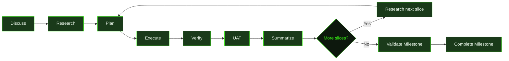
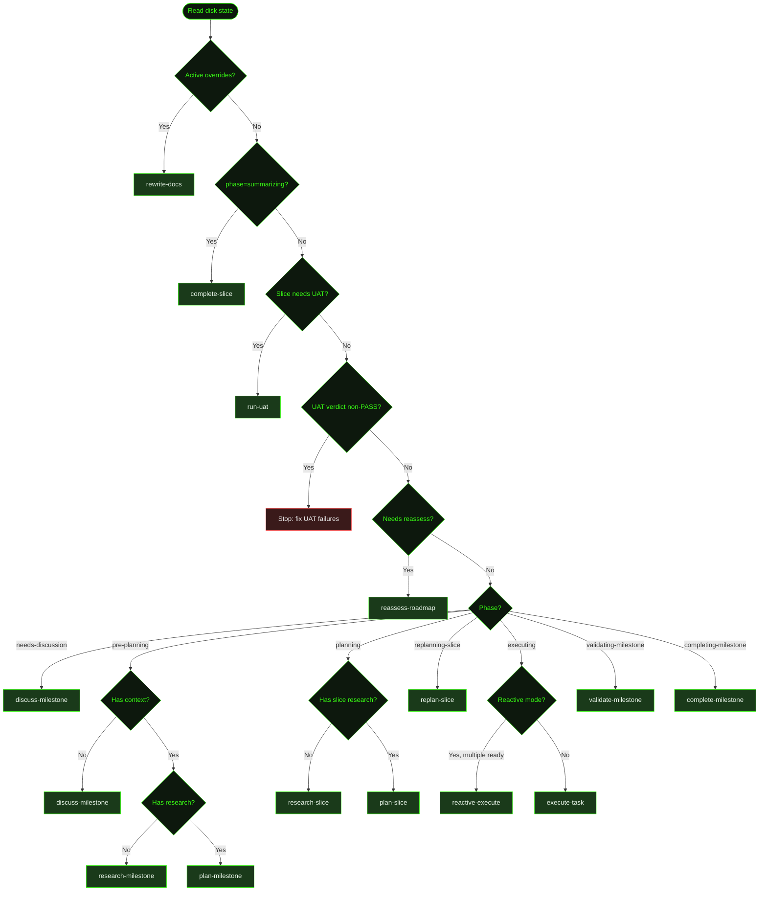

GSD structures work into **milestones**, **slices**, and **tasks** — each progressively more concrete. You describe what you want to build, and GSD guides it through discussion, research, planning, execution, and verification. This page walks through the full lifecycle using a real example.

## The Example: Cookmate

Throughout this walkthrough, we'll build **Cookmate** — a recipe-sharing web app with user accounts, recipe CRUD, image uploads, and search. It's complex enough to show how GSD decomposes real work, but simple enough to follow in one sitting.

## The GSD Lifecycle

Every project flows through the same phases. Some are interactive (you're in the conversation), others are autonomous (GSD works on its own).



### The Hierarchy

| Level | What it is | Scale | Example |
|-------|-----------|-------|---------|
| **Milestone** | A major project phase | Days to weeks | "Core recipe platform" |
| **Slice** | A demoable vertical increment | Hours to a day | "User authentication flow" |
| **Task** | One unit of focused work | 15–60 minutes | "Build the login API endpoint" |

Milestones decompose into slices. Slices decompose into tasks. Each level has its own artifacts — research docs, plans, summaries — that feed context to the next.

---

## Starting a Project

Run `/gsd` inside any GSD session. What happens depends on context:

- **No `.gsd/` directory** → starts a discussion to capture your project vision
- **Existing `.gsd/` with work in progress** → shows a wizard with status and next actions
- **Draft context found** (`CONTEXT-DRAFT.md`) → offers to resume discussion from saved draft material
- **All milestones complete** → reports completion

For Cookmate, we're starting fresh:

```
> /gsd

No .gsd/ directory found. Let's discuss what you're building.

What's the vision?
```

You describe your idea in plain language:

```
> I want to build Cookmate — a recipe sharing web app. Users can sign up,
> post recipes with photos, browse and search recipes, and save favorites.
> Next.js frontend, PostgreSQL backend, S3 for images. Should be deployable
> to Vercel.
```

---

## Phase 1: Discussion

GSD doesn't start building immediately. The discuss phase is a structured conversation where GSD:

1. **Reflects back** what it understood — a concrete summary, not a parrot repetition
2. **Estimates scale** — how many milestones, how many slices in the first one
3. **Lists capabilities** it heard — so you can catch misunderstandings
4. **Investigates before asking** — scouts the codebase, checks library docs, searches the web
5. **Asks targeted questions** — filling gaps that matter for planning

```
GSD: Here's what I'm hearing:

  - Next.js app with PostgreSQL (likely Prisma ORM)
  - User auth (sign-up, login, sessions)
  - Recipe CRUD with rich text and photo uploads to S3
  - Browse/search with filtering
  - Favorites/bookmarking per user
  - Vercel deployment with serverless functions

  Size read: 2 milestones. M001 covers the core platform (auth, recipes,
  search). M002 handles social features and deployment polish.
  First milestone: probably 5-6 slices.

  Did I get that right, or did I miss something?
```

After confirming, GSD asks clarifying questions — not generic ones, but questions based on what it found by scouting the codebase (if anything exists) and checking library docs:

```
GSD: A few things I need to nail down:

  1. Auth strategy — NextAuth.js with credentials + OAuth, or
     a hosted solution like Clerk?
  2. Image handling — client-side resize before upload, or
     handle it server-side?
  3. Search — PostgreSQL full-text search, or a dedicated
     engine like Meilisearch?
```

:::tip[Getting the most out of discussion]
The quality of everything auto-mode builds depends on this conversation. See [Discussing a Milestone](../discussing-a-milestone/) for a detailed guide on how to engage with each phase to produce the sharpest possible plan.
:::

### What discussion produces

When discussion finishes, GSD writes several artifacts in a single pass:

- **`PROJECT.md`** — what the project is, current state, and milestone sequence
- **`REQUIREMENTS.md`** — the capability contract: every requirement with ID, status, ownership, and traceability
- **`M001-CONTEXT.md`** — the milestone brief: scope, goals, constraints, and decisions from the conversation
- **`M001-ROADMAP.md`** — ordered slices with risk levels, demos, proof strategy, and boundary map
- **`DECISIONS.md`** — architectural decisions made during discussion, seeded for future reference
- **`STATE.md`** — derived state cache, written last to signal discussion is complete

```
.gsd/
├── PROJECT.md
├── REQUIREMENTS.md
├── DECISIONS.md
├── STATE.md
└── milestones/
    └── M001/
        ├── M001-CONTEXT.md    ← scope, goals, key decisions
        └── M001-ROADMAP.md    ← ordered slices with proof strategy
```

The context file is the authoritative record of what this milestone should achieve. Every downstream phase reads it.

### Multi-milestone projects

For larger projects spanning multiple milestones, GSD handles each milestone's readiness individually. For each non-primary milestone, you choose:

- **Discuss now** — conduct a focused discussion while context is fresh; produces a full `CONTEXT.md`
- **Write draft for later** — saves key ideas as `CONTEXT-DRAFT.md`; when auto-mode reaches it, GSD pauses and offers to resume the discussion
- **Just queue it** — creates the directory without context; auto-mode pauses and prompts you to run `/gsd` when it becomes active

GSD writes a `DISCUSSION-MANIFEST.json` after each gate decision. Auto-mode will not start until all gates are recorded.

For milestones that depend on others, GSD writes `depends_on` frontmatter into each `CONTEXT.md`. This is **mandatory** — the state machine reads this field to determine execution order:

```yaml
---
depends_on: [M001]
---

# M002: Social Features
```

---

## Phase 2: Research

Research happens automatically when you run `/gsd auto` (or GSD dispatches it). The research agent:

- **Scouts the codebase** — what exists, what patterns are established, what constraints the current code imposes
- **Checks library docs** — current API shapes, version-specific behavior, known gotchas
- **Investigates alternatives** — where the discuss phase left options open
- **Maps risks** — what's uncertain, what could go wrong, what should be proven first

For Cookmate's M001, the researcher might discover:
- Next.js 15 has a new `after()` API useful for background image processing
- Prisma's relation queries have specific patterns for recipe-ingredient relationships
- PostgreSQL full-text search with `tsvector` is sufficient — no need for Meilisearch

Milestone-level research is skipped for S01 (the first slice uses it directly). Subsequent slices get their own focused slice research unless `skip_slice_research` is set in preferences.

### What research produces

```
.gsd/
├── PROJECT.md
├── REQUIREMENTS.md
├── STATE.md
└── milestones/
    └── M001/
        ├── M001-CONTEXT.md
        └── M001-RESEARCH.md    ← codebase findings, tech decisions, risks
```

The research doc is written for the **planner**, not for a human audience. It answers: what files exist and what they do, where the natural seams are, what to build first, and how to verify the result.

---

## Phase 3: Planning

Planning happens in two stages: **milestone planning** (roadmap) and **slice planning** (task breakdown).

### Milestone Roadmap

The milestone planner reads the context and research, then decomposes work into **slices** — demoable vertical increments ordered by risk:

```
.gsd/
└── milestones/
    └── M001/
        ├── M001-CONTEXT.md
        ├── M001-RESEARCH.md
        └── M001-ROADMAP.md     ← ordered slices with risk, depends, demo lines
```

A roadmap looks like this:

```markdown
# M001: Core Recipe Platform

**Vision:** A recipe-sharing platform where cooks can publish, discover, and save recipes.

## Success Criteria

- User can complete signup → create recipe → upload photo → search end-to-end
- Full-text search returns relevant results within 500ms

## Slices

- [ ] **S01: Database schema and auth** `risk:high` `depends:[]`
  > After this: User can sign up, log in, and see their profile.
- [ ] **S02: Recipe CRUD** `risk:high` `depends:[S01]`
  > After this: Logged-in user creates, edits, and deletes a recipe.
- [ ] **S03: Image uploads** `risk:medium` `depends:[S02]`
  > After this: User attaches a photo to a recipe, sees it in the listing.
- [ ] **S04: Search and browse** `risk:medium` `depends:[S02]`
  > After this: User searches "pasta" and gets relevant results.
- [ ] **S05: Favorites** `risk:low` `depends:[S01,S02]`
  > After this: User bookmarks a recipe, sees it on their favorites page.
```

High-risk slices go first. If auth is broken, nothing else works — so it's S01. Favorites are low-risk and depend on established patterns, so they're last.

The roadmap also includes: key risks, proof strategy (which slice retires which risk), verification classes, milestone definition of done, requirement coverage, and a boundary map of what each slice produces and consumes.

### Slice Planning

Before each slice executes, a slice planner decomposes it into **tasks** — individual units of work small enough for one agent context window:

```
.gsd/
└── milestones/
    └── M001/
        ├── M001-CONTEXT.md
        ├── M001-RESEARCH.md
        ├── M001-ROADMAP.md
        └── slices/
            └── S01/
                ├── S01-RESEARCH.md      ← slice-specific research (skipped for S01)
                ├── S01-PLAN.md          ← task breakdown with estimates
                └── tasks/
                    ├── T01-PLAN.md      ← specific steps for task 1
                    ├── T02-PLAN.md      ← specific steps for task 2
                    └── T03-PLAN.md      ← specific steps for task 3
```

Each task plan contains:
- **Steps** — specific implementation instructions with file paths
- **Must-haves** — checkboxes that define "done" for the task
- **Verification** — concrete commands to prove the work is correct
- **Inputs** — what prior work or external resources the task needs

Tasks are self-contained. An executor agent sees only its task plan, the slice plan excerpt, and summaries of prior tasks — not the full research doc or roadmap. Everything it needs is in the plan.

---

## Phase 4: Execution

This is where code gets written. Run `/gsd auto` and GSD takes over.

### How auto mode works

Auto mode is a **declarative dispatch table** — an ordered list of rules evaluated per cycle. Each rule checks a condition; the first match fires. GSD reads the `.gsd/` directory structure to determine what phase the project is in, then evaluates the rules in sequence:



The first rule that matches wins. This is what happens during Cookmate's S01 execution:

1. **State check** → phase is `executing`, active task is `T01`
2. **Dispatch** → creates a fresh agent session with T01's plan pre-loaded
3. **Execute** → agent builds the Prisma schema, NextAuth config, signup/login pages
4. **Verify** → agent runs the verification commands from the task plan
5. **Write summary** → agent writes `T01-SUMMARY.md` with what happened
6. **State re-derived** → GSD reads disk again, sees T01 done, dispatches T02

### Fresh session per unit

Every task gets a **clean context window**. No accumulated garbage from prior tasks. The dispatch prompt pre-loads exactly what the agent needs:

| What's inlined | Why |
|---------------|-----|
| Task plan | What to build |
| Slice plan excerpt | Where this task fits |
| Prior task summaries | What's already done |
| Decisions register | Architectural context |
| Knowledge base | Recurring patterns and gotchas |

This is how GSD maintains quality across long projects — each unit starts fresh with focused, relevant context instead of degrading as the context window fills up.

### Blocker detection and replan

If an executor discovers a plan-invalidating issue, it sets `blocker_discovered: true` in its summary. On the next dispatch cycle, GSD transitions to `replanning-slice` and dispatches a `replan-slice` agent to rewrite the remaining tasks before execution continues. A `REPLAN.md` file is written to prevent infinite replan loops.

Triage can also trigger a replan: when a capture is classified as `replan`, triage writes a `REPLAN-TRIGGER.md` file in the slice directory. On the next dispatch cycle, GSD detects this and transitions to `replanning-slice`. The same `REPLAN.md` loop protection applies.

### Reactive execution

When `reactive_execution.enabled: true` is set in preferences, GSD derives a dependency graph from the task I/O declarations in the slice plan. If multiple tasks are ready at once (their declared dependencies are satisfied), GSD dispatches them in parallel — up to `max_parallel` tasks per cycle. If the graph is ambiguous or only one task is ready, execution falls back to sequential dispatch.

### What execution looks like on disk

Mid-execution of S01, the `.gsd/` directory looks like this:

```
.gsd/
├── PROJECT.md
├── REQUIREMENTS.md
├── STATE.md
├── DECISIONS.md                 ← architectural decisions accumulate here
├── KNOWLEDGE.md                 ← patterns and gotchas discovered during work
└── milestones/
    └── M001/
        ├── M001-CONTEXT.md
        ├── M001-RESEARCH.md
        ├── M001-ROADMAP.md
        └── slices/
            └── S01/
                ├── S01-PLAN.md
                └── tasks/
                    ├── T01-PLAN.md
                    ├── T01-SUMMARY.md   ← T01 done — summary compressed
                    ├── T02-PLAN.md
                    ├── T02-SUMMARY.md   ← T02 done
                    └── T03-PLAN.md      ← T03 executing now
```

Each summary compresses the full story of what a task did — files changed, decisions made, verification results, and anything the next task should know.

---

## Phase 5: Verification and Completion

When the last task in a slice finishes, GSD transitions to the **summarizing** phase.

### Slice completion

After all tasks are done, GSD runs through a post-completion sequence. The order matters — each step is a distinct dispatch cycle:

1. **Complete slice** — runs all slice-level verification, fixes failures, writes `S01-SUMMARY.md`, marks the slice done in the roadmap. This is the `summarizing` phase.
2. **Run UAT** — if `uat_dispatch` is enabled and a UAT script (`S01-UAT.md`) exists, executes the acceptance test script and writes `S01-UAT-RESULT.md`.
3. **UAT verdict gate** — if UAT ran and the verdict is not `PASS`, auto-mode stops. You must fix the failures and re-run `/gsd auto` to continue.
4. **Reassess roadmap** — checks whether the remaining slices still make sense given what was built; may reorder, merge, or drop slices. Skipped if `skip_reassess: true` is set.

The completion agent (step 1) also:
- Writes `S01-UAT.md` — concrete test cases derived from what was actually built
- Updates requirements — moves requirements between Active, Validated, Deferred based on evidence
- Checks the box in the roadmap

### Roadmap reassessment

After each slice completes, GSD reassesses the remaining roadmap. Plans made before execution may not survive contact with reality:

- Maybe S02 is simpler than expected because S01 established patterns that transfer
- Maybe a new risk emerged that should reorder the remaining slices
- Maybe a slice can be dropped because its goal was already achieved

The reassessment either confirms the plan or adjusts it. This is how GSD adapts without losing structure.

### Milestone validation

When all slices are done, GSD enters `validating-milestone` before writing the milestone summary. Before dispatching the validation agent, GSD performs a safety check: every slice in the roadmap must have a `SUMMARY.md` file. If any are missing, auto-mode stops with an error rather than falsely validating an incomplete milestone.

The validation agent:

1. Reads the milestone's success criteria and definition of done
2. Verifies the assembled work delivers the milestone goal
3. Writes `M001-VALIDATION.md` with a verdict: `pass`, `needs-attention`, or `needs-remediation`

If remediation is needed and remediation slices exist in the roadmap, GSD executes them before re-validating. A `needs-remediation` verdict without any remediation slices is treated as terminal to prevent infinite loops — the report is preserved on disk for manual review.

:::note[Skipping validation]
Set `skip_milestone_validation: true` in preferences to write a pass-through validation file and proceed directly to completion. Useful for projects where the milestone definition of done is verified by other means.
:::

### Milestone completion

When validation passes, the milestone completion agent:

1. Verifies that actual implementation files exist outside `.gsd/` — a milestone with only planning artifacts will not be marked complete
2. Writes `M001-SUMMARY.md` — the milestone-level record
3. Updates `PROJECT.md` with current state
4. If another milestone exists (M002), GSD continues into its discussion/research cycle

### Final directory structure

After S01 completes and S02 is in progress, the `.gsd/` tree looks like this:

```
.gsd/
├── PROJECT.md
├── STATE.md
├── REQUIREMENTS.md
├── DECISIONS.md
├── KNOWLEDGE.md
└── milestones/
    └── M001/
        ├── M001-CONTEXT.md
        ├── M001-RESEARCH.md
        ├── M001-ROADMAP.md          ← S01 checked off, S02-S05 remaining
        └── slices/
            ├── S01/
            │   ├── S01-PLAN.md
            │   ├── S01-SUMMARY.md    ← compressed slice record
            │   ├── S01-UAT.md        ← concrete test script
            │   ├── S01-UAT-RESULT.md ← UAT verdict
            │   └── tasks/
            │       ├── T01-PLAN.md
            │       ├── T01-SUMMARY.md
            │       ├── T02-PLAN.md
            │       ├── T02-SUMMARY.md
            │       ├── T03-PLAN.md
            │       └── T03-SUMMARY.md
            └── S02/
                ├── S02-RESEARCH.md    ← slice-level research
                ├── S02-PLAN.md        ← next slice being planned
                └── tasks/
                    └── ...
```

---

## How State Works

GSD derives its state entirely from files on disk. There's no database, no hidden process — just markdown files in `.gsd/`. The `STATE.md` file is a cache of the derived state, not the source of truth.

The state derivation algorithm:

1. Find all milestone directories (M001, M002, ...)
2. Skip **ghost milestones** — directories containing only `META.json` with no substantive files (`CONTEXT`, `ROADMAP`, or `SUMMARY`)
3. Skip **parked milestones** — directories with a `PARKED` file; these do not satisfy `depends_on` for other milestones
4. Check milestone-level `depends_on` frontmatter in each `CONTEXT.md` — skip milestones whose dependencies aren't complete
5. The first incomplete, unblocked milestone becomes the **active milestone**
6. Within that milestone, check if all slices are done and whether a `VALIDATION` file with a terminal verdict exists
7. If all slices done but no terminal validation → phase is `validating-milestone`
8. If all slices done and validation terminal but no summary → phase is `completing-milestone`
9. Otherwise, find the first incomplete slice (with dependencies met) → **active slice**
10. If the slice has no plan → phase is `planning`
11. If all tasks done but slice not marked complete → phase is `summarizing`
12. If a completed task has `blocker_discovered: true` and no `REPLAN.md` → phase is `replanning-slice`
13. If a `REPLAN-TRIGGER.md` exists in the slice directory and no `REPLAN.md` → phase is `replanning-slice`
14. If a `CONTINUE.md` (or `continue.md`) exists in the slice directory → phase is `executing` with a resume prompt
15. Otherwise → phase is `executing` with the first incomplete task as the **active task**

### All phases

| Phase | What it means |
|-------|--------------|
| `pre-planning` | Active milestone has context but no roadmap yet; or no milestones exist |
| `needs-discussion` | Active milestone has a `CONTEXT-DRAFT.md` seed — run `/gsd` to discuss |
| `planning` | Active slice needs a plan |
| `executing` | Active task is ready to run |
| `summarizing` | All tasks done — complete slice, then UAT and reassess |
| `replanning-slice` | A task blocker or triage trigger — replan remaining tasks |
| `validating-milestone` | All slices done — validate before completing |
| `completing-milestone` | Validation passed — write milestone summary |
| `blocked` | No eligible slice (dep cycle) or all remaining milestones are dep-blocked |
| `complete` | All milestones done |

This means you can always understand where GSD is by looking at the files. And if something goes wrong, you can fix it by editing the markdown — check a box, rename a file, adjust a plan.

State derivation uses a native Rust batch parser when available, reading all `.gsd/` markdown files in a single pass for speed. It falls back to sequential JS file reads if the native module is absent. Results are cached for 100ms per base path to avoid redundant re-reads during a single dispatch cycle.

---

## Steering and Intervention

You're never locked out of the process.

### During auto mode

- **`/gsd stop`** — stops auto mode after the current unit finishes
- **`/gsd pause`** — pauses so you can inspect, then resume
- **`/gsd status`** — shows a dashboard of progress without interrupting work
- **`/gsd steer`** — injects a steering override that the next unit will incorporate

### Between phases

- **Edit any plan file** — GSD reads from disk, so your changes take effect on the next dispatch
- **Mark a task done manually** — check its box in the plan, and GSD skips it
- **Add a task** — append it to the plan file, and GSD will execute it in order

### Quick tasks

For work that doesn't fit into the milestone/slice ceremony, use `/gsd quick <description>`. Quick tasks are created as numbered, slug-named directories inside `.gsd/quick/` (e.g., `.gsd/quick/1-add-rate-limiting/`). They get GSD's execution guarantees (atomic commits, verification) without a full slice plan.

### When things go wrong

- **`/gsd doctor`** — diagnoses issues in your `.gsd/` directory structure and optionally fixes them
- **`/gsd forensics`** — post-mortem analysis of auto-mode failures
- **Task blockers** — if an executor discovers a plan-invalidating issue, it sets `blocker_discovered: true` in its summary, triggering an automatic replan of the slice
- **Triage replan** — captures classified as `replan` write a `REPLAN-TRIGGER.md` file, which is detected on the next dispatch cycle

---

## Key Concepts Summary

| Concept | What it means |
|---------|--------------|
| **Disk-driven state** | GSD reads `.gsd/` files to determine what to do next — no hidden state |
| **Fresh sessions** | Every unit gets a clean context window with pre-loaded, focused context |
| **Risk-first ordering** | High-risk slices execute first to surface problems early |
| **Summaries as context** | Each completed unit writes a summary that feeds into the next unit's context |
| **Ordered dispatch rules** | Auto-mode is a table of rules evaluated in sequence — the first match wins |
| **Post-completion hooks** | UAT and roadmap reassessment run after slice completion, before the next slice starts |
| **UAT verdict gate** | A non-PASS UAT result blocks auto-mode until you fix the failures |
| **Capability contract** | `REQUIREMENTS.md` tracks every requirement with status, ownership, and traceability |
| **Milestone validation** | Before completing a milestone, GSD verifies the assembled work delivers the goal |
| **Blocker replanning** | Tasks or triage that discover plan-invalidating issues trigger automatic slice replanning |
| **Observable artifacts** | Every phase produces readable markdown files — you can always see what happened |
| **Intervention points** | Stop, pause, steer, edit plans, or fix things manually at any time |

---

## What's Next

- **[Getting Started](../../getting-started/)** — install GSD and run your first project
- **[Auto Mode](../../auto-mode/)** — deep dive into autonomous execution
- **[Commands Reference](../../commands/)** — every command and what it does
- **[Configuration](../../configuration/)** — customize phases, models, and behavior
